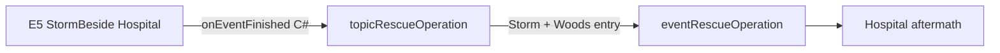

# Аудит карт HarveyOverhaulStory

Технический и **визуальный** аудит постановки story-арки E1–E9 (CP ID: `HarveyOverhaulStory.E{N}_…`).  
**События не изменялись.** Сюжет и реплики не оцениваются — только карта, координаты, движение, дистанция, камера.

**Источники:** CP `events.json`; [`events-coordinate-audit.md`](events-coordinate-audit.md); [`map-passports.md`](map-passports.md); C# `RescueOperationLauncher` / `PlayerEventHandler` (E5 → `topicRescueOperation`).

---

## Общий вывод

### Самые проблемные карты / события (нужны правки координат)

| Приоритет | Event | Карта | Проблема |
|-----------|-------|-------|----------|
| **P0** | **E2_InsistentExam** | Hospital | `doAction (5,9)` на тайле двери (Buildings); выходной `move` через `(3,3)` с коллизией |
| **P0** | **E7_TownSip_Sunny** | Town | Harvey setup `(27,22)` на Buildings — NPC в стене/лавке |
| **P0** | **E8_QuietShelf** | ArchaeologyHouse | `warp Gunther (6,5)` на Buildings; Harvey `advancedMove` через непроходимые тайлы |
| **P1** | **E4_PierBreath** | Beach | Финал: farmer и Harvey на **одном тайле** `(39,13)` — перекрытие спрайтов |
| **P1** | **E9_LightInWindow** | Town | Harvey `(-1000,-1000)` в setup (скрытие OK), но fork-warp `(35,88)` может совпасть с farmer; нужен in-game кадр у клиники |
| **P2** | **E6_SayItOutLoud** | Hospital | Проходимость OK; fork «шаг ближе/назад» — хороший паттерн, проверить `(10,15)` у стола |

### Стабильные события (мало или нет правок)

**E1**, **E2B**, **E3**, **E3B**, **E4B**, **E5** — карта и логика движения в целом согласованы с narrativ; E5 особенно удачен как мост к `eventRescueOperation`.

### Прогрессия дистанции (farmer ↔ Harvey)

| Этап | Событие | Стартовая дистанция | Комментарий |
|------|---------|---------------------|-------------|
| Ранний | E1 | ~6 тайлов | Подходит, останавливается «в полшага» — OK |
| Ранний | E2 | ~4 тайла (5,10)↔(1,5) | Клиника, дистанция врач–пациент — OK |
| Ранний | E2B | 4 тайла | Останавливается в 2 шагах — OK |
| Средний | E3/E3B | 1 тайл (рядом) | Лес, совместная работа — допустимо |
| Средний | E4 | 6 → **0** (один тайл) | Намеренная близость у воды; риск overlap |
| Средний | E4B | 3 → 2 тайла | У перил — **лучшая** outdoor-постановка арки |
| Поздний | E5–E6 | 1 тайл у двери → коридор | Близко, но в клинике — OK |
| Поздний | E7–E9 | 1 тайл / warp рядом | E7 ломается из‑за Buildings; E9 — у фасада клиники |

---

## HarveyOverhaulStory.E1_SlipperyPath

- **Location:** BusStop (ветер, утро)
- **Scene meaning:** Скользкая дорога у остановки; первый контакт, дистанция, выбор «принять руку / отступить»
- **Technical status:** **OK**
- **Visual status:** **OK**

### Coordinates audit

| Actor | Setup | Tile check | Объекты рядом |
|-------|-------|------------|---------------|
| farmer | (20, 23) | Back OK | открытая дорога BusStop |
| Harvey | (26, 22) | Back OK | ~6 тайлов восточнее |

### Movement audit

| Phase | Command | To | Passable | During QQ? |
|-------|---------|-----|----------|------------|
| Approach | farmer +3,0; Harvey −3,0 | (23,23)/(23,22) | OK | нет |
| Help fork | Harvey −1,0 / farmer −1,0 | ближе на 1 | OK | **после** выбора в fork |
| Exit | farmer −3,0; Harvey −3,0 | уход по краю | OK | нет |

### Visual staging notes

- Карта **соответствует** смыслу (ветер, мокрая обочина).
- Harvey **не врезается**: `proceedPosition`, сообщение «полшага».
- Камера: default; BusStop компактная — обычно OK.

### Recommended coordinate fixes

- Не требуются по TMX. In-game: проверить IF2R/BusStop warp-патчи.

---

## HarveyOverhaulStory.E2_InsistentExam

- **Location:** Hospital
- **Scene meaning:** Настойчивый осмотр у кушетки; ранний arc, дистанция врач–пациент
- **Technical status:** **Broken**
- **Visual status:** **Warning** (логика сцены верная, координаты двери/кушетки — нет)

### Coordinates audit

| Actor / cmd | Coords | Tile check | Объекты |
|-------------|--------|------------|---------|
| Harvey setup | (1, 5) | Front Warning | Message Hospital.2 |
| farmer setup | **(5, 10)** | OK (скрипт) | у зоны входа/кушетки |
| doAction | **(5, 9)** | **Buildings Broken** | **Door** |
| Harvey exam | (3–5, 5) | OK | рабочая зона |

### Movement audit

| Phase | Command | To | Passable | During QQ? |
|-------|---------|-----|----------|------------|
| Enter | doAction 5,9; farmer 0,−5 | (5,5) area | door Broken | нет |
| Exam | `faceDirection farmer 2` → `showFrame farmer 107`; Harvey moves | (3,5) | OK | **нет** — QQ на кушетке |
| Exit | Harvey/farmer 0,−2 true | (3,3) area | **(3,4)(3,3) Broken** | нет |

### Visual staging notes

- **Hospital — верная карта** для осмотра.
- Дистанция старт **~4 тайла** — ранний arc OK.
- **QQ на static showFrame 107** (с `faceDirection 2` перед посадкой) — персонажи не двигаются во время выбора — **хорошо**.
- `doAction (5,9)` на двери может дать странный «вход сквозь стену» или сбой action.
- Рекомендуемая зона кушетки из паспорта: **(4,6)**, **(6,10)**; дверь **(10,20)** warp Town — не путать с (5,9).

### Recommended coordinate fixes

- Заменить `doAction (5,9)` → открытие через **(10,20)** warp или проходимый тайл у входа **(10,19)** без doAction на Buildings.
- farmer setup **(5,10)** → **(4,6)** или **(6,10)** если осмотр у кушетки.
- Exit `move 0,-2` → путь через **(4,6)–(10,19)** без (3,3).

---

## HarveyOverhaulStory.E2B_QuietAgreement

- **Location:** Town (лавка / дерево, `(28,67)`)
- **Scene meaning:** Публичная забота без «спектакля»; тень, вода, клиника
- **Technical status:** **OK**
- **Visual status:** **OK**

### Coordinates audit

| Actor | Setup | Tile check | Объекты |
|-------|-------|------------|---------|
| farmer | (28, 67) | OK | юг Town, зона лавки (как в message) |
| Harvey | (32, 67) | OK | **4 тайла** — дистанция OK |

### Movement audit

| Phase | Command | To | Passable | During QQ? |
|-------|---------|-----|----------|------------|
| Approach | Harvey −2,0 true | (30,67) | OK | нет |
| QQ forks | move −1,0 / −3,0 | тень / клиника | OK | **внутри fork**, не во время prompt |
| showFrame | farmer 107 | «у дерева» (E2B Town — **не** сидение на кушетке) | — | до QQ |

### Visual staging notes

- Message «**у лавки, у ствола дерева**» — координаты **согласованы** (E2B reuse зоны).
- Harvey **останавливается в двух шагах** — ранний arc, без интимного overlap.
- Оба quickQuestion: основной prompt **без параллельного move** — OK.

### Recommended coordinate fixes

- Не требуются. CC vs `Town_Joja` — один in-game прогон.

---

## HarveyOverhaulStory.E3_ForestApothecary

- **Location:** Forest `(50,13)`–`(51,13)`
- **Scene meaning:** Совместный сбор трав; Harvey «студент», дистанция бок о бок
- **Technical status:** **OK**
- **Visual status:** **OK**

### Coordinates audit

| Actor | Setup | Tile check | Объекты |
|-------|-------|------------|---------|
| farmer | (50, 13) | OK | лесная тропа (E3-зона) |
| Harvey | (51, 13) | OK | 1 тайл — средний arc |

### Movement audit

| Phase | Command | To | Passable | During QQ? |
|-------|---------|-----|----------|------------|
| Walk | оба −3,0 true | (47,13)/(48,13) | OK | нет |
| QQ | — | — | — | **стоят** |

### Visual staging notes

- **Forest** — идеальная карта для «аптекаря».
- Старт **1 тайл** — уже близко, но narrativ «корзина / ножницы» оправдывает.
- Нет viewport — большая карта; fade быстрый — приемлемо.

### Recommended coordinate fixes

- Опционально: сдвинуть на **(48,14)/(49,14)** (зона E3B) для continuity без смены декора.

---

## HarveyOverhaulStory.E3B_WingPatient

- **Location:** Forest `(48,14)`–`(49,14)`
- **Scene meaning:** Птица у тропы; совместная помощь, animate Harvey
- **Technical status:** **OK**
- **Visual status:** **OK**

### Coordinates audit

| Actor | Setup | Tile check |
|-------|-------|------------|
| farmer | (48, 14) | OK |
| Harvey | (49, 14) | OK |

### Movement audit

| Phase | Command | To | Passable | During QQ? |
|-------|---------|-----|----------|------------|
| Approach | оба −2,0 true | (46,14)/(47,14) | OK | нет |
| Bird | animate Harvey | kneel | — | pause **до** QQ |
| QQ | — | — | — | **стоят / kneel** |

### Visual staging notes

- Лесная тропа + «трава у тропы» — визуально связно с E3.
- `animate` **до** quickQuestion, QQ без move — OK.
- Fork «отойти 2 шага» — только message, без координатного сдвига (можно усилить `move farmer 0,2` в fork).

### Recommended coordinate fixes

- Не обязательны. Опционально: fork «отойти» → `move farmer 0,2,2`.

---

## HarveyOverhaulStory.E4_PierBreath

- **Location:** Beach (пирс)
- **Scene meaning:** Дыхание у воды; близость, рука
- **Technical status:** **OK** (с Warning)
- **Visual status:** **Warning**

### Coordinates audit

| Actor | Setup | Tile check | Объекты |
|-------|-------|------------|---------|
| farmer | (40, 17) | OK | верх пирса |
| Harvey | (39, 23) | OK | **~6 тайлов** — хороший старт |

### Movement audit

| Phase | Command | To | Passable | During QQ? |
|-------|---------|-----|----------|------------|
| Descend | farmer 0,6; −1,0 | (39,23) | OK | нет |
| Breath | оба 0,−10 true | **(39,13) оба** | OK | нет |
| QQ touch | farmer −1,0 | разведение | OK | **в fork** |

### Visual staging notes

- **Beach / пирс** — идеальная карта.
- Прогрессия дистанции: далеко → **один тайл** — narrativ OK, **спрайты overlap**.
- Первый QQ: ветки **без move** до выбора (кроме fork «сжать руку») — OK.
- `ambientLight 110 110 140` — атмосфера вечера OK.

### Recommended coordinate fixes

- Финал дыхания: farmer **(39,13)**, Harvey **(40,13)** или **(38,13)** — соседние тайлы, face друг к другу.
- Альтернатива: farmer (39,13), Harvey (39,14) — смещение на 1 по Y.

---

## HarveyOverhaulStory.E4B_TooQuiet

- **Location:** Mountain `(44,21)` — **перила**
- **Scene meaning:** Тишина у обрыва; «рядом без слов»
- **Technical status:** **OK**
- **Visual status:** **Excellent**

### Coordinates audit

| Actor | Setup | Tile check | Объекты |
|-------|-------|------------|---------|
| farmer | (42, 21) | OK | у перил |
| Harvey | (45, 21) | OK | **3 тайла**, смотрит на долину |

### Movement audit

| Phase | Command | To | Passable | During QQ? |
|-------|---------|-----|----------|------------|
| Approach | farmer +2,0 true | (44,21) | OK | нет |
| QQ ×2 | message only | — | — | **нет move** |

### Visual staging notes

- **Лучшая outdoor-постановка арки:** перила `(44,21)` из map-passport (E4B).
- Message «**у перил**» = координаты совпадают.
- Два quickQuestion подряд **без движения** — образцово.
- `ambientLight 90 85 110` — вечер гор OK.

### Recommended coordinate fixes

- Не требуются.

---

## HarveyOverhaulStory.E5_StormBeside

- **Location:** Hospital (гроза, день)
- **Scene meaning:** Гроза у клиники; план безопасности; **мост к `topicRescueOperation`**
- **Technical status:** **Warning**
- **Visual status:** **Good / Strong**

### Coordinates audit

| Actor | Setup | Tile check | Объекты |
|-------|-------|------------|---------|
| farmer | (10, 19) | OK | **у входа** warp Town (10,20) |
| Harvey | (10, 18) | Front Warning | 1 тайл севернее — «у двери» |
| После move | (10, 15) / (9, 15) | OK | **коридор/рабочая зона** |

### Movement audit

| Phase | Command | To | Passable | During QQ? |
|-------|---------|-----|----------|------------|
| Enter | Harvey −3; farmer −4 | (10,15) | OK | нет |
| Bandage | showFrame Harvey 55 | — | — | нет |
| Storm plan QQ | — | (9–10,15) | OK | **стоят** |
| End | fade | — | — | — |

### Visual staging notes

- **Карта и смысл совпадают:** гроза → «внутрь» клиники → марля, дыхание, **план на грозу**.
- Старт у **двери Hospital** визуально оправдывает:
  - тему `topicHarveyStorm_*` (клиника / дом / escort);
  - C# **`topicRescueOperation`** после события (`PlayerEventHandler` → `RescueOperationLauncher`, trigger `"E5_StormBeside"`) — narrativ «Harvey строит протокол безопасности / escort» **логично** ведёт к `eventRescueOperation` в Woods.
- **Не** rescue aftermath здесь — только **эмоциональный и протокольный** setup; визуально достаточно (клиника, не палата).
- `playSound thunder`, `startJittering`, `ambientLight 80 80 110` — атмосфера OK.
- Дистанция поздний arc: 1 тайл у двери → рядом у стола — OK.

### Recommended coordinate fixes

- Harvey setup **(10,18)** → **(9,19)** или **(11,19)** если Front на (10,18) виден in-game.
- Убедиться, что `(10,15)` в кадре есть **стол/край стола** для message про чай (needs visual check).

---

## HarveyOverhaulStory.E6_SayItOutLoud

- **Location:** Hospital (вечер)
- **Scene meaning:** «Сказать вслух»; договор о дистанции; поздний arc
- **Technical status:** **Warning**
- **Visual status:** **Good**

### Coordinates audit

| Actor | Setup (скрипт) | Tile check |
|-------|----------------|------------|
| Harvey | (10, 18) | Front Warning |
| farmer | (10, 19) | OK |

### Movement audit

| Phase | Command | To | Passable | During QQ? |
|-------|---------|-----|----------|------------|
| Sit zone | Harvey −2; farmer −3 | ~(10,15) | OK | нет |
| Main QQ | fork move ±1 | ближе/назад | OK | **после** prompt в fork |
| Restore | оба +2,0 true | (10,17)/(10,18) | OK | нет |

### Visual staging notes

- Та же **Hospital-зона**, что E5 — **continuity** арки OK.
- QQ «Как ответить?» — **prompt без move**, fork двигает **после** выбора — **правильный паттерн**.
- «Шаг ближе / назад / дверь» — визуально поддерживает прогрессию intimacy без overlap.
- `Hospital_Ambient`, `ambientLight 100 90 75` — вечер клиники OK.

### Recommended coordinate fixes

- Старт farmer явно в setup (не полагаться на trigger-pos).
- In-game: проверить, что `(10,15)` не перекрывает стол при fork `move farmer -1,0`.

---

## HarveyOverhaulStory.E7_TownSip_Sunny

- **Location:** Town `(26,22)`–`(27,22)` (площадь)
- **Scene meaning:** Перегруз на солнце; лавка, бутылка; Penny проходит
- **Technical status:** **Broken**
- **Visual status:** **Broken**

### Coordinates audit

| Actor | Setup | Tile check | Объекты |
|-------|-------|------------|---------|
| farmer | (26, 22) | OK | площадь |
| Harvey | **(27, 22)** | **Buildings Broken** | **в стене/лавке** |
| Penny temp | (32, 24) | OK | проход NPC |

### Movement audit

| Phase | Command | To | Passable | During QQ? |
|-------|---------|-----|----------|------------|
| QQ1 | forks: move −2,0 | тень | OK | в fork |
| Penny | move +2,+4 | уходит | OK | после QQ1 |
| QQ2 | move 0,2 / −3,0 | fork | OK | в fork |

### Visual staging notes

- **Town + солнце + лавка** — narrativ OK (`message` про лавку).
- Harvey на **(27,22) Buildings** — **ломает** сцену («не нависаю» vs стоит в декоре).
- Реплика про **лавку/бутылку** при Harvey в Buildings — **visual mismatch**.
- Penny walk-through — OK для «никто не обязан знать».

### Recommended coordinate fixes

- Harvey **(27,22)** → **(28,22)** или **(29,22)** (как E2B: Harvey на 32 при farmer 28).
- Либо farmer **(26,22)**, Harvey **(30,22)** — 4 тайла, как E2B.
- При наличии лавки — поставить farmer **у края** `(27,23)`, Harvey **(29,23)`.

---

## HarveyOverhaulStory.E8_QuietShelf

- **Location:** ArchaeologyHouse (музей)
- **Scene meaning:** Тихая полка; Gunther; Harvey учится не «врываться»
- **Technical status:** **Broken**
- **Visual status:** **Warning** (идея сильная, warp/move ломают)

### Coordinates audit

| Actor | Setup / warp | Tile check | Объекты |
|-------|--------------|------------|---------|
| farmer | (18, 9) | Front Warning | **витрина/Notes** (17–19,8) |
| Gunther | (11, 9) | OK | стойка |
| Harvey | −1000,−1000 → **warp (3,15)** | warp Town | вход с юга |
| Gunther warp | **(6, 5)** | **Buildings Broken** | GuntherRoom warp |

### Movement audit

| Phase | Command | To | Passable | During QQ? |
|-------|---------|-----|----------|------------|
| Gunther | move к полке, уходит | (12,5) area | OK / warp Broken | нет |
| Harvey | advancedMove | **(5,18)** | **Warning** | pause до QQ |
| QQ | move Harvey ±1,2 | fork | частично | **в fork** |
| Gunther return | move 8,0 | (16,9) | Broken tiles | нет |

### Visual staging notes

- **ArchaeologyHouse** — верная карта для «тихой полки».
- farmer **(18,9)** у Messages — **визуально у стеллажа** — OK (Front — проверить overlap спрайта).
- Harvey **advancedMove** через полки — риск «телепорт сквозь мебель».
- Gunther **(6,5)** — появление **в стене** — резкий visual break.
- QQ **до** return Gunther — стоят у полки — структура OK.

### Recommended coordinate fixes

- Gunther warp **(6,5)** → **(11,5)** или **(14,5)** (проходимая зона за стеллажом).
- Harvey warp **(3,15)** → **(5,16)** (не на warp Town-тайле).
- Упростить advancedMove → `move Harvey 0,-2 4,0 0,1` по проходимым тайлам или warp ближе **(16,9)**.
- farmer **(18,9)** → **(16,9)** если Front мешает.

---

## HarveyOverhaulStory.E9_LightInWindow

- **Location:** Town `(35,88)` — **фасад клиники (юг)**
- **Scene meaning:** Свет в окне; вечер; финал arc — доверие
- **Technical status:** **Warning** (setup Harvey hide)
- **Visual status:** **Good** (сильный кадр, needs in-game)

### Coordinates audit

| Actor | Setup / fork warp | Tile check | Объекты |
|-------|-------------------|------------|---------|
| farmer | (35, 88) | OK | зона E9 / у клиники (passport) |
| Harvey | −1000,−1000 → fork **(36,89)/(35,88)** | OK после warp | **дверь/крыльцо** |
| ambientLight | 80 70 55 | — | вечер |

### Movement audit

| Phase | Command | To | Passable | During QQ? |
|-------|---------|-----|----------|------------|
| Open | message only | — | — | нет |
| QQ1 forks | warp Harvey; move 0,−1 | у двери | OK | **после** выборa |
| «Пройти мимо» | warp Harvey **(35,88)** | **same as farmer?** | overlap risk | fork |
| QQ2 | mostly speak | — | — | **стоят** |

### Visual staging notes

- **Карта Town у Hospital** — **идеальный** финал («свет в окне клиники»).
- `message` про **окно, кружку, журнал** — требует in-game: камера показывает **фасад**, не пустую траву.
- Harvey hide до первого QQ — **стандартный** приём; не Broken, если warp корректен.
- Fork «пройти мимо»: warp Harvey на **(35,88)** = **тот же тайл**, что farmer — **риск overlap**; лучше **(34,88)** или **(36,88)**.
- «Ступеньки клиники» — text-only; опционально `showFrame 108` / offset для сидения.
- **Не перекрыт** мебелью на farmer tile по TMX; Front на соседних — проверить in-game.

### Recommended coordinate fixes

- Fork «пройти мимо»: Harvey **(34,88)** face 1, farmer **(35,88)** face 3.
- Fork «окно»: Harvey **(36,89)** → **(37,88)** у крыльца, не внутри двери.
- Добавить `viewport 35 88 true` для фиксации фасада (будущая правка).
- Сверить с **(36,55)** Hospital door на северной стороне здания — игрок на **южном** `(35,88)`; убедиться, что окно света **читается** с этой стороны (SVE Town).

---

## Сводка: quickQuestion и движение

| Event | QQ count | Move во время prompt? | Fork move OK? |
|-------|----------|----------------------|---------------|
| E1 | 2 | нет | да |
| E2 | 2 | нет | да (на кушетке) |
| E2B | 2 | нет | да |
| E3 | 1 | нет | да |
| E3B | 1 | нет | да |
| E4 | 1 | нет | да (touch fork) |
| E4B | 2 | **нет** | message only |
| E5 | 1 | **нет** | speak only |
| E6 | 1 | **нет** | да (±1 tile) |
| E7 | 2 | нет | да |
| E8 | 1 | нет | да |
| E9 | 2 | нет | warp в fork — проверить overlap |

---

## E5 ↔ eventRescueOperation (continuity)

- **E5** визуально: вход в клинику во время грозы, **протокол** (клиника / дом / escort / записка).
- **Не** показывает rescue — это **правильно**; мост — **topic**, не cutscene.
- Для coherence: E5 должен читаться как «Harvey берёт шторм под контроль» → позже **Woods rescue** при storm + topic.
- Слабое звено — не E5, а **отдельный** audit `eventRescueOperation` (Woods/Hospital coords).

---

## In-game чеклист (story arc)

1. **E1** BusStop wind — дистанция, нет overlap.
2. **E2** — дверь/кушетка без застревания.
3. **E4** — два спрайта на пирсе **не** на одном тайле.
4. **E4B** — перила `(44,21)` в кадре.
5. **E5** — thunder + вход + стол; topic rescue после fade.
6. **E7** — Harvey **не** в Buildings.
7. **E8** — Gunther return без warp в стену.
8. **E9** — окно клиники + вечерний свет; fork без overlap.

---

## Связанные документы

- [`events-coordinate-audit.md`](events-coordinate-audit.md) — проходимость всех 31 событий
- [`storm-comfort-map-audit.md`](storm-comfort-map-audit.md) — storm comfort (параллельный мост к rescue)
- [`mine-events-map-risk-audit.md`](mine-events-map-risk-audit.md)
- [`events-map-audit-plan.md`](events-map-audit-plan.md)
