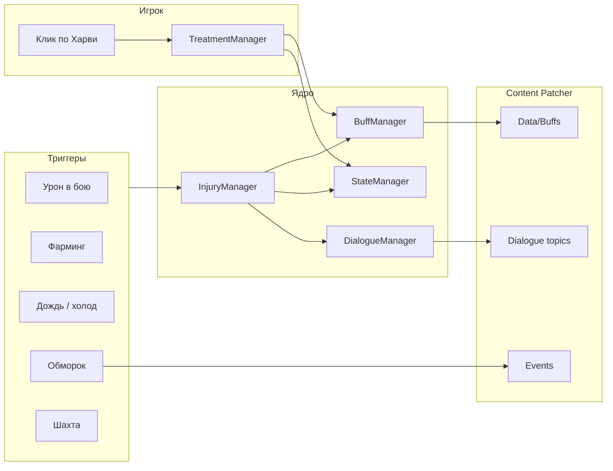

# Harvey Overhaul: Injury Logic — спецификация мода

> **Назначение документа:** единый источник правды для оформления проекта, постановки задач в нейросети и доработки мода.  
> **Версия мода:** 1.0.0 · **UniqueID:** `marilynsinister.HarveyOverhaul.Injury`  
> **Стек:** SMAPI 4.1+, .NET 6, C# · Content Patcher (контент — отдельный CP-мод в папке `HarveyOverhaul`)

---

## 1. Концепция

Мод добавляет в Stardew Valley **реалистичную систему травм и лечения** в рамках романтической линии Харви. Игрок получает дебаффы от урона, фарминга, окружения и обмороков; **Харви** диагностирует, лечит по фазам, следит за осложнениями и при необходимости **госпитализирует**.

**Ключевые принципы:**
- Травма = **бафф** (игровой дебафф) + **conversation topic** (для диалогов CP) + **DebuffState** (логика фаз в сохранении)
- Лечение инициируется **кликом по Харви** (InteractionHandler), не автоматически
- Фазовые травмы проходят стадии Acute → Healing → Recovery; переход — только после визита к Харви
- Осложнения (мокрая повязка, грязная рана и т.д.) могут перерасти в **инфекцию**
- Тяжёлые сценарии (шахта, обморок) связаны с **событиями Content Patcher** и топиками

**Зависимости:**
| Мод | Обязателен | Роль |
|-----|------------|------|
| Content Patcher | да | Баффы, диалоги, события, письма |
| Stardew Valley Expanded CP | да | Локация Hospital и контент Харви |

**Деплой:** сборка кладётся в `Stardew Valley/Mods/HarveyOverhaul/` (см. `GameModsPath` в `.csproj`).

---

## 2. Архитектура C#-части

```
ModEntry.cs                    — точка входа, инициализация, консольные команды, debug HUD (F10)

Managers/
  StateManager                 — загрузка/сохранение InjuryState в Data
  BuffManager                  — добавление/удаление баффов, загрузка Data/Buffs
  DialogueManager              — conversation topics, диалоги, эмоции
  InjuryManager                — применение травм, приоритеты, фазовые ID
  TreatmentManager             — лечение, смена фаз, выздоровление
  ComplicationManager          — инфекции, небрежность
  HospitalizationManager       — принудительная госпитализация, блокировка выхода
  HospitalActivityManager      — активности каждые 20 игровых минут в палате

EventHandlers/
  GameEventHandler             — DayStarted / DayEnding
  PlayerEventHandler           — Warped, UpdateTicked (урон, шахта, дождь, proximity)
  InteractionHandler           — клик по Харви → лечение / фаза / выздоровление
  TimeEventHandler             — смена времени, активности в больнице
  PassOutHandler               — обморок, спасение из шахты

Core/
  Constants.cs                 — ID баффов, топиков, наборы Severe/Critical/DirtyInMines
  ModConfig.cs                 — настройки (config.json)
  Models/InjuryState.cs        — персистентное состояние
  Models/DebuffState.cs        — состояние одной травмы (фазы, флаги)
  TextMessages.cs, Emotes.cs   — тексты и эмоции для proximity-реакций

Helpers/
  HarveyHelper, GameUtils      — утилиты
```

### Поток данных



### Сохранение

`StateManager` хранит `InjuryState` через SMAPI `Helper.Data`:
- `ActiveDebuffs` — словарь `buffId → DebuffState`
- `ActiveComplications` — словарь `complicationBuffId → dayStarted`
- `AppliedTriggers` — одноразовые триггеры (`{UniqueID}_trigger*`)
- `SavedActiveBuffs` — снапшот баффов на конец дня, восстанавливается утром

---

## 3. Каталог травм

### 3.1. Простые (без фаз лечения)

Лечение за **один визит** к Харви → лечебный бафф.

| Buff ID | Топик | Дней (topic) | Лечебный бафф | Триггер |
|---------|-------|--------------|---------------|---------|
| `buffHurt` | `topicHurt` | 3 | `buffHarveyTreatment` | урон ≥5 (35%), обморок |
| `buffBadlyHurt` | `topicBadlyHurt`, `topicHealthDamageCritical` | 8 | `buffHarveyIntensiveCare` | HP ≤10, обморок HP 0–10 |
| `buffSurgicalWound` | `topicSurgicalWound` | 14 | `buffPostSurgicalCare` | событие CP |

### 3.2. Фазовые (2–3 фазы)

После клика по Харви: `TreatmentStarted=true`, `CurrentPhase=1`, базовый бафф снимается, накладывается **фазовый бафф**.

| Buff ID | Топик | Фазы (дни P1/P2/P3) | Всего дней |
|---------|-------|---------------------|------------|
| `buffSprainedAnkle` | `topicSprainedAnkle` | 7 / 7 / — | 14 |
| `buffBruisedRibs` | `topicBruisedRibs` | 10 / 11 / — | 21 |
| `buffBackStrain` | `topicBackStrain` | 5 / 7 / — | 12 |
| `buffDeepCuts` | `topicDeepCuts` | 3 / 7 / 4 | 14 |
| `buffBurnWounds` | `topicBurnWounds` | 7 / 14 / — | 21 |
| `buffInfectedWound` | `topicInfectedWound` | 3 / 11 / — | 14 |
| `buffTornMuscles` | `topicTornMuscles` | 7 / 14 / 7 | 28 |
| `buffConcussion` | `topicConcussion` | 3 / 11 / 7 | 21 |
| `buffFracturedBone` | `topicFracturedBone` | 7 / 35 / 14 | 56 |
| `buffShrapnelWounds` | `topicShrapnelWounds` | 5 / 10 / 7 | 22 |
| `buffCold` | `topicCold` | 3 / 4 / — | 7 |

**Примеры фазовых баффов** (определяются в `InjuryManager.GetPhaseBuffId`):
- `buffDeepCuts` → `HarveyMod_DeepCuts_Acute`, `_Healing`, `_Recovery`
- `buffFracturedBone` → `HarveyMod_FracturedBone_Acute`, `_Cast`, `_Recovery`
- `buffCold` → `HarveyMod_Cold_Acute`, `_Recovery`

**Топики фаз** (для CP-диалогов): `topic{InjuryName}Phase{Acute|Healing|Recovery}`  
Пример: `topicDeepCutsPhaseHealing`

### 3.3. Наборы для проверок (`Constants.InjurySets`)

| Набор | Назначение | Состав |
|-------|------------|--------|
| **Severe** | Запрет шахты, госпитализация | BadlyHurt, Shrapnel, FracturedBone, Concussion, SurgicalWound, InfectedWound, BurnWounds |
| **Critical** | Приоритет / критика | Concussion, FracturedBone, BadlyHurt, InfectedWound |
| **DirtyInMines** | Загрязнение в шахте | DeepCuts, BurnWounds, ShrapnelWounds |
| **Simple** | Лёгкие | Hurt, BadlyHurt |
| **PainFlareOnStorm** | Обострение боли (гроза) | FracturedBone, ShrapnelWounds |

---

## 4. Триггеры получения травм

### 4.1. Боевой урон (`PlayerEventHandler.CheckHealthBasedInjuries`)

Проверка каждые ~2 сек при **уменьшении** HP. Кулдаун между травмами: **30 игровых минут**. Триггеры одноразовые (`AppliedTriggers`).

| Приоритет | Условие | Травма | Шанс |
|-----------|---------|--------|------|
| 1 | HP ≤ 10 | `buffBadlyHurt` | 100% |
| 2 | урон ≥ 30 | `buffFracturedBone` | 10% |
| 2 | урон ≥ 20 | `buffConcussion` | 25% |
| 3 | урон ≥ 15 | `buffBruisedRibs` | 25% |
| 3 | урон ≥ 10 | `buffDeepCuts` (combat) | 30% |
| 4 | урон ≥ 5 | `buffHurt` | 35% |

### 4.2. Фарминг (`TrackToolUsage` + `CheckFarmingInjuries`)

Использования инструментов считаются во время короткого состояния `Game1.player.UsingTool`. Система копит counters по типам инструментов (Hoe, WateringCan, Axe, Pickaxe, Scythe). Roll травмы происходит после накопления N использований и при низкой stamina.

Риск зависит от релевантного навыка:

- Hoe / WateringCan / Scythe → Farming
- Axe → Foraging
- Pickaxe → Mining

Каждый уровень навыка снижает шанс, но не выключает травмы полностью. Высокий навык немного повышает threshold использований.

| Инструмент | Навык | Stamina | Uses | Травма | Базовый шанс |
|------------|-------|---------|------|--------|--------------|
| Hoe / WateringCan | Farming | ≤ 30 | 30+ | `buffBackStrain` | 15% |
| Axe / Pickaxe | Foraging/Mining | ≤ 20 | 20+ | `buffTornMuscles` | 12% |
| Scythe / Axe | Farming/Foraging | ≤ 15 | 25+ | `buffDeepCuts` (farming) | 15% |

*Финальный шанс и порог uses модифицируются skill level через config.json.*

### 4.3. Взрывы (`CheckExplosionInjuries`)

Игрок в радиусе 3 тайлов от бомбы → 50% шанс травмы → 60% Shrapnel / 40% Burn.

### 4.4. Окружение

| Условие | Травма |
|---------|--------|
| Дождь на улице 5–20+ мин (накопительно за день) | `buffCold` (5%→80%) |
| Зима / дождь / снег на улице без защиты | риск (cold exposure) |
| Весна + аллергены | `HarveyMod_AllergicRash` (конфиг `SpringRashChance`) |

### 4.5. Обморок (`PassOutHandler.TrackPassOut` → `OnPlayerWarped`)

| Ситуация | Эффект |
|----------|--------|
| HP 0–10 + отношения с Харви | `buffBadlyHurt` |
| HP 0–10 + обморок в Mine + отношения | + `topicMineInjuryRescue` (2 дня) |
| Истощение (stamina ≤ -15) + отношения | `buffFarmerExhausted`, `topicFarmerExhausted` |
| Поздно в Town (time ≥ 2600) | `buffSleepy`, `topicPassedOutInTown`, письмо |

### 4.6. Шахта (`HandleMinesLogic`)

- **Severe** → строгое HUD-предупреждение, `MineWarningDay` → на след. день письмо + `HarveyMod_MineForbidden`
- Любая травма → мягкое предупреждение
- **DirtyInMines** → шанс `HarveyMod_DirtyWound` (`DirtyWoundChanceMines`, default 35%)

---

## 5. Цикл лечения

### 5.1. Клик по Харви (`InteractionHandler`)

```
1. Топик завершения (topic*Cured)? → диалог выздоровления
2. Есть нелеченный buff* (!TreatmentStarted)? → StartTreatment
3. Есть осложнения без новых травм? → лечение осложнений
4. TreatmentStarted + ReadyForNextPhase? → AdvanceInjuryToNextPhase
5. TreatmentStarted + ReadyForRecovery? → CompleteInjuryRecovery
6. Иначе → стандартный диалог игры (без Suppress)
```

Подробная блок-схема: `docs/flow-click-harvey.md`

### 5.2. StartTreatment

- Эмоция + текст над головой Харви
- `ApplyTreatmentForInjury`: для фазовых — phase 1 buff, `StartTreatment(day)`; для простых — cure buff
- Лечение осложнений (`TreatAllComplications`)
- Через 1 сек — комбинированный диалог, +10 дружбы, эмоция сердца

### 5.3. Прогресс фаз (`GameEventHandler.CheckInjuryPhases`, каждое утро)

- Если в фазе прошло ≥ `PhaseNDuration` дней:
  - не последняя фаза → `ReadyForNextPhase = true` + HUD-напоминание
  - последняя фаза → `ReadyForRecovery = true` + HUD-напоминание
- **Смена фазы и выздоровление только по клику** на Харви

### 5.4. Лечебные баффы (`CureBuffs`)

| ID | Назначение |
|----|------------|
| `buffHarveyTreatment` | Лёгкие травмы |
| `buffHarveyIntensiveCare` | Тяжёлые |
| `buffHarveyProtection` | Защита |
| `buffHarveyRecovery` | Восстановление |
| `buffTeracitin` | Спец. лечение |
| `buffAntibioticsTreatment` | Антибиотики |
| `buffForcedSedation` | Седация |
| `buffPostSurgicalCare` | После операции |
| `buffHarveyCare` | Забота после выписки |

---

## 6. Осложнения

| Buff ID | Топик | Как получить | Риск |
|---------|-------|--------------|------|
| `HarveyMod_WetBandage` | `topicHarvey_WetBandage` | Дождь с повязкой (Treatment/IntensiveCare); купание в спа | → InfectedWound (день 0: 0%; день 1: 15%; день 2: 35%; день 3+: 65%) |
| `HarveyMod_WetStitches` | `topicHarvey_WetStitches` | Спа с `buffSurgicalWound` | письмо, лечение у Харви |
| `HarveyMod_DirtyWound` | `topicHarvey_DirtyWound` | Шахта + DirtyInMines | → InfectedWound (15%/40%/100%) |
| `HarveyMod_Neglect` | `topicHarvey_Neglect` | Нелеченная травма ≥ NeglectDaysThreshold (3) | письмо, дебафф |
| `HarveyMod_AllergicRash` | `topicHarvey_AllergicRash` | Весна | лечение у Харви |
| `HarveyMod_PainFlare` | `topicHarvey_PainFlare` | Гроза + PainFlareOnStorm | временный дебафф |
| `HarveyMod_MineForbidden` | — | Вход в шахту с Severe (на след. день) | Speed -1, Luck -1, 2 дня |

**Небрежность:** `GameEventHandler.CheckNeglect` в конце дня — если травма есть, лечение не начато N дней.

---

## 7. Госпитализация

### Условия старта

**Одновременно:**
1. `topicMineInjuryRescue` активен
2. Хотя бы один бафф из **Severe**
3. `ForceHospitalization == true`

**Точки входа:**
- Варп в Hospital (`HandleHospitalLogic`)
- Proximity к Харви ≤ `ProximityTiles` (`CheckHarveyProximity`)

### Поведение

1. `StartForcedHospitalizationWithExplanation(injury, harvey, "mine_rescue")`
2. Телепорт на кровать (`HospitalBedX/Y`, default 20,5)
3. Диалог с объяснением (минимум `MinHospitalStayMinutes`, default 120)
4. Топик `topicMineInjuryRescue` удаляется
5. **Блокировка выхода** из Hospital до истечения срока
6. Каждые **20 игр. минут** — случайная активность (`HospitalActivityManager`):
   checkVitals, bringWater, adjustPillow, readChart, conversation, holdHand, checkBandage, bringMedicine, comfort, checkTemperature

Подробнее: `docs/mines-forbidden-injuries.md`, `ИНСТРУКЦИЯ_ГОСПИТАЛИЗАЦИЯ.md`

---

## 8. Спасение из шахты

### Цепочка событий

```
1. Боевая смерть в Mine (health=0), отношения с Харви
   → PassOutHandler фиксирует NeedsMineRescueEvent, PassedOutInMineYesterday

2. DayStarted → TriggerMineRescueEvents()
   → Телепорт в Mine → CP-событие:
      • eventHarveyMineRescue (Severe)
      • eventHarveyMinorMineRescue (лёгкое)
   → Событие добавляет topicMineInjuryRescue

3. OnPlayerWarped после обморока (не в Mine):
   → ApplyBadlyHurtSafe() при HP 0–10 + отношения
   → topicMineInjuryRescue если LastPassedOutLocation содержит "Mine"

4. Вход в Hospital / proximity → принудительная госпитализация
```

**CP-события** (не в этом репозитории, патчатся через HarveyOverhaul CP):
- `eventHarveyMineRescue`
- `eventHarveyMinorMineRescue`
- `eventHarveyMineRescueMemory` (FarmHouse, утро после обморока — альтернативный сценарий)
- `eventHarveyClinicAfterMine`

---

## 9. Conversation Topics (основные)

| Топик | Назначение |
|-------|------------|
| `topicHurt` … `topicCold` | Диалоги по травме |
| `topic*Phase*` | Диалоги по фазе лечения |
| `topic*Cured` | Завершение лечения (клик → финальный диалог) |
| `topicMineInjuryRescue` | Флаг «ранен в шахте» → госпитализация |
| `topicMineDeathRescue` | Альтернативный сценарий обморока (событие на след. день) |
| `topicHarvey_WetBandage` и др. | Осложнения |
| `topicHarvey_ForcedHospitalization` | Принудительная госпитализация |
| `topicFarmerExhausted`, `topicPassedOutInTown` | Обмороки |

---

## 10. Конфигурация (`config.json` / `ModConfig`)

| Параметр | Default | Описание |
|----------|---------|----------|
| `OnlyAtClinic` | true | Лечение только в клинике (если используется) |
| `SendLetters` | true | Письма от Харви |
| `ForceHospitalization` | true | Принудительная госпитализация |
| `MinHospitalStayMinutes` | 120 | Мин. время в палате |
| `ProximityTiles` | 3 | Радиус обнаружения Харви |
| `HospitalLocationName` | `"Hospital"` | Локация (SVE) |
| `HospitalBedX` / `Y` | 20 / 5 | Координаты кровати |
| `MineForbiddenDurationDays` | 2 | Длительность запрета шахты |
| `DirtyWoundChanceMines` | 0.35 | Шанс грязной раны |
| `WetBandageToInfectionChance` | 0.25 | (legacy в конфиге) |
| `DirtyWoundToInfectionChance` | 0.25 | (legacy) |
| `SpringRashChance` | 0.35 | Аллергия весной |
| `NeglectDaysThreshold` | 3 | Дней до небрежности |

---

## 11. Отладка

### Консольные команды SMAPI

| Команда | Описание |
|---------|----------|
| `injury_reset` | Полный сброс мода |
| `injury_debuff_list` | Список ID травм и осложнений |
| `injury_debuff_add <id> [минуты]` | Наложить дебафф |
| `injury_phase_list` | Активные травмы и фазы |
| `injury_phase_ready <id> [1\|0]` | Флаг готовности к смене фазы |
| `injury_phase_recovery <id> [1\|0]` | Флаг готовности к выздоровлению |
| `injury_phase_advance <id>` | Принудительная смена фазы |
| `injury_phase_cure <id>` | Полное выздоровление |

### Debug HUD

**F10** — переключение оверлея: ActiveDebuffs, осложнения, топики, триггеры, DebuffState, последний клик по Харви.

---

## 12. Интеграция с Content Patcher

Этот репозиторий содержит **только логику SMAPI**. Контент должен быть согласован:

| Что патчит CP | Что делает C# |
|---------------|---------------|
| `Data/Buffs` — все `buff*`, `HarveyMod_*`, фазовые баффы | `BuffManager.AddBuff/RemoveBuff` |
| `Data/Conversations` — реакции на `topic*` | `DialogueManager.AddTopic/RemoveTopic` |
| `Data/Events/*` — mine rescue, clinic | `PassOutHandler.TriggerEventByName` |
| `Data/Mail` — письма | `Game1.addMailForTomorrow` |
| `Data/TriggerActions` (если есть) | `AppliedTriggers` с префиксом UniqueID |

**Правило:** при добавлении новой травмы нужно обновить **оба** слоя:
1. CP: buff JSON, topic, диалоги, иконка
2. C#: `InjuryManager.Apply*`, `KnownTraumas` в ModEntry, при необходимости `InjurySets`, фазовый маппинг

---

## 13. Приоритет травм

При нескольких активных травмах обрабатывается **самая серьёзная** (`InjuryManager.InjuryPriority`):

```
Concussion → InfectedWound → FracturedBone → SurgicalWound → ShrapnelWounds →
BurnWounds → DeepCuts → TornMuscles → BackStrain → BruisedRibs →
SprainedAnkle → BadlyHurt → Hurt
```

---

## 14. Типичные сценарии (для тестов и промптов)

### A. Лёгкая травма от боя
```
Урон 8 HP → buffHurt → клик Харви → buffHarveyTreatment → через 3 дня topicHurtCured → финальный осмотр
```

### B. Фазовая травма
```
Урон 12 HP → buffDeepCuts → клик → HarveyMod_DeepCuts_Acute (3 д) →
ReadyForNextPhase → клик → _Healing (7 д) → _Recovery (4 д) → CompleteRecovery
```

### C. Шахта + Severe
```
buffBadlyHurt → вход Mine → предупреждение → след. день MineForbidden + письмо
```

### D. Обморок в шахте (dating Harvey)
```
HP=0 в Mine → NeedsMineRescueEvent → утро: eventHarveyMineRescue → topicMineInjuryRescue →
Hospital/proximity → госпитализация 2 часа
```

### E. Осложнение
```
DeepCuts + Mine → DirtyWound → 2 дня без лечения → InfectedWound
```

---

## 15. Известные ограничения и точки доработки

- Контент CP **не в этом репо** — при сборке только DLL; buff/topic/event JSON живут в `HarveyOverhaul`
- `OnlyAtClinic` в конфиге — проверить фактическое использование в InteractionHandler
- Два сценария mine rescue (событие в Mine vs memory в FarmHouse) — убедиться в согласованности CP-триггеров
- Миграция старых сохранений: obsolete-поля `TreatmentConversations`, `ActivePhases` в InjuryState
- 9 warnings при сборке (не блокируют)

---

## 16. Структура файлов репозитория

```
HarveyOverhaulInjury/
├── ModEntry.cs
├── manifest.json, config.json
├── Core/           — константы, модели, конфиг
├── Managers/       — бизнес-логика
├── EventHandlers/  — SMAPI-события
├── Helpers/
├── docs/
│   ├── MOD_SPEC.md              ← этот файл
│   ├── flow-click-harvey.md
│   └── mines-forbidden-injuries.md
└── *.md                         — история изменений и отладочные заметки (RU)
```

---

## 17. Шаблон промпта для нейросети

```
Контекст: мод Harvey Overhaul Injury Logic для Stardew Valley (SMAPI, C#).
Спецификация: docs/MOD_SPEC.md

Задача: [опиши задачу]

Ограничения:
- Namespace HarveyOverhaul.InjuryCare
- Не ломать цикл: травма → DebuffState → клик Харви → фазы → выздоровление
- Новые buff/topic ID согласовать с Content Patcher
- Минимальный diff, стиль существующего кода
- Логировать через _monitor.Log с эмодзи-префиксами как в проекте

Файлы для изменения: [перечисли]
```

---

*Документ сгенерирован на основе актуального кода репозитория HarveyOverhaulInjury.*
