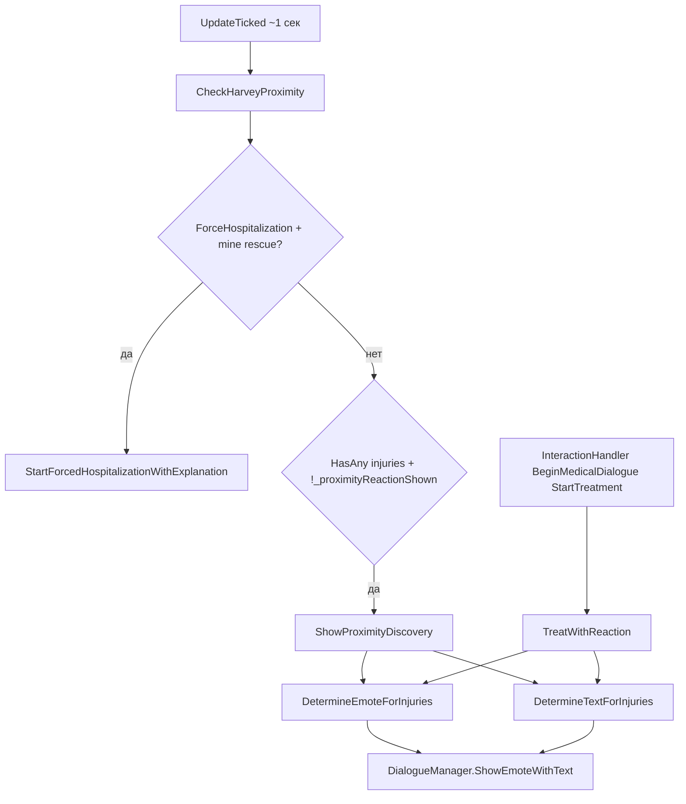

# Аудит proximity-реакций Харви на травмы

**Дата:** 2026-05-25  
**Задача:** проверить, что облачко при проходе рядом с Харви **не звучит как начатое лечение** — только заметил травму, обеспокоился, просит зайти в клинику. Полное лечение остаётся по клику через `InteractionHandler`.

**Код не менялся** — только аудит и предложения.

---

## Краткий вывод

| Проблема | Суть |
|----------|------|
| **Общий селектор** | `ShowProximityDiscovery` и `TreatWithReaction` (клик → `BeginMedicalDialogue`) вызывают **одни и те же** `DetermineEmoteForInjuries` + `DetermineTextForInjuries`. |
| **Ветка «начало лечения»** | Для большинства травм без критичности/3+ осложнений proximity получает `ForTreatmentStart` → `StartingTreatment` / `Examining` — явное «начинаю лечение / осматриваю». |
| **Осложнения в настоящем времени** | `WetBandage`, `WetStitches`, частично `DirtyWound` — Харви **уже делает** процедуру в тексте. |
| **Discovery-тексты** | Даже «обнаружение» (`FindInjury`, `CriticalInjury`, …) сформулировано как **взял контроль / осмотр сейчас / не мешай лечить**, а не «зайди в клинику». |
| **Эмоция по умолчанию** | `HarveyEmotes.StartTreatment` (улыбка) семантически = «начинаем лечение», не «заметил с расстояния». |

**Рекомендация по архитектуре (после аудита):** разделить выбор текста/эмоции для proximity и для `TreatWithReaction` (параметр `isProximity` или отдельные методы `Determine*ForDiscovery`). Одной правкой строк в `HarveyTextMessages` **нельзя** починить proximity, не сломав облачко при клике «начать лечение».

---

## Цепочка вызовов (proximity)



**Файлы:** `EventHandlers/PlayerEventHandler.cs` (720–783), `Managers/TreatmentManager.cs` (332–507), `Core/TextMessages.cs`, `Core/Emotes.cs`.

**Ограничение proximity:** `_proximityReactionShown` — одна реакция за период (сброс при смене локации/дня — см. код вокруг `_proximityReactionShown`).

**Смежный путь (не `CheckHarveyProximity`, тот же текст):** `TryApplyDirtyWoundFromMine` → `HarveyTextMessages.DirtyWound` (`PlayerEventHandler.cs` ~539).

---

## Логика `DetermineTextForInjuries` (какие тексты достаются proximity)

Порядок веток (`TreatmentManager.cs` 458–506):

1. Критическая `MainInjury` → `TextMessageSelector.ForInjuryDiscovery(critical)`
2. `Complications.Count >= 3` → `MultipleInjuries`
3. Серьёзная `MainInjury` **и** есть осложнения → `ForInjuryDiscovery(serious)`
4. Иначе по одному осложнению: `DirtyWound`, `WetBandage`, `WetStitches`, `AllergicRash`
5. Есть `MainInjury` → `ForTreatmentStart(hasComplications)` → `Examining` / `StartingTreatment`
6. Fallback → `StartingTreatment`

**Критические** (`IsCriticalInjury`): `buffConcussion`, `buffFracturedBone`, `buffInfectedWound`, `buffBadlyHurt`.

**Серьёзные** (`IsSeriousInjury`): shrapnel, burn, surgical, deep cuts, torn muscles + все критические.

**Не попадают в discovery-ветки** (типичный proximity → ветка 5): `buffHurt`, `buffSprainedAnkle`, `buffBruisedRibs`, `buffBackStrain`, любая серьёзная травма **без** осложнений, `buffPainFlare` (нет отдельной ветки — уходит в 5).

---

## Таблица: тексты, плохие для proximity-облачка

Условные колонки:
- **Достижимость proximity** — при каких травмах/осложнениях строка попадает в облачко.
- **Правка** — «только текст» = смена константы затронет и клик-лечение; «код» = нужно развести контексты.

### 1. Ветка «начало лечения» (главная проблема)

| Файл | Метод / константа | Текущий текст | Почему плохо для облачка | Предложенный текст (короткий) | Правка |
|------|-------------------|---------------|---------------------------|-------------------------------|--------|
| `Core/TextMessages.cs` | `HarveyTextMessages.StartingTreatment` | «Начинаю лечение. Расслабься и слушай мои советы.» | Прямое начало лечения; игрок ещё не кликал. | «Ты ранена. Зайди в клинику — помогу.» | **Код** (отдельная константа `Proximity_*` или параметр селектора; иначе сломается `TreatWithReaction`) |
| `Core/TextMessages.cs` | `HarveyTextMessages.Examining` | «Осматриваю тебя. Не отвлекайся, мне важно всё заметить.» | Настоящее время = осмотр уже идёт. | «Вижу, что-то не так. Приходи в клинику.» | **Код** (то же) |
| `Core/TextMessages.cs` | `TextMessageSelector.ForTreatmentStart` | см. выше | Вызывается из `DetermineTextForInjuries` для proximity (ветка 5). | Новый `ForProximityDiscovery(...)` без treatment-строк | **Код** |
| `Managers/TreatmentManager.cs` | `DetermineTextForInjuries` ветки 499–506 | — | Для обычной/серьёзной травмы без 3+ осложнений proximity **всегда** получает treatment-start. | Вызов discovery-селектора при `isProximity` | **Код** |

**Типичные сценарии proximity с плохим текстом:** `buffHurt`, растяжения, `buffDeepCuts` / `buffBurnWounds` без осложнений, лечение уже идёт (фазовый бафф) но облачко снова при новом осложнении — всё равно может уйти в 5, если осложнение не из списка 4.

---

### 2. Блок «обнаружение» (`ForInjuryDiscovery`) — тоже слишком «врач уже работает»

| Файл | Метод / константа | Текущий текст | Почему плохо для облачка | Предложенный текст | Правка |
|------|-------------------|---------------|--------------------------|-------------------|--------|
| `Core/TextMessages.cs` | `HarveyTextMessages.FindInjury` | «Я уже здесь. Сейчас всё осмотрю — слушай мои указания.» | «Сейчас осмотрю» = процедура началась на месте. | «Эй, ты ранена! Зайди в клинику.» | **Код** (отдельная proximity-константа; на клике можно оставить текущий тон) |
| `Core/TextMessages.cs` | `HarveyTextMessages.SeriousInjury` | «Ситуация серьёзная. Не спорь, я всё возьму под контроль.» | Захват контроля / лечение, не приглашение. | «Это серьёзно. Срочно в клинику!» | **Код** |
| `Core/TextMessages.cs` | `HarveyTextMessages.CriticalInjury` | «Это критично. Я займусь этим лично — делай, что я говорю.» | «Займусь лично» + приказы = уже лечит. | «Критично! Немедленно в клинику!» | **Код** |
| `Core/TextMessages.cs` | `HarveyTextMessages.MultipleInjuries` | «Много травм? Теперь слушай меня внимательно и не мешай лечить.» | Явно «не мешай **лечить**». | «Слишком много… Зайди в клинику, разберёмся.» | **Код** |
| `Core/TextMessages.cs` | `TextMessageSelector.ForInjuryDiscovery` | маршрутизирует 3 строки выше | Используется proximity при critical / serious+complications. | `ForProximityDiscovery` с мягкими строками | **Код** |

**Достижимость proximity:** критические травмы; серьёзная + ≥1 осложнение; ≥3 осложнения без приоритета «лёгкой» ветки.

---

### 3. Осложнения — настоящее время / действие «здесь и сейчас»

| Файл | Метод / константа | Текущий текст | Почему плохо для облачка | Предложенный текст | Правка |
|------|-------------------|---------------|--------------------------|-------------------|--------|
| `Core/TextMessages.cs` | `HarveyTextMessages.WetBandage` | «Повязка промокла — **меняю**. В следующий раз будь внимательнее.» | «Меняю» = лечение в процессе. | «Повязка промокла! Зайди в клинику.» | **Код** (или дублировать константу для proximity) |
| `Core/TextMessages.cs` | `HarveyTextMessages.WetStitches` | «Швы намокли. **Исправляю**, но впредь слушай мои советы.» | «Исправляю» = уже лечит. | «Швы намокли! Приходи в клинику.» | **Код** |
| `Core/TextMessages.cs` | `HarveyTextMessages.DirtyWound` | «Рану надо очистить. Не спорь, я знаю, что делаю.» | Императив очистки + «я знаю» = скоро/сейчас процедура. | «Рана грязная! В клинику — обработаем там.» | **Код** (тот же текст в шахте, `TryApplyDirtyWoundFromMine`) |
| `Core/TextMessages.cs` | `HarveyTextMessages.AllergicReaction` | «Аллергия? **Я разберусь**, но впредь сообщай о реакциях сразу.» | «Разберусь» без «в клинику» = лечение сейчас. | «Похоже на аллергию. Зайди в клинику.» | **Код** |

**Достижимость proximity:** при наличии соответствующего баффа осложнения (приоритет ветки 4 выше ветки 5, кроме случая 3+ осложений → `MultipleInjuries`).

---

## Эмоции (`HarveyEmotes` + `DetermineEmoteForInjuries`)

Proximity использует тот же `DetermineEmoteForInjuries`, что и `TreatWithReaction`.

| Файл | Константа / ветка | Значение | Проблема для proximity | Рекомендация | Правка |
|------|-------------------|----------|------------------------|--------------|--------|
| `Core/Emotes.cs` | `HarveyEmotes.StartTreatment` | `Emotes.Happy` (улыбка) | Fallback при «пустой» коллекции; семантика «начинаем лечение». | `HarveyEmotes.FindInjury` (`!`) или `WorriedAboutPatient` | **Код** (fallback только для proximity) |
| `Core/Emotes.cs` | `HarveyEmotes.StartTreatment` | — | Не используется в `DetermineEmoteForInjuries` напрямую, но имя вводит в заблуждение при рефакторинге. | Переименовать в `FriendlyConcern` / разделить Discovery vs Treatment | **Код** (косметика) |
| `Managers/TreatmentManager.cs` | default return `StartTreatment` | улыбка | См. выше. | `FindInjury` для discovery | **Код** |
| `Core/Emotes.cs` | `HarveyEmotes.CriticalInjury` | `Anger` | Для proximity допустимо (тревога), не про «лечу». | Оставить | — |
| `Core/Emotes.cs` | `HarveyEmotes.WorriedAboutPatient` | `Sad` | Подходит (беспокойство). | Оставить | — |
| `Core/Emotes.cs` | `HarveyEmotes.FoundComplication` | `Question` | Подходит. | Оставить | — |
| `Core/Emotes.cs` | `HarveyEmotes.DirtyWound` | `!` | Подходит для грязной раны. | Оставить | — |
| `HarveyHelper.GetCaringEmote()` | ♥ при dating/married | На proximity при одной травме — забота, **не** «лечение». | Оставить (по желанию ослабить на 0–2♥ — отдельный тон-аудит) | опционально |

---

## Что proximity **не** делает (подтверждение)

| Проверка | Результат |
|----------|-----------|
| Начинает лечение? | **Нет** — нет вызовов `ApplyTreatmentForInjury`, `BeginMedicalDialogue`, смены фаз/баффов. |
| Только облачко? | **Да** — `ShowEmoteWithText` (~3 с). |
| Принудительная госпитализация | Отдельная ветка в `CheckHarveyProximity` (mine rescue) — **не** `ShowProximityDiscovery`. |
| Полный диалог лечения | `InteractionHandler` + `BuildCombinedDialogue` (в т.ч. CP `Proximity_*` в **диалоге по клику**, не в этом облачке). |

---

## Константы `HarveyTextMessages`, не используемые в proximity-селекторе

Через `DetermineTextForInjuries` **не** попадают (но могут использоваться в других системах — госпитализация, recovery, neglect):

`Processing`, `ApplyingBandage`, `GivingMedicine`, `FoundComplication`, `Infection`, `NeedHospitalization`, `StayInBed`, `DontMove`, `RestRequired`, `NotTreating`, `Worried`, `Disappointed`, `DangerousIgnoring`, `GoodProgress`, `AlmostHealed`, `FullRecovery`, `Congratulations`, `BeCareful`, `TakeCare`, `ImHere`, `DontWorry`, `EveryThingWillBeOk`, `Emergency`, `Dangerous`, `CallAmbulance`, `SitDown`, `LieDown`, …  

Их **не** включали в таблицу проблем proximity, если только тот же текст не дублируется в смежном вызове (`DirtyWound` в шахте).

---

## Сводка по типу правки

| Категория | Кол-во строк | Только текст | Нужен код |
|-----------|--------------|--------------|-----------|
| Treatment-start (`StartingTreatment`, `Examining`, ветки 5–6) | 2 константы + селектор | ❌ сломает клик | ✅ |
| Discovery (`FindInjury`, `SeriousInjury`, `CriticalInjury`, `MultipleInjuries`) | 4 константы | ❌ сломает клик, если общие | ✅ раздельные `Proximity_*` |
| Осложнения (4 константы) | 4 | ❌ шахта + клик | ✅ |
| Эмоция fallback `StartTreatment` | 1 | — | ✅ |

**Минимальный план реализации (после утверждения):**

1. `DetermineTextForInjuries(InjuryCollection injuries, bool forProximity)` или `DetermineTextForProximityDiscovery`.
2. `DetermineEmoteForInjuries` — аналогично.
3. `HarveyTextMessages` — блок `// Proximity discovery (облачко, не лечение)` с 8–12 короткими строками.
4. `TextMessageSelector.ForProximityDiscovery(...)` — зеркало веток `TreatmentManager`, без `ForTreatmentStart`.
5. `ShowProximityDiscovery` → новые методы; `TreatWithReaction` → старые.

**Тон:** для 0–2♥ в новых строках предпочтительно «Вы» / «зайдите в клинику» (см. [audit-relationship-tone.md](./audit-relationship-tone.md)) — отдельная задача градации по сердцам, в этой таблице примеры на «ты» как в текущем коде.

---

## Справка: ключевые фрагменты кода

**Proximity не лечит:**

```773:783:EventHandlers/PlayerEventHandler.cs
        private void ShowProximityDiscovery(NPC harvey, Core.Models.InjuryCollection injuries)
        {
            int emote = _treatmentManager.DetermineEmoteForInjuries(injuries);
            string textMessage = _treatmentManager.DetermineTextForInjuries(injuries);
            _dialogueManager.ShowEmoteWithText(harvey, emote, textMessage);
        }
```

**Общий селектор с кликом-лечением:**

```332:350:Managers/TreatmentManager.cs
        public void TreatWithReaction(NPC harvey, InjuryCollection injuries)
        {
            int emote = DetermineEmoteForInjuries(injuries);
            string textMessage = DetermineTextForInjuries(injuries);
            _dialogueManager.ShowEmoteWithText(harvey, emote, textMessage);
        }
```

**Ветка treatment-start в селекторе текста:**

```499:506:Managers/TreatmentManager.cs
            if (injuries.MainInjury != null)
            {
                return TextMessageSelector.ForTreatmentStart(injuries.Complications.Count > 0);
            }
            return HarveyTextMessages.StartingTreatment;
```

---

## Чеклист для ручной проверки после правок

- [ ] `buffHurt` без осложнений: облачко просит клинику, без «начинаю лечение».
- [ ] `buffDeepCuts` без осложнений: то же.
- [ ] `buffConcussion`: тревога + клиника, без «займусь лично» в облачке.
- [ ] `buffWetBandage` / `buffDirtyWound`: нет «меняю» / «исправляю» в облачке.
- [ ] Клик по Харви → `TreatWithReaction`: по-прежнему допустимы «осматриваю» / «начинаю лечение» (если оставлены отдельные константы).
- [ ] Грязная рана в шахте: текст согласован с proximity или осознанно отличается.
- [ ] Повторный проход мимо Харви в тот же день: облачко не спамит (`_proximityReactionShown`).
