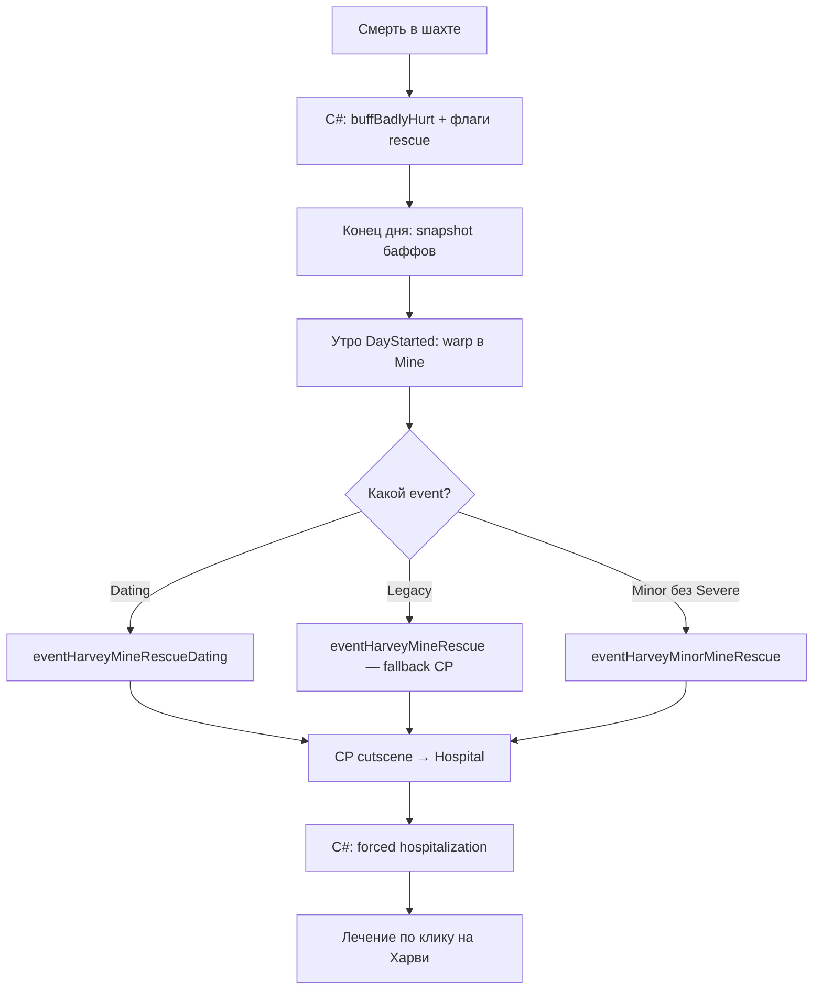
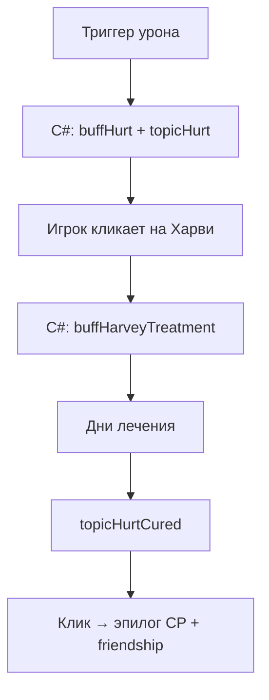
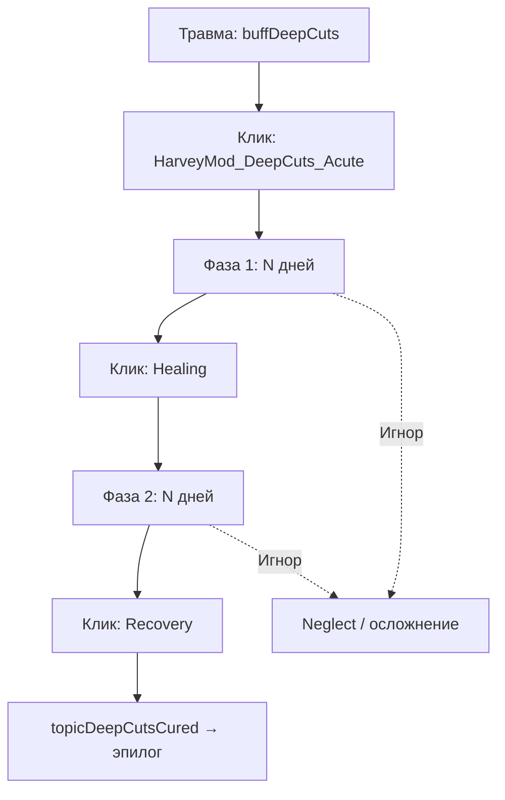
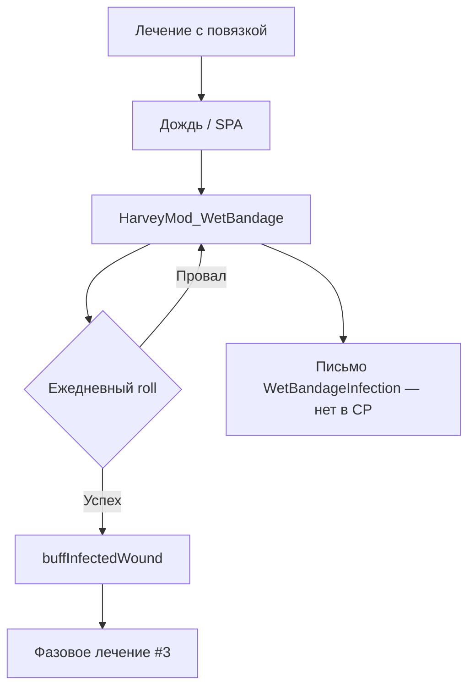
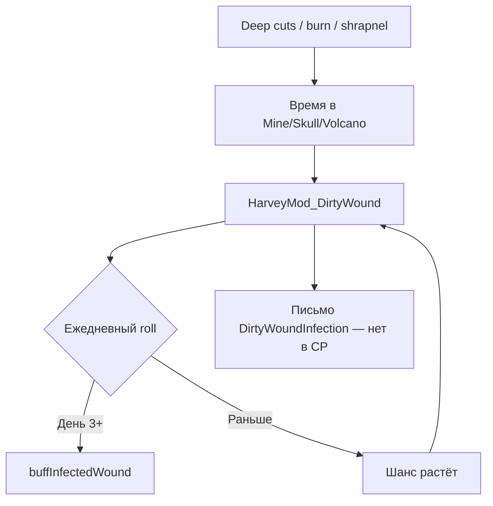
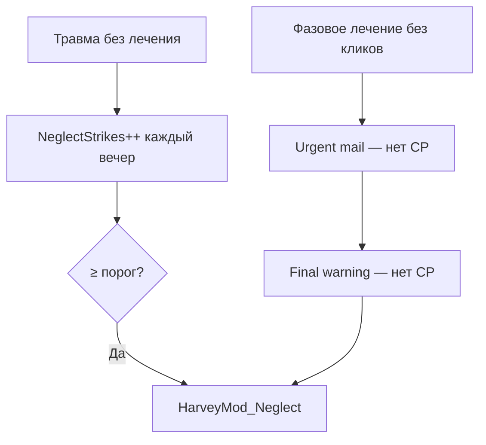
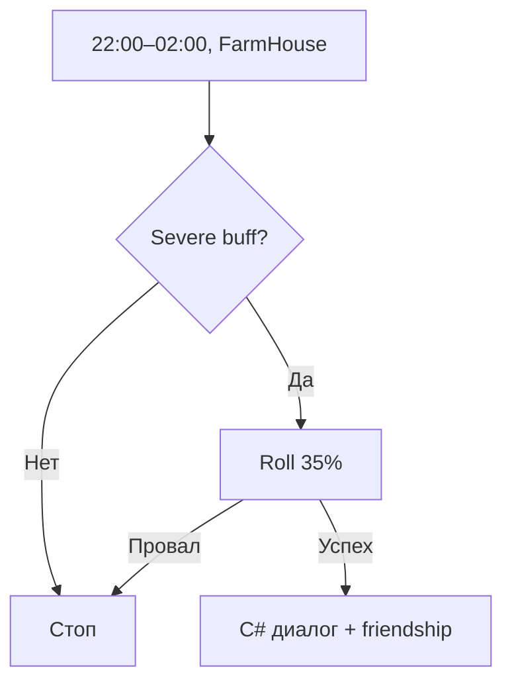
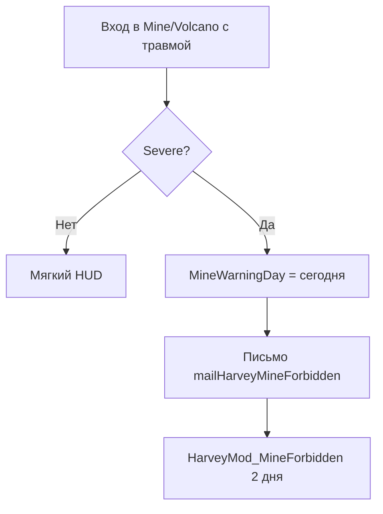
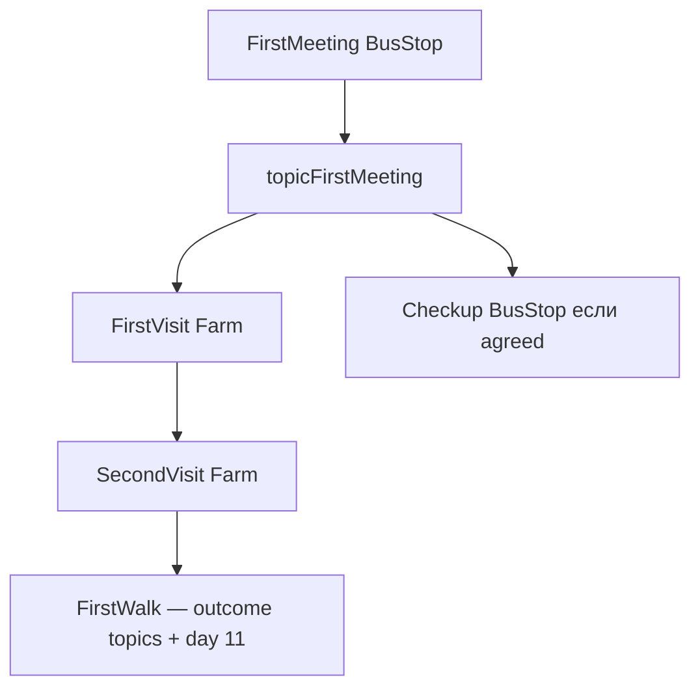
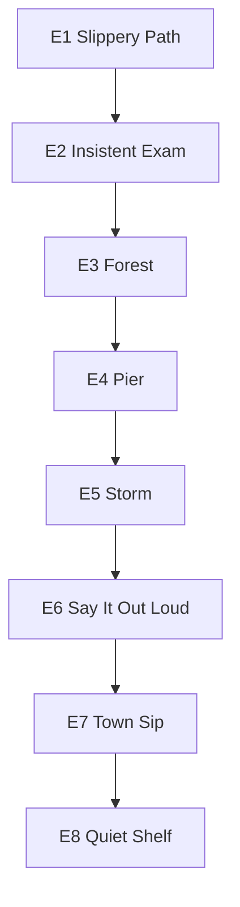

# Аудит событий HarveyOverhaul InjuryCare

Сводный отчёт для **автора мода** и **программиста**. Объединяет инвентаризацию content pack (CP) и SMAPI-мода InjuryCare.

**Дата аудита:** май 2026 · **Актуализация:** **2026-05-24** (после CP/C# sync + launchers)  
**Активные источники CP:** `events.json`, `eventsCare.json`, `eventsMineRescue.json` (через `content.json`)  
**Не подключено:** `events_for_mode_new_formatted.json`, закомментированные `triggersInjury.json` / `triggersStress.json`

Подробные черновики: [docs/events-inventory/](events-inventory/README.md) · отчёт о правках: [harvey-events-fix-report.md](harvey-events-fix-report.md) · тон/контакт: [harvey-relationship-visits-audit/](harvey-relationship-visits-audit/README.md)

---

## 1. Краткий вывод

| Показатель | Значение | Пояснение |
|---|---:|---|
| **Событий найдено** | **47** уникальных ID в активном CP | +3 split (`NightCrisis_*`, `BirthdayHospital_*`, `MedicalCheck_Dating`); −3 legacy single-ID; плюс 3 `MyMod_*` вне content.json |
| **Корректных (✅)** | **30** | Запускаются при типичной игре, без логических блокеров |
| **С рисками (⚠️)** | **15** | Узкое окно, Random, BETAS, BusStop/Hospital mismatch, Married vs Dating |
| **Недостижимых (❌)** | **2** | Orphan scripts: `eventHarveyTreatmentCollapse`, `eventStayInHospital` |
| **Мёртвый контент** | **3** | `events_for_mode_new_formatted.json` не в content.json |

### Главные проблемы (актуально 2026-05-24)

1. ~~**Разрыв C# ↔ CP по письмам (4 mail)**~~ — **✅ закрыто** — все 7 C# mail ID в CP.
2. ~~**Травмы «один раз за сейв» (AppliedTriggers)**~~ — **✅ частично** — repeatable injuries через `InjuryCooldownUntilDay`; story triggers (`SurgicalWound`, `ExplosionInjury`) остаются one-shot.
3. ~~**Штормовые сцены недостижимы**~~ — **✅ закрыто** — `StormComfortLauncher` ставит `buffStressThunder` или `topicHarveyStormStress`.
4. ~~**Pass-out без кат-сцен**~~ — **✅ закрыто** — `PassOutHandler.QueueHospitalEvent` → `eventHarveyEmergencyCare` / `eventHarveyExhaustion`.
5. ~~**Minor mine rescue недостижим**~~ — **✅ закрыто** — `TryTriggerMinorMineRescue` при опасном состоянии без Severe.
6. ~~**Orphan `topicDiagnosisComplete`**~~ — **✅ закрыто** — C# `TryAddDiagnosisCompleteTopic`.
7. ~~**Orphan `topicRescueOperation`**~~ — **✅ закрыто** — `RescueOperationLauncher` после E5.
8. **⚠️ Открыто:** `topicHarveyMinorMineRescue` — нет CP dialogue key; mine interception phase buff mismatch; night visit без dating gate.

### Исправлено (2026-05-23 — 2026-05-24)

- **Care-цепочка Farm:** SecondVisit / FirstWalk — gate на outcome-topics ✅
- **Split по отношениям:** NightCrisis, Birthday, MedicalCheck ✅
- **`HarveyMod_FirstTreatment`:** C# `topicHarveyNeedsFirstTreatment` ✅
- **Mine rescue (C#):** Dating/Married; `topicMineRescuePending`; minor rescue path ✅
- **Story E1–E8:** линейная цепочка + CD topics ✅
- **Mail sync:** 7/7 C# mail в CP ✅
- **Storm comfort launcher:** `StormComfortLauncher` ✅
- **Rescue operation launcher:** `RescueOperationLauncher` ✅
- **Diagnosis complete topic:** `TryAddDiagnosisCompleteTopic` ✅
- **Pass-out hospital events:** `QueueHospitalEvent` ✅
- **Repeatable injuries:** cooldown policy вместо permanent AppliedTriggers ✅

---

## 2. Карта событий

**Легенда статуса:** ✅ корректно · ⚠️ риск · ❌ недостижимо · 💀 не в content.json

**Легенда повторяемости:** 🔒 one-shot (`eventsSeen` / AppliedTriggers) · 🔁 random entry · ♻️ repeatable (с cooldown) · 📅 topic/mail chain

| ID | Тип | Локация | Источник | Запуск | Условия (кратко) | Повторяемость | Статус |
|---|---|---|---|---|---|---|---|
| `eventHarveyMineRescueDating` | Cutscene | Mine | `eventsMineRescue.json` | C# `PassOutHandler` | Dating/married, severe, шахтная смерть | 🔒 | ✅ |
| `eventHarveyMineRescue` | Cutscene | Mine | `eventsMineRescue.json` | C# fallback | Legacy severe; C# skip без Dating | 🔒 | ⚠️ |
| `eventHarveyMinorMineRescue` | Cutscene | Mine | `eventsMineRescue.json` | C# `TryTriggerMinorMineRescue` | Опасное состояние без Severe + Dating | 🔒 | ✅ |
| `eventHarveyMineInterception` | Cutscene | Mine | `eventsCare.json` | SpaceCore trigger | Dating/married + injury buff из списка CP | ♻️ (каждый вход) | ⚠️ |
| `eventHarveySkullCavePrevention` | Cutscene | SkullCave | `eventsCare.json` | SpaceCore trigger | Dating+; warning-trigger сломан | ♻️ | ⚠️ |
| `eventHarveyFirstMeeting` | Story | BusStop | `eventsCare.json` | Vanilla entry | `!PLAYER_HAS_MET Harvey` | 🔒 | ✅ |
| `eventHarveyCheckup` | Care | BusStop* | `eventsCare.json` | Vanilla entry | `topicAgreedCheckup`; скрипт — координаты Hospital | 🔒 | ⚠️ |
| `eventHarveyFirstVisit` | Care | Farm | `eventsCare.json` | Vanilla entry | `topicFirstMeeting`, day≥3 | 🔒 | ✅ |
| `eventHarveySecondVisit` | Care | Farm | `eventsCare.json` | Vanilla entry | day≥7, seen first visit, !outcome topics | 🔒 | ✅ |
| `eventHarveyFirstWalk` | Romance | Farm | `events.json` | Vanilla entry | Sunny, day≥11, seen second visit, !outcome topics | 🔒 | ✅ |
| `eventHarveyCheckFarmerOutsideAfter22` | Care | Farm | `events.json` | Vanilla entry | Topic от C# pass-out + dating/married | 🔒 | ⚠️ |
| `eventHarveyMorningCheckup` | Care | Farm | `events.json` | Vanilla entry | Mandatory topic; **только Dating** | 🔒 | ⚠️ |
| `eventHarveyCheckHealthFarmer` | Care | Farm | `events.json` | Vanilla entry | `PlayerKilled` + Dating | 🔒 | ⚠️ |
| `eventHarveyEmergencyCare` | Emergency | Hospital | `eventsCare.json` | C# `PassOutHandler` | Critical pass-out | 🔒 | ✅ |
| `eventHarveyExhaustion` | Emergency | Hospital | `eventsCare.json` | C# `PassOutHandler` | Exhaustion pass-out | 🔒 | ✅ |
| `eventHarveyTreatmentCollapse` | Emergency | Hospital | `events.json` | — | Orphan script | 🔒 | ❌ |
| `eventStayInHospital` | Hospital | Hospital | `events.json` | — | Заменено C# hosp | 🔒 | ❌ |
| `eventHarveyMedicalCheck` | Hospital | Hospital | `events.json` | Vanilla + mail trigger | 6♥, sunny, mail, !Dating | 🔁 mail | ✅ |
| `eventHarveyMedicalCheck_Dating` | Hospital | Hospital | `events.json` | Vanilla + mail trigger | 6♥, mail, Dating/Married | 🔁 mail | ✅ |
| `eventHarveyTraumaExam` | Hospital | Hospital | `events.json` | Vanilla entry | 8♥ | 🔒 | ✅ |
| `HarveyMod_FirstTreatment` | Hospital | Hospital | `events.json` | Vanilla entry | 3♥, `topicHarveyNeedsFirstTreatment` (C#) | 🔒 | ✅ |
| `HarveyMod_NightCrisis_Dating` | Hospital | Hospital | `events.json` | Vanilla entry | 6♥, night, Dating/Married, seen FirstTreatment | 🔒 | ✅ |
| `HarveyMod_NightCrisis_PreDating` | Hospital | Hospital | `events.json` | Vanilla entry | 6♥, night, !Dating, seen FirstTreatment | 🔒 | ✅ |
| `HarveyMod_BirthdayHospital_Dating` | Hospital | Hospital | `events.json` | Vanilla entry | 8♥, 9 summer, Dating/Married | 🔒 | ⚠️ |
| `HarveyMod_BirthdayHospital_Friend` | Hospital | Hospital | `events.json` | Vanilla entry | 8♥, 9 summer, !Dating | 🔒 | ⚠️ |
| `HarveyMod_TreatmentPlanMeeting` | Hospital | Hospital | `events.json` | Vanilla entry | `topicDiagnosisComplete` (C#) | 🔒 | ✅ |
| `HarveyOverhaulStory.E1` | Story arc | BusStop | `events.json` | Vanilla entry | Wind, 2♥ (500), !seen E1 | 🔒 + CD | ✅ |
| `HarveyOverhaulStory.E2` | Story arc | Hospital | `events.json` | Vanilla entry | Seen E1, 3♥ (750) | 🔒 + CD | ✅ |
| `HarveyOverhaulStory.E3` | Story arc | Forest | `events.json` | Vanilla entry | Thu–Sat, 4♥, seen E2 | 🔒 + CD | ⚠️ |
| `HarveyOverhaulStory.E4` | Story arc | Beach | `events.json` | Vanilla entry | Seen E3, evening | 🔒 + CD | ✅ |
| `HarveyOverhaulStory.E5` | Story arc | Hospital | `events.json` | Vanilla entry | Storm, 6♥, seen E4 | 🔒 + CD | ⚠️ |
| `HarveyOverhaulStory.E6` | Story arc | Hospital | `events.json` | Vanilla entry | 7♥, seen E5 | 🔒 + CD | ⚠️ |
| `HarveyOverhaulStory.E7` | Story arc | Town | `events.json` | Vanilla entry | 8♥, sunny, seen E6 | 🔒 + CD | ✅ |
| `HarveyOverhaulStory.E8` | Story arc | ArchaeologyHouse | `events.json` | Vanilla entry | Sat, 8♥, seen E7 | 🔒 + CD | ⚠️ |
| `eventHarveyFirstDate` | Romance | Forest | `events.json` | Vanilla entry | Dating, 8♥, evening | 🔒 | ✅ |
| `eventHarveyMountainDate` | Romance | Mountain | `events.json` | Vanilla entry | Dating, 9♥, morning | 🔒 | ✅ |
| `eventHarveyPropose` | Romance | Beach | `events.json` | Vanilla entry | Dating, 10♥, evening | 🔒 | ✅ |
| `eventHarveyRoomCheckup` | Romance | HarveyRoom | `events.json` | Vanilla entry | 6♥, без dating gate | 🔒 | ✅ |
| `eventHarveyRoomCheckup2` | Romance | HarveyRoom | `events.json` | Vanilla entry | Dating + BETAS mod | 🔒 | ⚠️ |
| `eventHarveyLateNightCollapse` | Emergency | Town | `events.json` | Vanilla entry | 24:00–26:00 | 🔁 | ⚠️ |
| `eventHarveyStormComfortFarm` | Comfort | Farm | `events.json` | Vanilla + C# launcher | Storm + buff/topic gate | 🔁 | ✅ |
| `eventHarveyStormComfortForest` | Comfort | Forest | `events.json` | Vanilla + C# launcher | То же | 🔁 | ✅ |
| `eventHarveyStormComfortTown` | Comfort | Town | `events.json` | Vanilla + C# launcher | То же | 🔁 | ✅ |
| `eventHarveyStormComfortMine` | Comfort | Mine | `events.json` | Vanilla + C# launcher | То же | 🔁 | ✅ |
| `eventHarveyStormComfortMountain` | Comfort | Summit | `events.json` | Vanilla + C# launcher | То же + SVE | 🔁 | ✅ |
| `eventHarveyStormComfortDesert` | Comfort | Desert | `events.json` | Vanilla + C# launcher | То же | 🔁 | ✅ |
| `eventRescueOperation` | Story | Woods | `events.json` | Vanilla + C# launcher | `topicRescueOperation` | 🔒 | ✅ |
| `MyMod_HarveyStormComfortForest` | Comfort | Forest | `events_for_mode…` | — | Не загружается | — | 💀 |
| `MyMod_HarveyStressTiredCheck` | Care | Hospital | `events_for_mode…` | — | Не загружается | — | 💀 |
| `MyMod_HarveyUrgentFarmVisit` | Care | Farm | `events_for_mode…` | — | Не загружается | — | 💀 |

**C# без CP-event (важно для автора):** лечение по клику, ночной визит, госпитализация, phase transitions, wet/dirty complications — это **диалоги и buff/topic**, не cutscene events.

---

## 3. Событийные цепочки

### Шахтная смерть → спасение → госпитализация

**Когда:** dating/married с Харви, HP = 0 в Mine, не exhaustion.



Игрок видит кат-сцену спасения и оказывается в клинике **только при Dating/Married** (C# skip иначе). Minor-ветка: `TryTriggerMinorMineRescue` при опасном состоянии без Severe (2026-05-24). Topic `topicMineInjuryRescue` может быть снят при warp (см. H7).

---

### Лёгкая травма → лечение → выздоровление

**Пример:** `buffHurt` (порез, ушиб).



После первого срабатывания триггер `triggerHurt` помечается навсегда — **повторная лёгкая травма того же типа невозможна** (см. раздел 7).

---

### Фазовая травма (Deep Cuts и др.)



Три фазы лечения с кликами по Харви. Имена диалогов в CP (`PhaseTransition_*`) и C# (`topicDeepCutsPhaseAcute`) **не совпадают** — часть текстов может не показаться.

---

### Мокрая повязка → инфекция



---

### Грязная рана в шахте → инфекция



---

### Небрежность лечения



---

### Ночной визит Харви



Не CP-event: короткий диалог из C#. Нет проверки dating — ночной визит в спальню возможен без романтических отношений.

---

### Запрет шахты при тяжёлой травме



---

### Care-цепочка на автобусной и ферме (CP-only)



Topics создаёт **сам event script**, не C#. C# pass-out chain (`topicPassedOutInTown`) — отдельная ветка для dating/married. **2026-05-23:** gate SecondVisit/FirstWalk переведён на outcome-topics `*Agree/Neutral/Refused`.

---

### Story arc E1–E8



Линейная цепочка после правок: каждый шаг требует `seen` предыдущего. Cooldown topics `HarveyMod_CD_*` ограничивают частоту. Полностью на CP — C# не участвует.

---

## 4. Проверка достижимости

| Event/Scene | Достижимо? | Что нужно | Кто создаёт условия | Проблема |
|---|---|---|---|---|
| `eventHarveyMineRescueDating` | ✅ Да | Dating, шахтная смерть | C# PassOutHandler | Повтор → только topic |
| `eventHarveyMineRescue` | ⚠️ Fallback | Legacy severe; C# без Dating **не запускает** rescue | C# PassOutHandler | Dating-only by design |
| `eventHarveyMinorMineRescue` | ✅ Да | Опасное состояние без Severe + Dating | C# `TryTriggerMinorMineRescue` | Dialogue key отсутствует |
| `eventHarveyMineInterception` | ⚠️ Частично | Dating + SpaceCore + buff | CP trigger | Фазовые buff ID не в списке CP |
| `eventHarveySkullCavePrevention` | ⚠️ Частично | Dating + SpaceCore | CP trigger | Warning-trigger: локация `Mine SkullCave` |
| `eventHarveyFirstMeeting` | ✅ Да | Первый визит BusStop | CP precondition | Дубль в двух JSON |
| `eventHarveyCheckup` | ⚠️ Частично | BusStop precondition, скрипт Hospital (5,9) | CP Target mismatch | Перенести на `Data/Events/Hospital` |
| `eventHarveyFirstVisit` | ✅ Да | `topicFirstMeeting` | CP first meeting | — |
| `eventHarveySecondVisit` | ✅ Да | day≥7, seen first visit, !outcome topics first visit | CP | — |
| `eventHarveyFirstWalk` | ✅ Да | day≥11, Sunny, seen second visit, !outcome topics second visit | CP | — |
| `eventHarveyEmergencyCare` | ✅ Да | Critical pass-out | C# `QueueHospitalEvent` | — |
| `eventHarveyExhaustion` | ✅ Да | Exhaustion pass-out | C# `QueueHospitalEvent` | — |
| `eventHarveyTreatmentCollapse` | ❌ Нет | — | — | Orphan |
| `eventStayInHospital` | ❌ Нет | — | C# hosp вместо event | Orphan |
| `HarveyMod_TreatmentPlanMeeting` | ✅ Да | `topicDiagnosisComplete` от C# | `TryAddDiagnosisCompleteTopic` | — |
| `eventHarveyStormComfort*` (×6) | ✅ Да | Storm + C# buff/topic gate | `StormComfortLauncher` | Random — CD topic есть |
| `eventRescueOperation` | ✅ Да | `topicRescueOperation` от C# | `RescueOperationLauncher` | — |
| `eventHarveyLateNightCollapse` | ⚠️ Частично | Town 24:00–26:00 | CP entry | BETAS trigger отключён |
| `eventHarveyMorningCheckup` | ⚠️ Частично | Topic + Dating | C# + CP | Married исключён из event |
| Story E1–E8 | ✅/⚠️ | Hearts, погода, CD, линейный seen | CP | E3/E5/E6/E8 — узкие окна; E7/E8 после правок линейны |
| Romance dates | ✅ | Dating + hearts | CP | — |
| C# night visit | ✅ | Severe + home + roll | C# | Нет dating gate |
| C# treatment click | ✅ | Любая травма | C# | Не event — диалог |

---

## 5. Проверка отношений с Харви

Шкала: 250 pts = 1♥. В CP `Dating` и `Married` часто в одном gate — **отдельных married-текстов почти нет**.

| Event/Scene | До dating | Dating | Married | Рекомендация по тону |
|---|---|---|---|---|
| `eventHarveyFirstMeeting` | ✅ Gate | — | — | Смягчить pet names для незнакомца; «Вы» |
| Care visits (1st/2nd) | ✅ | — | — | Сосед-врач — OK |
| `eventHarveyFirstWalk` | ❌ Нет gate | Стадия 2 | Прогулка | ✅ Достижимо; тон смягчён (вар. B) | Опционально dating gate для романт. fork |
| Story E1–E2 | ✅ | — | — | Профессиональный тон — OK | E2: контроль смягчён |
| Story E3–E4 | ⚠️ 4–5♥ без dating | Стадия 2 | Забота | Тон смягчён (E4 «хорошая девочка» → med) | — |
| Story E5–E6 | ⚠️ 6–7♥ без dating | Pre-dating story | Близость | **Текст** переписан под врача; gate Dating не добавляли | OK по дизайну E-дуги |
| `HarveyMod_FirstTreatment` | ⚠️ 3♥ | Стадия 2 (med) | Осмотр | Pet names убраны; контакт с согласием | C# topic `topicHarveyNeedsFirstTreatment` |
| `HarveyMod_NightCrisis_Dating` | — | **Dating** | Объятия | Split ✅ | — |
| `HarveyMod_NightCrisis_PreDating` | ⚠️ 6♥ | Стадия 2 | Ночной кризис | Проф. тон без объятий | Split ✅ |
| `eventHarveyTraumaExam` | ⚠️ 8♥ | Dating | Dating | Глубоко личное |
| Mine rescue dating | — | ✅ | ✅ (тот же текст) | Добавить married-ветку |
| Mine rescue legacy | Med для всех | C# требует dating | — | Non-dating: холоднее med script |
| Mine interception | — | ✅ | ✅ | «Моё слово закон» — OK при dating |
| Storm comfort (×6) | ⚠️ 3♥ | Pre-dating med tone | Married fork | Тон med (вар. B); **buff gate** всё ещё блокирует | C# buff или убрать gate |
| `eventRescueOperation` | ⚠️ 2.4♥ | Dating для hug | — | Травма-intimacy слишком рано |
| `eventHarveyRoomCheckup` | ⚠️ 6♥ | Dating | Dating | Домашний осмотр |
| Romance dates / propose | — | ✅ | — | OK |
| C# night visit | ⚠️ Нет gate | Dating | Married | Спальня без romance gate |
| C# treatment click | ✅ Med всегда | Opt. `$l` | Opt. | Оставить медицинским |
| `eventHarveyLateNightCollapse` | ⚠️ Нет gate | Dating для «60 сек» | Married | Fork med / personal |

---

## 6. Проверка C# ↔ CP ID

Сводка по **837** ID (buff, topic, mail, event, trigger). Критичных разрывов mail/topic: **0** (2026-05-24). Остаются MEDIUM: phase buff mismatch (mine interception), minor rescue dialogue.

| ID | Тип | C# | CP | Статус |
|---|---|---|---|---|
| `HarveyMod_DirtyWoundInfection` | mail | `addMailForTomorrow` | ✅ Mail | ✅ OK |
| `HarveyMod_WetBandageInfection` | mail | `addMailForTomorrow` | ✅ Mail | ✅ OK |
| `HarveyMod_TreatmentUrgentReminder` | mail | `ComplicationManager` | ✅ Mail | ✅ OK |
| `HarveyMod_TreatmentFinalWarning` | mail | `ComplicationManager` | ✅ Mail | ✅ OK |
| `buffStressThunder` | buff | C# `StormComfortLauncher` | CP preconditions storm | ✅ OK |
| `topicDiagnosisComplete` | topic | C# `TryAddDiagnosisCompleteTopic` | CP TreatmentPlanMeeting | ✅ OK (event gate, dialogue optional) |
| `topicRescueOperation` | topic | C# `RescueOperationLauncher` | CP eventRescueOperation | ✅ OK |
| `topicFirstMeeting` и care topics | topic | ❌ | CP care chain | ✅ CP-only (script ставит topics) |
| `topicHarveyNeedsFirstTreatment` | topic | C# InjuryManager | CP FirstTreatment | ✅ Sync OK |
| `topic*PhaseAcute` (C# format) | topic | `GetPhaseTopicId` | dialogues + alias block1 | ✅ OK (incl. Cold phases) |
| `PhaseTransition_*` | dialogue key | ❌ не создаёт | CP injury JSON | ⚠️ Legacy схема |
| `buffDeepCuts` vs `HarveyMod_DeepCuts_Acute` | buff | Phase buffs | CP triggers: base ID | ⚠️ Mine interception mismatch |
| Phase buffs (все) | buff | `GetPhaseBuffId` | buffsInjury/buffsCure | ✅ Sync OK |
| C# event IDs (mine rescue) | event | PassOutHandler | eventsMineRescue.json | ✅ Все найдены |
| `mailHarveyMineForbidden` | mail | C# DayEnding | mailInjury.json | ✅ OK |
| `mailHarveyAfterMineRescue` | mail | CP script | Mail CP | ✅ OK |
| Trigger IDs `{ModId}_trigger*` | trigger | 16 | CP TriggerActions 18 | ⚠️ 2 только в CP |

---

## 7. Найденные проблемы

### Critical

#### C1. Письма осложнений без текста в CP

**Статус: ✅ ИСПРАВЛЕНО (2026-05-23)** — все 7 C# mail ID имеют CP entries.

#### C2. AppliedTriggers блокирует повтор травм

**Статус: ✅ ЧАСТИЧНО ИСПРАВЛЕНО (2026-05-24)** — repeatable injuries используют `InjuryCooldownUntilDay` (residual 2 д после cure). Story triggers (`SurgicalWound`, `ExplosionInjury`) остаются one-shot через `AppliedTriggers`.

#### C3. Storm comfort недостижим

**Статус: ✅ ИСПРАВЛЕНО (2026-05-24)** — `StormComfortLauncher.TryDailyStormComfortRoll` ставит `buffStressThunder` или fallback `topicHarveyStormStress`.

#### C4. Emergency / exhaustion pass-out без cutscene

**Статус: ✅ ИСПРАВЛЕНО (2026-05-24)** — `PassOutHandler.QueueHospitalEvent` запускает CP events.

---

### High

#### H1. Minor mine rescue

**Статус: ✅ ИСПРАВЛЕНО (2026-05-24)** — `TryTriggerMinorMineRescue` при опасном состоянии без Severe. **Остаётся:** добавить CP dialogue `topicHarveyMinorMineRescue`.

#### H2. Фазовые buff vs CP trigger (mine interception)

| | |
|---|---|
| **Симптом** | Interception не играет при лечении `HarveyMod_DeepCuts_Acute`. |
| **Причина** | CP trigger проверяет `buffDeepCuts`, C# заменяет на phase buff. |
| **Где** | `triggersCare.json`; `TreatmentManager` |
| **Исправление** | Добавить phase IDs в Condition **или** `PLAYER_HAS_CONVERSATION_TOPIC`. |
| **Регрессия** | Низкая. |

#### H3. `eventHarveyFirstWalk` — конфликт preconditions

| | |
|---|---|
| **Статус** | ✅ **Исправлено 2026-05-23** — gate на outcome-topics + `!seen` + `DAYS_PLAYED 11`. |
| **Было** | Precondition `!topicHarveySecondVisit`, но second visit ставил topic на 10 д. |
| **Где** | CP `events.json` + `eventsCare.json` — см. [01-early-farm-visit-chain.md](harvey-relationship-visits-audit/01-early-farm-visit-chain.md) |

#### H4. Orphan topics блокируют events

| | |
|---|---|
| **Статус** | ✅ **Исправлено 2026-05-24** — `TryAddDiagnosisCompleteTopic` + `RescueOperationLauncher` создают topics перед CP events. |
| **Было** | `topicDiagnosisComplete`, `topicRescueOperation` нигде не создавались → TreatmentPlanMeeting / RescueOperation не стартовали. |
| **Где** | `RescueOperationLauncher.cs`, `ComplicationManager.cs` → CP preconditions |

#### H5. Романтика без dating-gate (E4–E6, storm, FirstTreatment)

| | |
|---|---|
| **Статус** | ⚠️ **Частично исправлено 2026-05-23–24** — split NightCrisis/Birthday/MedicalCheck; смягчение текстов (вар. B); FirstTreatment через C# topic; storm comfort через `StormComfortLauncher`. |
| **Остаётся** | Night visit без dating gate (H6); Married ≠ Dating в тексте. |
| **Где** | CP `events.json`, `TimeEventHandler.cs`, `docs/harvey-relationship-visits-audit/` |

#### H6. C# night visit без relationship gate

| | |
|---|---|
| **Симптом** | Харви стучит ночью в спальню без dating. |
| **Причина** | `TimeEventHandler.CheckNightVisit` — только Severe + location. |
| **Где** | `TimeEventHandler.cs` |
| **Исправление** | `IsDatingOrMarriedToHarvey()`. |
| **Регрессия** | Низкая — design choice. |

#### H7. `topicMineInjuryRescue` снимается рано

| | |
|---|---|
| **Симптом** | CP-диалоги по topic не срабатывают после rescue. |
| **Причина** | `PlayerEventHandler` RemoveTopic при warp Hospital. |
| **Где** | `PlayerEventHandler.cs`, `HospitalizationManager` |
| **Исправление** | Снимать topic после cutscene/диалога, не при warp. |
| **Регрессия** | Средний — повторные триггеры по topic. |

---

### Medium

#### M1. Morning checkup исключает Married

Topic ставится для Dating **и** Married (after22), event — только Dating. Добавить Married в precondition или отдельный event.

#### M2. Phase dialogue naming (две схемы)

C#: `topicDeepCutsPhaseAcute`; CP legacy: `PhaseTransition_DeepCuts_2`. Часть текстов не показывается. Унифицировать имена в CP или C#.

#### M3. Storm / interception repeat spam

SpaceCore triggers на каждый `LocationChanged` без cooldown mail. Добавить `!PLAYER_HAS_MAIL today` или eventsSeen.

#### M4. `eventHarveyMedicalCheck` mail spam

`triggersCare` шлёт reminder каждый DayStarted при dating. One-shot флаг в trigger.

#### M5. Hospitalization `IsHospitalized` не в save

Reload mid-hosp может сбросить удержание. Persist state (см. timing audit).

#### M6. SkullCave warning trigger

Condition `Mine SkullCave` невыполним. Исправить на `SkullCave`.

---

### Low

#### L1. Дубликат `eventHarveyFirstMeeting`

Два файла CP с одним ID — побеждает последний в merge (eventsCare). Убрать дубль из `events.json`.

#### L2. Random storm comfort без eventsSeen

Если починить buff — возможен spam. Добавить CD topic.

#### L3. `eventHarveyRoomCheckup2` требует BETAS

Fallback для vanilla schedule.

#### L4. Три `MyMod_*` events вне content.json

Удалить или подключить файл.

#### L5. E8 precondition ссылается на E1 вместо E7

**Статус:** ✅ **Исправлено** — E8 требует `seen E7` + `!HarveyMod_CD_E7`.

---

## 8. Тест-план

> **Детальный ручной прогон** с предусловиями, логами и Debug HUD — в [§10](#10-ручной-тест-план-детальный).

Команды вводятся в SMAPI console (`\` или настроенная клавиша).

| Тест | Подготовка | Действия | Ожидаемый результат | Команды SMAPI |
|---|---|---|---|---|
| **T1. Mine rescue cutscene** | Dating Harvey | `\injury_debug_mine_rescue` → спать | Утром warp Mine → dating rescue → Hospital | `injury_debug_mine_rescue` |
| **T2. Mine rescue reload** | T1 mid-event | F5 во время cutscene → load | Resume через PendingMineRescueEventId | — |
| **T3. Light injury treatment** | — | `\injury_debuff_add buffHurt` → клик Harvey | Treatment buff → через дни cured topic | `injury_debuff_add buffHurt` |
| **T4. Phased deep cuts** | — | `\injury_debuff_add buffDeepCuts` → клик → phase advance | Acute → Healing → Recovery → cured | `injury_phase_list`, `injury_phase_advance buffDeepCuts`, `injury_phase_cure buffDeepCuts` |
| **T5. AppliedTriggers one-shot** | T3 cured | Повторный sprain trigger in game | **Сейчас:** не срабатывает | `injury_cooldowns`, `injury_reset` |
| **T6. Wet bandage** | Treatment active | `\injury_rain_debug 600 600` + дождь | Wet bandage buff/topic | `injury_rain_debug 600 600` |
| **T7. Dirty wound mine** | Deep cuts | В Mine 30+ game min | Dirty wound complication | `injury_mine_dirty_debug`, `injury_debuff_add buffDeepCuts` |
| **T8. Night visit** | Severe buff, 22:00+ | FarmHouse, `\injury_night_visit_reset` | 35% roll dialogue | `injury_debuff_add buffBadlyHurt`, `injury_night_visit_reset` |
| **T9. Mine forbidden** | Severe buff | Войти в MineShaft | Warning → mail завтра → debuff 2d | `injury_debuff_add buffBadlyHurt` |
| **T10. Care first meeting** | New save / `\injury_reset` | BusStop до знакомства | First meeting event | `injury_reset` |
| **T11. Story E1** | Windy day | BusStop 7–14 | E1 plays once | — |
| **T12. Storm comfort** | Storm, 3♥ | Farm evening | **Сейчас:** не играет | — |
| **T13. Full reset** | Любое | `\injury_reset` | Чистое состояние мода | `injury_reset` |
| **T14. Neglect mail** | Phased treatment, ignore clicks | +10 days | Neglect debuff; urgent mail **отсутствует** | `injury_phase_ready buffDeepCuts 0` |

**Полный список debug-команд:** `injury_reset`, `injury_debuff_list`, `injury_debuff_add`, `injury_phase_list`, `injury_phase_ready`, `injury_phase_recovery`, `injury_phase_advance`, `injury_phase_cure`, `injury_rain_debug`, `injury_mine_dirty_debug`, `injury_debug_mine_rescue`, `injury_cooldowns`, `injury_farming_counters`, `injury_night_visit_reset`.

---

## 9. Рекомендации

### Исправить первым (P0) — актуально

1. ~~**Добавить 4 mail в CP**~~ — ✅ done
2. ~~**AppliedTriggers / repeatable injuries**~~ — ✅ cooldown policy
3. ~~**Storm buff gate**~~ — ✅ StormComfortLauncher
4. ~~**Emergency/exhaustion launcher**~~ — ✅ QueueHospitalEvent
5. **MEDIUM:** CP dialogue `topicHarveyMinorMineRescue`
6. **MEDIUM:** Mine interception — phase buff IDs в CP trigger
7. **MEDIUM:** Night visit dating gate

### Исправлено (2026-05-23, не требует повторного P0)

- **Care chain Farm** — SecondVisit / FirstWalk достижимы.
- **Split NightCrisis / Birthday / MedicalCheck** — dating vs pre-dating.
- **FirstTreatment** — C# topic `topicHarveyNeedsFirstTreatment`.
- **Mine rescue** — dating-only + `topicMineRescuePending`.
- **Story E1–E8** — линейный порядок + CD topics.
- **Тон** — controlling lines, physical contact, romantic variant B (см. relationship audit).

### Оставить как есть (пока)

- **Story E1–E8** — работает на CP alone; правки только по тону/gates по желанию автора.
- **Mine rescue dating path** — основной сценарий OK после P0 safety fixes.
- **C# treatment click flow** — стабильный med loop; не требует CP event.
- **Phase buff sync** — buff IDs совпадают; проблема только в trigger conditions и dialogue keys.

### Требует ручного теста в игре

| Область | Почему не покрыть консолью |
|---|---|
| Care chain BusStop → Farm | Нужны дни, topics, time windows |
| Story E3/E5/E6/E8 | Погода, день недели, hearts, CD topics |
| Romance dates / propose | Season, time, dating state |
| SpaceCore mine interception | LocationChanged + реальные buff IDs |
| Pass-out town → after22 → morning | Clock 22:00+, dating, farm entry |
| Married vs dating text | Нет отдельных веток — визуальная проверка тона |
| Reload mid-hospitalization | Save/load edge case |
| Mail delivery next morning | Sleep cycle + SendLetters config |

---

## 10. Ручной тест-план (детальный)

Пошаговые сценарии для проверки **C#-цепочек InjuryCare**. CP-only events (story, romance, storm) — см. краткую таблицу в §8 и ручные прогоны в §9.

### Общая подготовка

| Что | Как |
|---|---|
| **SMAPI console** | Клавиша `` ` `` или `\` → команды без префикса мода |
| **Debug HUD** | **F10** — overlay в левом верхнем углу (`InjuryState`, топики, флаги rescue) |
| **Логи** | SMAPI log → фильтр `Harvey Overhaul`, `[MineRescue]`, `[WetBandage]`, `[Шахта]` |
| **Сброс между тестами** | `injury_reset` — debuffs, topics, AppliedTriggers, rescue-флаги |
| **Конфиг** | `ForceHospitalization = true` (по умолчанию) для тестов госпитализации |

**Дополнительные команды** (не в базовом списке, но нужны для rescue/rain/mine):

- `injury_debug_mine_rescue` — флаги rescue + `buffBadlyHurt`
- `injury_night_visit_reset` — сброс roll ночного визита
- `injury_rain_debug [secondsToday] [continuousSeconds]` — счётчики дождя для wet bandage
- `injury_mine_dirty_debug` — read-only состояние грязной раны

---

### MT-01. Mine rescue (dating cutscene)

**1. Название:** Шахтное спасение — `eventHarveyMineRescueDating`

**2. Предусловия**

| Параметр | Значение |
|---|---|
| Отношения | **Dating** или **Married** с Harvey |
| Локация | Любая (перед сном) |
| Время | Любое до сна |
| Баффы | После команды: `buffBadlyHurt` (Severe) |
| Топики | Нет `topicMineInjuryRescue` |
| eventsSeen | `!eventHarveyMineRescueDating` (первый просмотр) |

**3. Команды SMAPI**

```
injury_reset
injury_debug_mine_rescue
```

**4. Действия игрока**

1. Убедиться в dating/married (сердечки через `\friendship` vanilla или игрой).
2. Выполнить команды.
3. **Лечь спать** (переход на следующий день).
4. Дождаться cutscene в Mine → Hospital.
5. Пройти диалог госпитализации (если C# блокирует выход).

**5. Ожидаемый результат**

- Утром warp в Mine → CP cutscene `eventHarveyMineRescueDating`.
- После сцены — локация **Hospital**, активен `buffBadlyHurt`.
- `eventsSeen` содержит `eventHarveyMineRescueDating`.
- Принудительная госпитализация (диалог «mine_rescue») при попытке уйти.
- HUD: «Харви нашёл тебя…» (если fallback) или полная cutscene.

**6. Логи**

```
[MineRescue] Подготовка события спасения из шахты
[MineRescue] Выбран eventId: eventHarveyMineRescueDating (серьёзные травмы: True)
[MineRescue] Телепортация в шахту для запуска: ...
[MineRescue] ✅ Событие '...' запущено
[MineRescue] ✅ Событие '...' завершено — eventsSeen и флаги обновлены
```

**7. Debug HUD (F10)**

- `NeedsMineRescue✨False` после завершения.
- `buffBadlyHurt` в ActiveDebuffs, `лечится` / `не лечится`.
- Топик `topicMineInjuryRescue` — может быть снят при warp (известный баг H7).
- `_state`: `WasPassedOut✨True` до очистки.

---

### MT-02. Minor mine rescue (обход Severe)

**1. Название:** Лёгкое шахтное спасение — `eventHarveyMinorMineRescue`

**2. Предусловия**

| Параметр | Значение |
|---|---|
| Отношения | Dating/Married |
| Локация | Любая |
| Время | До сна |
| Баффы | **Нет Severe** к моменту `DayStarted` (workaround ниже) |
| Топики | — |
| eventsSeen | `!eventHarveyMinorMineRescue` |

> **Известный баг:** `injury_debug_mine_rescue` всегда даёт `buffBadlyHurt`. Для теста minor — снять Severe **до сна**.

**3. Команды SMAPI**

```
injury_reset
injury_debug_mine_rescue
injury_phase_cure buffBadlyHurt
```

**4. Действия игрока**

1. Dating/married.
2. Команды по порядку (cure убирает badly hurt, **флаги rescue остаются**).
3. Проверить F10: `NeedsMineRescue✨True`, Severe-баффов нет.
4. Лечь спать.

**5. Ожидаемый результат**

- Лог: `Выбран eventId: eventHarveyMinorMineRescue (серьёзные травмы: False)`.
- Cutscene minor-ветки → Hospital.
- **Если cure не снял HUD-buff полностью** — снова выберется dating/severe (зафиксировать как дефект).

**6. Логи**

```
[MineRescue] Выбран eventId: eventHarveyMinorMineRescue (серьёзные травмы: False)
```

**7. Debug HUD**

- Перед сном: `NeedsMineRescue✨True`, список ActiveDebuffs **пуст** или без Severe.
- После: `eventsSeen` + minor event ID.

---

### MT-03. Mine rescue — повтор (topic без cutscene)

**1. Название:** Повторное шахтное спасение без кат-сцены

**2. Предусловия**

| Параметр | Значение |
|---|---|
| Отношения | Dating/Married |
| eventsSeen | **`eventHarveyMineRescueDating` уже seen** (после MT-01) |

**3. Команды SMAPI**

```
injury_debug_mine_rescue
```

(без `injury_reset`, чтобы сохранить eventsSeen)

**4. Действия игрока**

1. Выполнить команду → спать.

**5. Ожидаемый результат**

- **Нет** повторной cutscene.
- Лог: `Событие ... уже просматривалось — добавляем topicMineInjuryRescue`.
- Топик `topicMineInjuryRescue` активен.

**6. Логи**

```
[MineRescue] Событие eventHarveyMineRescueDating уже просматривалось — добавляем topicMineInjuryRescue
```

**7. Debug HUD**

- Топики: `topicMineInjuryRescue (Nd)`.
- `NeedsMineRescue✨False`.

---

### MT-04. Госпитализация после rescue

**1. Название:** Forced hospitalization (`HospitalizationManager`)

**2. Предусловия**

| Параметр | Значение |
|---|---|
| Отношения | Dating/Married |
| Локация | Hospital (после MT-01) |
| Баффы | Severe (`buffBadlyHurt`) |
| Конфиг | `ForceHospitalization = true` |

**3. Команды SMAPI**

```
(после MT-01, без injury_reset)
```

**4. Действия игрока**

1. После rescue-cutscene остаться в Hospital.
2. Попытаться **выйти** из Hospital (дверь / warp).
3. Подождать `MinHospitalStayMinutes` (конфиг, обычно несколько игровых минут).
4. Снова попытаться выйти.

**5. Ожидаемый результат**

- До истечения срока — диалог удержания, warp обратно.
- Лог: `✅ Минимальный срок госпитализации прошёл, игрок может выписаться`.
- После срока — свободный выход.

**6. Логи**

```
✅ Минимальный срок госпитализации прошёл
```

**7. Debug HUD**

- Прямого поля `IsHospitalized` нет (in-memory); ориентир — поведение при выходе.
- `buffBadlyHurt` всё ещё в списке до лечения.

---

### MT-05. Клик по Харви — старт лечения (лёгкая травма)

**1. Название:** Treatment click — `buffHurt` → `buffHarveyTreatment`

**2. Предусловия**

| Параметр | Значение |
|---|---|
| Отношения | Любые |
| Локация | Там, где стоит Harvey (Clinic / Farm / следование) |
| Время | Рабочие часы, Harvey доступен |
| Баффы | `buffHurt`, **без** `buffHarveyTreatment` |
| Топики | `topicHurt` (ставится автоматически) |
| eventsSeen | — |

**3. Команды SMAPI**

```
injury_reset
injury_debuff_add buffHurt
injury_debuff_list
```

**4. Действия игрока**

1. Найти Harvey на карте.
2. **Action-клик** (ПКМ / кнопка действия) по NPC.
3. Прочитать диалог лечения (`TreatWithReaction`).

**5. Ожидаемый результат**

- HUD-buff: `buffHurt` снят → `buffHarveyTreatment` (или cure-buff лёгкой травмы).
- F10: `buffHurt … лечится`, `TreatmentStarted✨True`.
- Дружба +5 (если включено в TreatWithReaction).

**6. Логи**

- Ошибок `Ошибка StartTreatment` быть не должно.
- При proximity — `✨ Харви: эмоция=...`.

**7. Debug HUD**

- Блок **«Клик (последняя проверка)»**: `Клик: Харви + травма=buffHurt → StartTreatment`.
- DebuffState: `TreatmentStarted✨True`, `PhaseStartDay` = сегодня.

---

### MT-06. Смена фазы (фазовая травма)

**1. Название:** Phase advance Acute → Healing — `buffDeepCuts`

**2. Предусловия**

| Параметр | Значение |
|---|---|
| Отношения | Любые |
| Локация | Рядом с Harvey |
| Баффы | После старта лечения: `HarveyMod_DeepCuts_Acute` |
| Топики | `topicDeepCutsPhaseAcute`, `topicTreatmentDeepCuts` |
| State | `ReadyForNextPhase = true` |

**3. Команды SMAPI**

```
injury_reset
injury_debuff_add buffDeepCuts
```

→ Action-клик Harvey (старт фазового лечения):

```
injury_phase_list
injury_phase_ready buffDeepCuts 1
```

**4. Действия игрока**

1. `injury_debuff_add buffDeepCuts`.
2. Клик Harvey → начало phased treatment.
3. `injury_phase_ready buffDeepCuts 1`.
4. Снова **Action-клик** Harvey → диалог смены фазы.

**Альтернатива (без клика):**

```
injury_phase_advance buffDeepCuts
injury_phase_list
```

**5. Ожидаемый результат**

- Бафф: `HarveyMod_DeepCuts_Acute` → `HarveyMod_DeepCuts_Healing`.
- F10: `фаза 2/3`, `CurrentPhase✨2`.
- HUD: `[Фаза] buffDeepCuts: переход на фазу 2` (при advance-команде).

**6. Логи**

```
Фаза «buffDeepCuts» переключена: 1 → 2
```

**7. Debug HUD**

- `buffDeepCuts` или phase buff ID в ActiveDebuffs.
- `[→след.фаза]` исчезает после клика/advance.
- Клик: `Клик: Харви + смена фазы/выздоровление → Suppress(e)`.

---

### MT-07. Recovery (полное выздоровление)

**1. Название:** Complete recovery — `topicDeepCutsCured`

**2. Предусловия**

| Параметр | Значение |
|---|---|
| Баффы | На последней фазе: `HarveyMod_DeepCuts_Recovery` |
| State | `ReadyForRecovery = true`, `CurrentPhase = 3` |

**3. Команды SMAPI**

```
injury_reset
injury_debuff_add buffDeepCuts
```

→ клик Harvey (старт) → довести фазы:

```
injury_phase_advance buffDeepCuts
injury_phase_advance buffDeepCuts
injury_phase_recovery buffDeepCuts 1
injury_phase_list
```

**4. Действия игрока**

1. Пройти MT-06 дважды (или `advance` ×2).
2. `injury_phase_recovery buffDeepCuts 1`.
3. Action-клик Harvey → финальный осмотр / `CompleteRecovery`.

**Быстрый путь (только C# state):**

```
injury_phase_cure buffDeepCuts
```

**5. Ожидаемый результат**

- Все phase buffs сняты.
- Топик `topicDeepCutsCured` (7 д).
- Краткий `buffHarveyCare`.
- Клик по topic → эпилог CP (`dialoguesHarveyCure.json`).

**6. Логи**

```
Выздоровление от «buffDeepCuts» применено
```

**7. Debug HUD**

- ActiveDebuffs **пуст** (после cure).
- Топик `topicDeepCutsCured`.
- Клик: `Клик: Харви + топик завершения → Suppress(e)`.

---

### MT-08. Осложнение — мокрая повязка

**1. Название:** Wet bandage → риск инфекции

**2. Предусловия**

| Параметр | Значение |
|---|---|
| Локация | Farm / outdoor |
| Погода | **Дождь** (или SPA позже) |
| Баффы | `buffHarveyTreatment` или `buffHarveyIntensiveCare` (после MT-05 / phased start) |
| Баффы (не должно быть) | `HarveyMod_WetBandage` |

**3. Команды SMAPI**

```
injury_reset
injury_debuff_add buffHurt
```

→ клик Harvey (лечение), затем:

```
injury_rain_debug 600 600
```

**4. Действия игрока**

1. Начать лечение (MT-05).
2. Выполнить rain_debug.
3. Стоять под дождём **~10 игровых секунд** (roll каждые 10 сек).
4. Дождаться HUD «Повязка промокла!».

**5. Ожидаемый результат**

- Бафф `HarveyMod_WetBandage`.
- Топик `topicHarvey_WetBandage` (4 д).
- F10: `ActiveComplications` +1.
- На следующие дни — roll инфекции в `ComplicationManager` (15% → 35% → 65%).

**6. Логи**

```
[WetBandage] ...
Показано напоминание: ...
```

**7. Debug HUD**

- `Neglect✨… Rain✨600т/600т` (после rain_debug).
- `Осложнения✨1` → `HarveyMod_WetBandage`.
- При инфекции: HUD «Мокрая повязка привела к инфекции!», новый `buffInfectedWound`.

---

### MT-09. Осложнение — грязная рана в шахте

**1. Название:** Dirty wound → infected wound

**2. Предусловия**

| Параметр | Значение |
|---|---|
| Отношения | Любые |
| Локация | **Mine** / SkullCave / Volcano |
| Баффы | `buffDeepCuts`, `buffBurnWounds` или `buffShrapnelWounds` |
| Осложнения | Нет `HarveyMod_DirtyWound` |

**3. Команды SMAPI**

```
injury_reset
injury_debuff_add buffDeepCuts
injury_mine_dirty_debug
```

**4. Действия игрока**

1. Войти в Mine.
2. Оставаться **10+ игровых минут** (экспозиция копится).
3. Периодически `injury_mine_dirty_debug` — смотреть exposure.
4. Дождаться HUD «Рана загрязнилась!».

**5. Ожидаемый результат**

- `HarveyMod_DirtyWound` + `topicHarvey_DirtyWound`.
- F10: `MineDirtyExposure✨…м` растёт.
- День 3+ — 100% roll → `buffInfectedWound`, HUD «Грязная рана инфицирована!».
- Письмо `HarveyMod_DirtyWoundInfection` — **не придёт** (нет в CP, баг C1).

**6. Логи**

```
[Шахта] Грязная рана не сработала: chance=...  (до успеха)
[MineDirtyDebug] loc=Mine, exposure=...m, ...
```

**7. Debug HUD**

- `MineDirtyExposure✨Nm  LastRoll✨…  BoostUntil✨…`.
- `Осложнения` → `HarveyMod_DirtyWound  с дня N`.

---

### MT-10. Осложнение — небрежность лечения

**1. Название:** Phase neglect → `HarveyMod_Neglect`

**2. Предусловия**

| Параметр | Значение |
|---|---|
| Баффы | Фазовое лечение начато (`TreatmentStarted = true`) |
| State | `ReadyForNextPhase = false`, игрок **не кликает** Harvey |
| Дни | Phase duration + 7 grace (≈14+ дней для deep cuts) |

**3. Команды SMAPI**

```
injury_reset
injury_debuff_add buffDeepCuts
```

→ клик Harvey (старт лечения):

```
injury_phase_ready buffDeepCuts 0
```

**4. Действия игрока**

1. Начать phased treatment.
2. **Не** кликать Harvey для смены фазы.
3. Спать **много дней** (или `\sleep` / `\day` если доступны в debug mods).
4. Следить за HUD «Харви настаивает на осмотре!» / «СРОЧНО!».

**5. Ожидаемый результат**

- Mail urgent/final — **не приходят** (баг C1).
- После grace: `HarveyMod_Neglect`, `topicHarvey_Neglect`, HUD «Травма ухудшилась…».
- Письмо `mailHarvey_Neglect` — должно прийти (есть в CP).

**6. Логи**

- ComplicationManager neglect messages в лог при `LogLevel.Debug`.

**7. Debug HUD**

- `Neglect✨N` растёт (для нефазовой ветки — отдельно `NeglectStrikes`).
- `ReadyForNextPhase✨False`.
- После neglect: осложнение в списке.

---

### MT-11. Ночной визит Харви

**1. Название:** Night visit — `TimeEventHandler.CheckNightVisit`

**2. Предусловия**

| Параметр | Значение |
|---|---|
| Отношения | Любые (gate в коде **нет**) |
| Локация | **FarmHouse** (внутри) |
| Время | **22:00–02:00** (2600 = 2:00) |
| Баффы | Любой **Severe** (`buffBadlyHurt`, `buffInfectedWound`, …) |
| State | `LastNightRoundRollDay != today` |

**3. Команды SMAPI**

```
injury_reset
injury_debuff_add buffBadlyHurt
injury_night_visit_reset
```

**4. Действия игрока**

1. Войти в FarmHouse ночью (`\time 2200` через CJB Cheats или дождаться).
2. Стоять / ждать tick (roll **35%** — может потребоваться несколько попыток).
3. При неудаче: `\sleep` до следующей ночи + `injury_night_visit_reset` + повтор.

**5. Ожидаемый результат**

- Диалог ночного обхода (C# inline, не CP event).
- Friendship +10.
- Топик `topicHarvey_NightRound` (2 д).
- HUD «После ночного визита Харви боль утихла.» (если был `HarveyMod_PainFlare`).

**6. Логи**

```
Ночной визит Харви: roll не сработал сегодня   (при неудаче)
```

**7. Debug HUD**

- `_state`: `LastNightRoundDay✨` = сегодня после успеха.
- Топик `topicHarvey_NightRound`.
- `DaysWithSevere` может расти.

---

### MT-12. Mine forbidden (запрет шахты)

**1. Название:** Severe warning → mail → `HarveyMod_MineForbidden`

**2. Предусловия**

| Параметр | Значение |
|---|---|
| Отношения | Любые |
| Баффы | **Severe** (`buffBadlyHurt`) |
| Локация | Вход в **MineShaft** / VolcanoDungeon |
| State | `MineWarningDay != today` |
| Конфиг | `SendLetters = true` |

**3. Команды SMAPI**

```
injury_reset
injury_debuff_add buffBadlyHurt
```

**4. Действия игрока**

1. Подойти к **лестнице шахты** (MineShaft) или Volcano — триггер входа.
2. Прочитать HUD-предупреждение (Severe).
3. **Лечь спать** (конец дня → mail на завтра).
4. Утром проверить почту `mailHarveyMineForbidden`.
5. На следующий вход — debuff `HarveyMod_MineForbidden` блокирует вход (~2 дня).

**5. Ожидаемый результат**

- День 1: HUD error «С твоими ранами…» (Severe).
- День 2: письмо в почтовом ящике.
- День 2+: HUD debuff Mine Forbidden, вход заблокирован.
- Через `MineForbiddenDurationDays` (default 2) — debuff снимается.

**6. Логи**

```
ℹ️ [Шахта] Вход с ранами — напоминание Харви
```

**7. Debug HUD**

- После warning (до сна): в `_state` должен выставиться `MineWarningDay` (смотреть через полный dump или поведение mail).
- После сна: активный HUD-buff `HarveyMod_MineForbidden`.
- **Не** путать с MT-01: при `NeedsMineRescueEvent` warning **подавлен**.

---

### MT-13. Лёгкая травма — completion topic (эпилог)

**1. Название:** Simple treatment completion — `topicHurtCured`

**2. Предусловия**

| Параметр | Значение |
|---|---|
| Баффы | Лечение завершено (`buffHarveyTreatment` снят системой) |
| State | `topicHurtCured` выставлен `GameEventHandler` на DayStarted |
| Дни | Phase1Duration (3 д) после старта лечения |

**3. Команды SMAPI**

```
injury_reset
injury_debuff_add buffHurt
```

→ клик Harvey, затем **пропустить дни** (3+ sleep) **или** ускорить через debug time.

**4. Действия игрока**

1. MT-05 (старт лечения).
2. Спать 3+ ночи **без** повторного лечения.
3. Action-клик Harvey при активном `topicHurtCured`.

**5. Ожидаемый результат**

- Эпилог CP / fallback C#.
- Топик снят, `buffHarveyCare` на 8 ч.
- Friendship +10.

**6. Логи**

- Без ошибок interaction.

**7. Debug HUD**

- Топик `topicHurtCured` до клика.
- После: ActiveDebuffs пуст, `AppliedTriggers` содержит `triggerHurt` (**навсегда** — MT-14).

---

### MT-14. AppliedTriggers — повтор травмы (регрессия)

**1. Название:** One-shot trigger после cure

**2. Предусловия**

| Параметр | Значение |
|---|---|
| State | После MT-13: `triggerHurt` в AppliedTriggers |

**3. Команды SMAPI**

```
injury_debuff_add buffHurt
```

**4. Действия игрока**

1. Попытаться снова получить `buffHurt` через команду или игровой триггер.

**5. Ожидаемый результат (текущий баг C2)**

- `injury_debuff_add` **работает** (обходит AppliedTriggers).
- Реальный игровой триггер `triggerHurt` — **не сработает** повторно.
- F10: триггер в «Применённые триггеры (мод)».

**6. Логи**

```
⏳ Травма buffHurt уже активна...  или  Кулдаун...
```

**7. Debug HUD**

- `StoryTriggers✨N` / список `HarveyOverhaulInjury_triggerHurt`.

---

### Сводная таблица тестов

| ID | Область | Ключевые команды | Критичный assert |
|---|---|---|---|
| MT-01 | Rescue dating | `injury_debug_mine_rescue` | Cutscene + eventsSeen |
| MT-02 | Minor rescue | `debug` + `phase_cure buffBadlyHurt` | eventId = Minor |
| MT-03 | Rescue repeat | `debug` (seen) | Topic без cutscene |
| MT-04 | Hospitalization | после MT-01 | Блок выхода → release |
| MT-05 | Treatment click | `debuff_add buffHurt` | StartTreatment в HUD |
| MT-06 | Phase advance | `phase_ready 1` + клик | Фаза 2/3 |
| MT-07 | Recovery | `phase_recovery 1` + клик | topic*Cured |
| MT-08 | Wet bandage | `rain_debug` + дождь | WetBandage buff |
| MT-09 | Dirty wound | `debuff_add` + Mine time | DirtyWound → infection |
| MT-10 | Neglect | дни без клика | `HarveyMod_NeglectWarning` |
| MT-11 | Night visit | `night_visit_reset` + 22:00 | Диалог + topic |
| MT-12 | Mine forbidden | `debuff_add buffBadlyHurt` + shaft | Mail + debuff |
| MT-13 | Completion | sleep после лечения | topicHurtCured |
| MT-14 | One-shot | после MT-13 | trigger blocked |

**Рекомендуемый порядок прогона:** MT-01 → MT-04 → MT-05 → MT-06 → MT-07 → MT-08… MT-12 → `injury_reset` → MT-02 → MT-03 → MT-14.

---

## Связанные документы

| Документ | Содержание |
|---|---|
| [events-inventory/README.md](events-inventory/README.md) | Индекс всех черновиков 00–14 |
| [07-reachability-table.md](events-inventory/07-reachability-table.md) | Детальная достижимость |
| [10-relationship-narrative-audit.md](events-inventory/10-relationship-narrative-audit.md) | Тон и gates |
| [11-id-sync-audit.md](events-inventory/11-id-sync-audit.md) | Полная таблица 837 ID |
| [13-one-shot-audit.md](events-inventory/13-one-shot-audit.md) | Повторяемость |
| [14-scenario-chains.md](events-inventory/14-scenario-chains.md) | Сценарные цепочки |
| [harvey-events-fix-report.md](harvey-events-fix-report.md) | Отчёт о правках CP/C# 2026-05-23 |
| [harvey-relationship-visits-audit/](harvey-relationship-visits-audit/README.md) | Тон, gates, care chain |

**Статус:** сводный аудит, актуализирован **2026-05-24**. Открытые задачи: minor rescue dialogue, mine interception phase buffs, tone gates для night visit.
