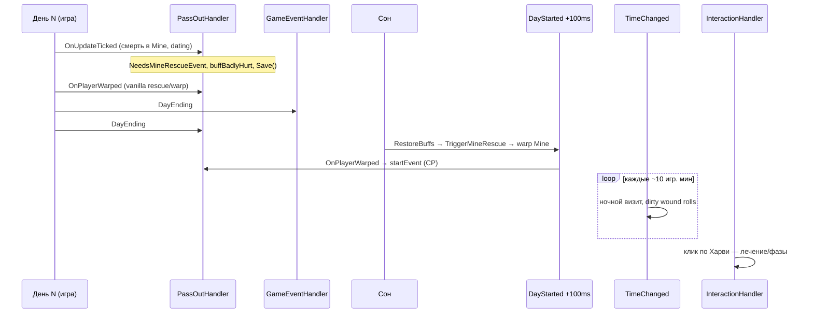

# Аудит таймингов событий и сцен (HarveyOverhaulInjury)

Аудит C#-обработчиков и их связи с CP-сценами. **Актуализация 2026-05-24** — добавлены `QueueHospitalEvent`, `StormComfortLauncher`, `RescueOperationLauncher`, minor mine rescue.

Источники: `GameEventHandler`, `PlayerEventHandler`, `TimeEventHandler`, `InteractionHandler`, `PassOutHandler`, `ModEntry.cs` (порядок подписок).

Для каждого механизма ответы на 7 вопросов:

1. Когда именно проверяется?
2. Сколько раз в день/ночь может быть попытка?
3. Может ли шанс фактически стать намного выше заявленного?
4. Может ли событие сработать до того, как нужный buff/topic восстановлен?
5. Может ли событие пропасть из-за порядка DayEnding → snapshot → TrackPassOut → DayStarted?
6. Может ли оно сработать повторно, когда должно быть одноразовым?
7. Может ли оно стать одноразовым навсегда, хотя по дизайну должно повторяться?

---

## Цикл дня: порядок вызовов



### Порядок подписок (`ModEntry.cs`)

| Событие | Порядок |
|---|---|
| `DayEnding` | 1. `GameEventHandler.OnDayEnding` → 2. `PassOutHandler.TrackPassOut` |
| `Warped` | 1. `PlayerEventHandler.OnWarped` → 2. `PassOutHandler.OnPlayerWarped` |
| `TimeChanged` | 1. `PlayerEventHandler.OnTimeChanged` (dirty wound) → 2. `TimeEventHandler.OnTimeChanged` (ночь) |

---

## Сводная таблица по обработчикам

| Обработчик | Когда проверяется | Попыток/день | Шанс > заявленного? | До restore buff/topic? | Потеря в цепочке DayEnding? | Повтор when one-shot? | Навсегда one-shot? |
|---|---|---|---|---|---|---|---|
| **GameEventHandler.OnDayStarted** | +100 ms после начала дня | 1 пакет | Нет | Restore **первым**; rescue **после** | Флаги rescue в save — OK; snapshot buffs может отставать от TrackPassOut fallback (fallback перезаписывает) | Phase flags каждый день, пока не сброшены кликом | `topic*Cured` auto — одноразовый по дизайну |
| **GameEventHandler.OnDayEnding** | Перед сном, **до** TrackPassOut | 1 | Нет | Snapshot **до** сна; topics **не** snapshot | Mine injury только в TrackPassOut → snapshot в GE может быть без badly hurt, fallback исправляет | Neglect strikes копятся | `mailHarveyMineForbidden` — одно письмо на warning-day |
| **PlayerEventHandler.OnWarped** | Любой warp | Без лимита | Нет | Buffs утром restored; topics — из CP/C# | Нет прямой | Proximity 1×/локация | `RemoveTopic(topicMineInjuryRescue)` — topic не вернётся |
| **PlayerEventHandler.OnUpdateTicked** | Throttle 6/30/60/120/600 ticks | Dirty: roll /10 игр.мин; wet: roll /10 сек под дождём | **Да** — dirty cap 95%; wet до 98% | Real-time в течение дня | Нет | Farming cooldown; cold — 4 порога/день | Drunk — `AppliedTriggers` one-shot |
| **PlayerEventHandler.OnTimeChanged** | Каждый шаг ~10 мин | Dirty wound roll с интервалом | Cap 95% vs config 35%+15% | N/A | N/A | Пока в Mine с dirty injury | N/A |
| **TimeEventHandler.OnTimeChanged** | Каждый шаг ~10 мин | Night visit: **1 roll/ночь**; doctor HUD /2 игр. часа | Night: clamp 0–1 — **нет** | После утреннего restore | Нет | `LastNightRoundRollDay` блокирует повтор roll | Нет hard one-shot |
| **InteractionHandler.OnButtonPressed** | Каждый Action-клик по Харви | **Неограниченно** | Нет | Completion topic может появиться утром **до** клика | Нет | Completion topic снимается после обработки | Phase/recovery — пока не обработано |
| **PassOutHandler.TrackPassOut** | DayEnding #2 | 1/ночь | Нет | Fallback обновляет snapshot | Если tick не поймал death — fallback здесь | WasPassedOut сбрасывается в warp, `NeedsMineRescueEvent` — нет | N/A |
| **PassOutHandler.TriggerMineRescueEvents** | DayStarted +100 ms | 1/день пока flag | N/A | **После** restore | `_pendingMineRescueEventId` **не в save** | `eventsSeen` → только topic | **Да** — rescue-катсцена навсегда one-shot |
| **PassOutHandler.TriggerEventByName** | OnPlayerWarped в Mine | 1 на pending warp | N/A | После restore | Crash между warp и event — застряло до след. DayStarted | `eventsSeen.Add` **до** конца event | **Да** |

---

## GameEventHandler.OnDayStarted

**Порядок** (один раз за +100 ms, `GameEventHandler.cs`):

1. `RestoreBuffsFromSnapshot()`
2. `ApplyMineForbiddenIfWarningWasYesterday()`
3. `ExpireMineForbiddenIfDue()`
4. `TriggerMineRescueEvents()` — **после** restore
5. `ComplicationManager.CheckTreatmentCompletion()`
6. `CheckSimpleTreatmentCompletion()`
7. `CheckInjuryPhases()`

| # | Ответ |
|---|---|
| 1 | Начало дня N+1, через 100 ms (`DelayedAction`) |
| 2 | 1 проход всех проверок |
| 3 | Нет random |
| 4 | Rescue **после** restore — Severe виден корректно. Topics **не** восстанавливаются из snapshot |
| 5 | Snapshot buffs из DayEnding #1; если mine death только в TrackPassOut — GE-snapshot устарел, но TrackPassOut перезаписывает `SavedActiveBuffs` |
| 6 | `ReadyForNextPhase` / `ReadyForRecovery` ставятся снова каждое утро, пока игрок не кликнет Харви |
| 7 | `CheckSimpleTreatmentCompletion` auto-добавляет `topic*Cured` — одноразовый финальный диалог |

**Письма после предупреждений:** `ApplyMineForbiddenIfWarningWasYesterday` — debuff на день **после** `MineWarningDay`; письмо планируется в **DayEnding** предыдущего дня (`mailHarveyMineForbidden`).

---

## GameEventHandler.OnDayEnding

| # | Ответ |
|---|---|
| 1 | Перед сном, **до** `TrackPassOut` |
| 2 | 1×/ночь |
| 3 | Нет |
| 4 | Snapshot buffs **сохраняет** текущие; topics/mail flags — отдельно |
| 5 | **Риск:** snapshot без mine-injury, если death пойман только в TrackPassOut (исправляется fallback) |
| 6 | Neglect strikes накапливаются по дням без лечения |
| 7 | `MineWarningDay == today` → одно письмо на warning |

---

## PlayerEventHandler.OnWarped

**Порядок:** `HandleWarpAttempt` (госпитализация) → `HandleLocationLogic` (Hospital, Mine warning, Spa).

**Госпитализация после `topicMineInjuryRescue`** (`HandleHospitalLogic`):

- Условия: `ForceHospitalization` + topic + `InjurySets.Severe`
- При срабатывании: `StartForcedHospitalizationWithExplanation` + **`RemoveTopic("topicMineInjuryRescue")`**

| # | Ответ |
|---|---|
| 1 | Warp в Hospital (и любой warp для block exit) |
| 2 | Hospital logic — при каждом входе в Hospital; block — при каждой попытке выхода |
| 3 | Нет |
| 4 | Topic должен быть от CP/fallback **до** warp; C# снимает topic **сразу** — CP-диалоги на topic теряются |
| 5 | Нет |
| 6 | `IsHospitalized` session-only → после reload может сработать **снова**, если topic ещё есть (но topic уже снят) |
| 7 | Topic удалён — **повторный триггер невозможен** |

**Mine entry warning при rescue-warp:** утром `TriggerMineRescueEvents` → warp Mine → `HandleMineEntryWarning` видит Severe → **ложное** предупреждение + `MineWarningDay = today` → письмо/запрет шахты **на следующий день после rescue**.

---

## PlayerEventHandler.OnUpdateTicked

| Интервал | Что |
|---|---|
| /6 (~100 ms) | Tool usage → farming injuries |
| /30 | Explosion injuries |
| /60 | Harvey proximity, farming roll, **rain/wet bandage** |
| /120 | Health-based injuries, dirty boost |
| /600 | Cold, drunk |

**Промокание повязки:** roll каждые **10 секунд** под дождём, шанс до **98%** — не привязан к `WetBandageToInfectionChance` в config.

**Грязная рана в шахте:** roll в `OnTimeChanged`, не здесь; здесь только damage-boost на 30 игр. мин.

| # | Ответ |
|---|---|
| 2 | Proximity: ~1 раз/сек при условиях; wet: до 6 roll/мин под дождём |
| 3 | **Да** — effective >> config для wet; dirty cap 95% |
| 4 | Real-time; buffs утром restored, но wet/cold идут в течение дня |
| 6 | Proximity hosp: 1× пока `IsHospitalized`; injury discovery 1×/локация |

**CheckHarveyProximity** (forced hosp): каждую секунду при `topicMineInjuryRescue` + Severe + Harvey в `_config.ProximityTiles` (3) — **может сработать до входа в Hospital**, параллельно с CP-сценой.

---

## PlayerEventHandler.OnTimeChanged

Только **dirty wound** rolls в Mine/Volcano: 1 roll / `DirtyWoundMineRollIntervalMinutes` (10), шанс 10%→35% (+15% boost), **cap 95%**.

За 2 часа в шахте после high exposure: до **~12 roll'ов** → cumulative probability **намного выше** одного броска 35%.

---

## TimeEventHandler.OnTimeChanged

### Ночной визит Харви

Условия (`TimeEventHandler.CheckNightVisit`):

- Время 22:00–26:00
- Локация `FarmHouse`
- Активен Severe buff
- `LastNightRoundRollDay != today` → set **до** roll
- Roll `NightVisitChance` (default 35%)
- Dialogue + `topicHarvey_NightRound` (2 дня)

| # | Ответ |
|---|---|
| 1 | Первый `TimeChanged` 22:00–26:00, когда игрок **дома** и есть **Severe buff** |
| 2 | **Ровно 1 попытка roll за календарный день** |
| 3 | **Нет** — clamp 0–1 |
| 4 | Severe должен быть **в момент первого qualifying tick** |
| 5 | Нет |
| 6 | Нет CP event — inline dialogue |
| 7 | Failed roll блокирует ночь (by design) |

**⚠️ UX:** если в 22:00 дома + Severe, roll провалился — `LastNightRoundRollDay` уже set → **до 26:00 повтора нет**.

**Не CP event** — только C# dialogue + `topicHarvey_NightRound` для CP-диалогов.

### Госпитализация: CanDischarge

- `elapsed = timeOfDay - _admissionTime` — **без wrap-around**
- `IsHospitalized` **не сохраняется** в save

---

## InteractionHandler.OnButtonPressed

**Не запускает CP events** — только C# dialogue.

**Приоритет клика:** completion topic → новая травма → осложнения → phase/recovery → vanilla dialogue.

| # | Ответ |
|---|---|
| 1 | Action-клик по тайлу Харви, `IsPlayerFree`, не в DialogueBox |
| 2 | **Неограниченно** — каждый клик |
| 3 | Нет |
| 4 | Утром `CheckSimpleTreatmentCompletion` может добавить `topic*Cured` **до** первого клика — OK |
| 5 | Нет |
| 6 | Completion topic удаляется после `ShowCompletionDialogue` — one-shot |
| 7 | Phase transition повторяется, пока `ReadyForNextPhase` не сброшен через `AdvanceInjuryToNextPhase` |

**Фазы:** флаг `ReadyForNextPhase` ставится в **DayStarted**; переход — только по клику.

---

## PassOutHandler — цепочка mine rescue

### TrackPassOut (DayEnding #2)

| # | Ответ |
|---|---|
| 1 | Один раз перед сном, **после** GE snapshot |
| 2 | 1×/ночь |
| 4 | Fallback `ApplyBadlyHurtFromMinePassOut` + **перезапись** snapshot |
| 5 | Основной путь — `OnUpdateTicked` (real-time); fallback если tick пропустил |
| 6 | `NeedsMineRescueEvent` **не** сбрасывается в pass-out warp handler |

### TriggerMineRescueEvents (DayStarted)

| # | Ответ |
|---|---|
| 1 | После `RestoreBuffsFromSnapshot` |
| 2 | 1×/день пока `NeedsMineRescueEvent` |
| 4 | Severe check **после** restore — OK |
| 5 | **`_pendingMineRescueEventId` in-memory** — crash/reload между warp и `OnPlayerWarped` → rescue зависнет до следующего DayStarted |
| 6 | `IsMineRescueEventAlreadySeen` → только `topicMineInjuryRescue`, без кат-сцены |
| 7 | **`eventsSeen.Add` до конца event** — reload mid-cutscene = навсегда «видел», topic может не добавиться |

### TriggerEventByName

```csharp
location.startEvent(...);
Game1.player.eventsSeen.Add(eventId);  // сразу после startEvent
```

**Race с warp order:** `PlayerEventHandler.OnWarped` → mine warning **до** `PassOutHandler.OnPlayerWarped` → startEvent.

### Timeline rescue (dating, первый раз)

```
День N:   death in Mine → NeedsMineRescueEvent, buffBadlyHurt
          vanilla warp → ApplyBadlyHurt (guarded)
День N:   DayEnding → snapshot buffs
День N+1: RestoreBuffs → TriggerMineRescueEvents
          warp Mine → [mine warning HUD!] → startEvent CP
          CP script → Hospital + topicMineInjuryRescue
          warp Hospital → ForceHospitalization? → RemoveTopic
```

---

## Фокусные цепочки

### Rescue из шахты

| | |
|---|---|
| Проверка | Tick (death) + DayStarted (trigger) + Warp (start) |
| Попыток | 1 rescue/смерть; повторная смерть → topic only если `eventsSeen` |
| Шанс | Детерминировано (Severe → dating event) |
| До restore | Rescue **после** restore — OK |
| Потеря | Pending ID не в save; eventsSeen premature |
| Повтор | **Намеренно** one-shot через `eventsSeen` |
| Навсегда one-shot | **Да** для кат-сцены; topic может выдаваться повторно |

### Ночной визит

| | |
|---|---|
| CP event | **Нет** — C# only |
| 1 roll/ночь | **Да**, `LastNightRoundRollDay` |
| Failed roll | Ночь «сожжена» без визита |
| Severe в 22:00 | Обязателен |

### Госпитализация после `topicMineInjuryRescue`

Триггеры: warp в Hospital, proximity (1/sec). Условия: `ForceHospitalization` + topic + Severe.

**Критично:** topic **снимается сразу**; `IsHospitalized` **не в save**; CP `eventStayInHospital` **не используется**.

**Двойная госпитализация:** CP event → Hospital, затем C# `StartForcedHospitalization` (session-only gate).

### Лечение по клику

CP events лечения по клику (`HarveyMod_FirstTreatment` и т.д.) **не вызываются** из C# — только `StartTreatment` + dialogue. **Исключение (2026-05-24):** pass-out cutscenes `eventHarveyEmergencyCare` / `eventHarveyExhaustion` через `QueueHospitalEvent`.

### Завершение фаз

| Этап | Когда | Механика |
|---|---|---|
| Таймер фазы истёк | DayStarted `CheckInjuryPhases` | `ReadyForNextPhase` / `ReadyForRecovery` + HUD |
| Переход | Harvey click | `AdvanceInjuryToNextPhase` |
| Письма neglect | DayStarted `CheckPhaseNeglect` | **exact day** `== phaseDuration+3`, `== totalAllowed-1` |
| Осложнение neglect | DayStarted | `>= totalAllowedDays` |

**Complication infection:** 1 roll/день в `CheckTreatmentCompletion` (DayStarted), шкала 15%→40%→100% (dirty) / 15%→35%→65% (wet).

### Письма после предупреждений

| Mail | Когда | CP есть? |
|---|---|---|
| `mailHarveyMineForbidden` | DayEnding, `MineWarningDay == today` | ✅ |
| `mailHarveySleepControl` | OnPlayerWarped, town pass-out | ✅ |
| `mailHarveyAfterMineRescue` | **Внутри CP** legacy rescue script | ✅ (только major) |
| `HarveyMod_TreatmentUrgentReminder` | DayStarted phase neglect | ✅ CP 2026-05-23 |
| `HarveyMod_TreatmentFinalWarning` | DayStarted | ✅ |
| `HarveyMod_DirtyWoundInfection` | DayStarted complication | ✅ |
| `HarveyMod_WetBandageInfection` | DayStarted | ✅ |
| `MailIds.NeglectWarning` | DayStarted | ✅ unified 2026-05-23 |

**Rescue-warp ложный warning** → лишнее `mailHarveyMineForbidden` **на следующий день после rescue**.

---

## CP-сцены через C#-мосты (тайминг)

| CP / эффект | Когда становится доступен | Launcher |
|---|---|---|
| `eventHarveyMineRescueDating` | Утро N+1 после mine death | C# startEvent |
| `eventHarveyCheckFarmerOutsideAfter22` | После `topicPassedOutInTown` + Farm 22:00–02:00 | Vanilla CP |
| `eventHarveyMorningCheckup` | После CP chain → `topicHarveyMandatoryCheckup` | Vanilla CP |
| Storm comfort | `buffStressThunder` — **C# не выставляет** | Vanilla CP (недостижимо?) |
| `eventHarveyMineInterception` | SpaceCore при входе в Mine | CP trigger, не C# handler |

**Единственный C# → `startEvent` path:** `PassOutHandler.TriggerEventByName` (mine rescue).

---

## Ранжирование рисков

| # | Severity | Проблема |
|---|---|---|
| 1 | **Critical** | `_pendingMineRescueEventId` не в save — crash между warp и event |
| 2 | **Critical** | `eventsSeen.Add` **до** завершения event — partial play = навсегда seen |
| 3 | **Critical** | Госпитализация in-memory — reload снимает hold, topic уже удалён |
| 4 | **High** | Rescue-warp → `HandleMineEntryWarning` → ложный запрет шахты + письмо |
| 5 | **High** | `RemoveTopic(topicMineInjuryRescue)` сразу — ломает CP/mail на topic |
| 6 | **High** | 4+ mail ID из C# **отсутствуют в CP** |
| 7 | **High** | Mine rescue **permanently one-shot** — повторная death без кат-сцены |
| 8 | **Medium** | Night visit: failed roll блокирует всю ночь |
| 9 | **Medium** | Dirty wound: много roll'ов/день → cumulative >> 35% |
| 10 | **Medium** | Wet bandage: до 98%/10 сек, не из config |
| 11 | **Medium** | Double forced hosp: CP Hospital + C# hosp |
| 12 | **Medium** | `CanDischarge` без wrap-around после полуночи |
| 13 | **Low** | Phase neglect mail на exact calendar day |
| 14 | **Low** | Doctor reminder каждые 2 игр. часа — spam HUD |

---

## Краткие ответы по типам сцен

| Тип | > заявленного шанса? | До restore? | Потеря DayEnding chain? | One-shot bugs |
|---|---|---|---|---|
| Mine rescue CP | N/A | Нет | Низкий (flags OK) | **eventsSeen** блокирует repeat |
| Night visit C# | Нет | Нет | Нет | Failed roll = no retry |
| Forced hosp C# | N/A | N/A | Topic lost | Session-only state |
| Treatment click | N/A | Completion topic утром OK | Нет | Topic consumed once |
| Phase/mail | Per-day 1 roll infection | DayStarted after restore | Snapshot OK for buffs only | Exact-day mail miss |
| Dirty/wet | **Да** | Real-time | Нет | Complication daily until success |
| CP vanilla (topics) | Random in CP | Topics not in snapshot | Topic timing vs pass-out warp | `eventsSeen` in CP guards |

---

## Config: timing-related (`ModConfig.cs`)

| Параметр | Default | Где используется |
|---|---|---|
| `NightVisitChance` | 0.35 | `TimeEventHandler.CheckNightVisit` |
| `MinHospitalStayMinutes` | 120 | `HospitalizationManager.CanDischarge` |
| `ProximityTiles` | 3 | `CheckHarveyProximity` |
| `DirtyWoundChanceMines` | 0.35 | Dirty roll (cap 0.95) |
| `DirtyWoundMineRollIntervalMinutes` | 10 | Roll interval |
| `NeglectDaysThreshold` | 3 | `CheckNeglect` |
| `ForceHospitalization` | true | Hospital + proximity |
| `MineForbiddenDurationDays` | 2 | Debuff после warning |

---

**Статус:** черновик аудита, без исправлений в коде.
