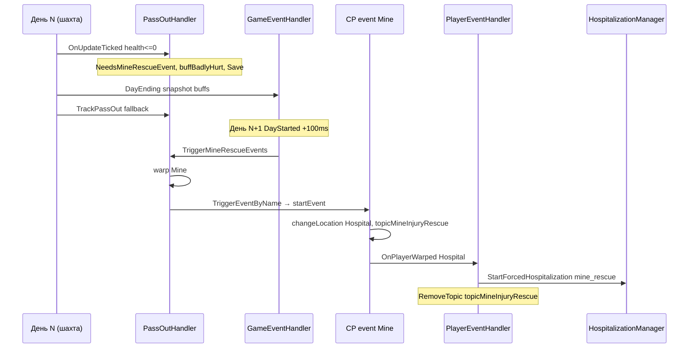
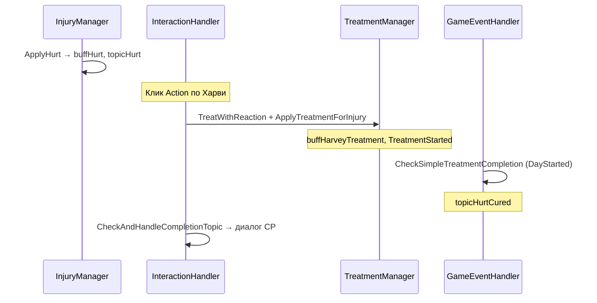
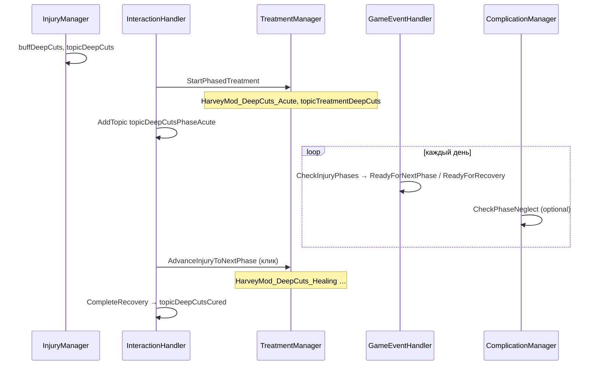

# Сценарные цепочки (HarveyOverhaul InjuryCare + CP)

Пошаговые flow для крупных игровых сценариев. **Актуализация 2026-05-24** — hospital pass-out cutscenes, minor mine rescue, storm/rescue topic launchers.

Источники: `PassOutHandler`, `InteractionHandler`, `GameEventHandler`, `PlayerEventHandler`, `TimeEventHandler`, `ComplicationManager`, CP `eventsMineRescue.json`, `dialoguesHarvey*.json`.

---

## Оглавление

1. [Боевая смерть в шахте → спасение → госпитализация](#1-боевая-смерть-в-шахте--спасение--госпитализация)
2. [Лёгкая травма → клик по Харви → лечение → завершение](#2-лёгкая-травма--клик-по-харви--лечение--завершение)
3. [Фазовая травма → лечение → фазы → recovery](#3-фазовая-травма--лечение--фазы--recovery)
4. [Мокрая повязка → риск инфекции → infected wound](#4-мокрая-повязка--риск-инфекции--infected-wound)
5. [Грязная рана в шахте → риск инфекции](#5-грязная-рана-в-шахте--риск-инфекции)
6. [Небрежность лечения → предупреждение → осложнение](#6-небрежность-лечения--предупреждение--осложнение)
7. [Ночной визит Харви](#7-ночной-визит-харви)
8. [Запрет шахты при Severe](#8-запрет-шахты-при-severe)

---

## 1. Боевая смерть в шахте → спасение → госпитализация

### Стартовое условие

- Dating/married с Харви
- `health <= 0` в Mine / UndergroundMine (боевой урон, не exhaustion / late time)
- Не `WasExhausted`, не `WasUpTooLate`

### Диаграмма

### Шаги

| Шаг | C# метод | Buff / topic / mail / state | CP | Результат | Где обрывается |
|---|---|---|---|---|---|
| **0. Смерть** | `PassOutHandler.OnUpdateTicked` (или `TrackPassOut` fallback) | `WasPassedOut`, `NeedsMineRescueEvent`, `PassedOutInMineYesterday`, `LastPassedOutHealth=0`; `ApplyBadlyHurtFromMinePassOut()` → `buffBadlyHurt`, `topicBadlyHurt`, `DebuffState` | — | Флаги rescue в save | Нет dating → rescue не планируется; tick пропущен → только fallback в TrackPassOut |
| **1. Конец дня** | `GameEventHandler.OnDayEnding` | `SavedActiveBuffs` snapshot | — | Баффы сохранены на утро | Snapshot до TrackPassOut может не содержать badly hurt (fallback перезаписывает) |
| **2. Утро** | `GameEventHandler.OnDayStarted` → `PassOutHandler.TriggerMineRescueEvents` | Выбор `eventHarveyMineRescueDating` / `eventHarveyMineRescue` / `eventHarveyMinorMineRescue`; `PendingMineRescueEventId` | — | Warp в Mine (17,7) | Нет dating → флаги сброшены без event; `eventsSeen` уже есть → только `topicMineInjuryRescue` |
| **3. Warp Mine** | `PassOutHandler.OnPlayerWarped` → `TriggerEventByName` | `onEventFinished` → `eventsSeen`, `ClearMineRescueState` | **CP** `eventsMineRescue.json`: cutscene, `changeLocation Hospital`, `action AddConversationTopic topicMineInjuryRescue 2`, опционально `mailHarveyAfterMineRescue` | Игрок в Hospital после cutscene | Event не найден / throw → `RunMineRescueFallback` (topic + warp); reload mid-event → resume via `PendingMineRescueEventId` |
| **4. Госпитализация** | `PlayerEventHandler.HandleHospitalLogic` **или** `CheckHarveyProximity` | `HospitalizationManager.StartForcedHospitalizationWithExplanation(..., "mine_rescue")`; **`RemoveTopic(topicMineInjuryRescue)`**; `_hospitalHoldActive` (in-memory) | CP event уже показал Hospital; C# диалог mine_rescue explanation | Игрок удерживается в Hospital `MinHospitalStayMinutes` | `ForceHospitalization=false`; Severe buff отсутствует → warp logic не срабатывает; topic снят до клика по Харви |

### Финальный результат

- `buffBadlyHurt` (+ возможно Severe) активны
- Cutscene seen (`eventsSeen` для rescue event)
- Принудительная госпитализация (session) или свободное движение после CP warp
- Лечение дальше — цепочка **#2** или **#3** по клику на Харви

### CP-контент

| Элемент | Файл |
|---|---|
| `eventHarveyMineRescue` / `Dating` / `MinorMineRescue` | `eventsMineRescue.json` |
| `topicMineInjuryRescue` | event script + `dialoguesHarveyInjury.json` |
| `mailHarveyAfterMineRescue` | `eventsMineRescue.json` → Mail |

---

## 2. Лёгкая травма → клик по Харви → лечение → завершение

Пример: **`buffHurt`** (лёгкая травма, нефазовая).

### Стартовое условие

- Триггер урона / farming / pass-out → `InjuryManager.ApplyHurtSafe()`
- `AppliedTriggers` помечает `triggerHurt` (one-shot за сейв — см. `13-one-shot-audit.md`)

### Диаграмма

### Шаги

| Шаг | C# метод | Buff / topic / state | CP | Результат | Где обрывается |
|---|---|---|---|---|---|
| **1. Травма** | `InjuryManager.ApplyHurtSafe` → `ApplyHurt` | `buffHurt`; `topicHurt` (3d); `DebuffState` (Phase1Duration=3); `AppliedTriggers += triggerHurt` | `dialoguesHarveyInjury.json` → `topicHurt` | HUD debuff | Повтор blocked AppliedTriggers; `OnlyAtClinic` не блокирует наложение |
| **2. Клик** | `InteractionHandler.OnButtonPressed` → `StartTreatment` | — | — | Suppress click | Харви не на тайле; `DialogueBox` открыт |
| **3. Лечение** | `TreatmentManager.ApplyTreatmentForInjury` | Remove `buffHurt`; Add `buffHarveyTreatment`; `TreatmentStarted=true`, `PhaseStartDay=today` | `TreatWithReaction` dialogue (C# text + CP proximity keys) | Лечение начато | Exception → «Попробуй ещё раз» |
| **4. Срок** | `GameEventHandler.CheckSimpleTreatmentCompletion` | Remove cure buff; Remove `DebuffState`; Add **`topicHurtCured`** (7d) | — | HUD «Обратись к Харви» | Игрок не кликает → topic висит |
| **5. Финал** | `InteractionHandler.CheckAndHandleCompletionTopic` | Remove `topicHurtCured`; Add `buffHarveyCare` (8h) | **`dialoguesHarveyCure.json`** → `topicHurtCured` | Эпилог + friendship +10 | Нет CP ключа → fallback текст C# |

### Финальный результат

- Травма снята, `buffHarveyCare` на короткое время
- `triggerHurt` остаётся в AppliedTriggers → **повтор buffHurt невозможен**

---

## 3. Фазовая травма → лечение → фаза 1 → фаза 2 → recovery

Пример: **`buffDeepCuts`** (3 фазы: Acute → Healing → Recovery).

### Стартовое условие

- `InjuryManager.ApplyDeepCutsSafe` (combat/farming)
- `DebuffState`: Phase1=7d, Phase2=7d, Phase3=7d (типично)

### Диаграмма

### Шаги

| Фаза | C# метод | Buff / topic / state | CP диалог | Результат | Обрыв |
|---|---|---|---|---|---|
| **Травма** | `ApplyDeepCuts` | `buffDeepCuts`, `topicDeepCuts` (14d), `DebuffState` 3-phase | `dialoguesHarveyInjury.json` | Базовая травма | AppliedTriggers one-shot |
| **Старт лечения (клик)** | `StartTreatment` → `StartPhasedTreatment` | Remove `buffDeepCuts`; Add **`HarveyMod_DeepCuts_Acute`**; `topicTreatmentDeepCuts`; **`topicDeepCutsPhaseAcute`** (7d); `StartTreatment()` state | **`dialoguesHarveyCure.json`** `topicDeepCutsPhaseAcute` | Фаза 1 treatment | Нет DebuffState → warn |
| **Ожидание фазы 1** | `CheckInjuryPhases` | `ReadyForNextPhase=true` после Phase1Duration | HUD reminder | Ждёт клика | Игнор → `CheckPhaseNeglect` (#6) |
| **Переход 1→2 (клик)** | `AdvanceInjuryToNextPhase` | Remove Acute buff; Add **`HarveyMod_DeepCuts_Healing`**; phase=2 | **`PhaseTransition_DeepCuts_2`** или fallback C# | Фаза 2 | — |
| **Переход 2→3 (клик)** | то же | **`HarveyMod_DeepCuts_Recovery`** | `PhaseTransition_DeepCuts_3` / `topicDeepCutsPhaseRecovery` | Фаза 3 | 2-фазные травмы (Cold) — другая схема |
| **Recovery (клик)** | `CompleteRecovery` | Remove all phase buffs; **`topicDeepCutsCured`** (7d); `buffHarveyCare` | **`topicDeepCutsCured`** в Cure JSON | Полное выздоровление | — |
| **Эпилог (клик)** | `CheckAndHandleCompletionTopic` | Remove cured topic; care buff | CP cured dialogue | Закрытие цикла | — |

### Финальный результат

- `DebuffState` удалён, phase buffs сняты
- Completion topic + optional care buff
- **Примечание:** phase topics C# (`topicDeepCutsPhaseAcute`) и CP legacy (`PhaseTransition_*`, `topicDeepCutsPhase1Ready`) — **две параллельные схемы имён** (см. `11-id-sync-audit.md`)

---

## 4. Мокрая повязка → риск инфекции → infected wound

### Стартовое условие

- Активно нефазовое лечение: `buffHarveyTreatment` или `buffHarveyIntensiveCare`
- Игрок под дождём (`HandleRainLogic`)

### Шаги

| Шаг | C# метод | Buff / topic / mail / state | CP | Результат | Обрыв |
|---|---|---|---|---|---|
| **1. Дождь** | `PlayerEventHandler.HandleRainLogic` | Roll каждые 10 сек; `TimeUnderRainTicks` | — | — | Нет повязки → skip |
| **2. Wet bandage** | `HandleRainLogic` (roll success) | **`HarveyMod_WetBandage`**; `ActiveComplications[WetBandage]=today`; **`topicHarvey_WetBandage`** (4d) | `dialoguesHarvey.json` | HUD «Повязка промокла» | Уже wet → skip |
| **3. Ежедневная проверка** | `ComplicationManager.CheckWetBandageComplication` | Roll: day1 15%, day2 35%, day3+ 65% | — | — | Roll fail → ждёт следующий день |
| **4. Инфекция** | `CheckWetBandageComplication` (success) | Remove WetBandage; **`ApplyInfectedWoundSafe()`** → `buffInfectedWound`, `topicInfectedWound`, phased DebuffState; mail **`HarveyMod_WetBandageInfection`** (нет в CP Mail!) | Injury dialogues | Новая фазовая травма | Клик лечение → цепочка **#3** |
| **Alt: spa** | `HandleSpaLogic` | Wet bandage если bandage + spa | — | То же wet | — |

### Финальный результат

- Осложнение заменено на **`buffInfectedWound`** (тяжёлая фазовая травма)
- Wet topic снят

---

## 5. Грязная рана в шахте → риск инфекции

### Стартовое условие

- Травма из `InjurySets.DirtyInMines`: `buffDeepCuts`, `buffBurnWounds`, `buffShrapnelWounds`
- Игрок в Mine / SkullCave / Volcano

### Шаги

| Шаг | C# метод | Buff / topic / state | CP | Результат | Обрыв |
|---|---|---|---|---|---|
| **1. Экспозиция** | `PlayerEventHandler.HandleMineDirtyExposureTimeChanged` | `MineDirtyExposureMinutesToday++` | — | Накопление времени | Не dirty injury → skip |
| **2. Roll грязи** | `TryApplyDirtyWoundFromMine` | Chance по exposure (safe/med/high) + damage boost | — | Roll fail → continue | Interval 10 game min |
| **3. Dirty wound** | `TryApplyDirtyWoundFromMine` (success) | **`HarveyMod_DirtyWound`**; `ActiveComplications`; **`topicHarvey_DirtyWound`** (4d) | `dialoguesHarvey.json`; proximity `Proximity_DirtyWound` | HUD + emote | — |
| **4. Daily infection roll** | `ComplicationManager.CheckDirtyWoundComplication` | day0: 0%; day1: 15%; day2: 40%; day3+: 100% | — | — | Roll fail |
| **5. Infection** | success path | Remove DirtyWound; **`ApplyInfectedWoundSafe()`**; mail **`HarveyMod_DirtyWoundInfection`** | — | → infected wound chain | Mail ID нет в CP |

### Финальный результат

- **`buffInfectedWound`** вместо dirty complication
- Лечение через **#3**

---

## 6. Небрежность лечения → предупреждение → осложнение

Две параллельные ветки: **нефазовые** (DayEnding) и **фазовые** (DayStarted).

### 6A. Нефазовая небрежность (buffHurt без лечения)

| Шаг | C# метод | State / buff / topic | CP | Обрыв |
|---|---|---|---|---|
| Условие | `GameEventHandler.CheckNeglect` (DayEnding) | Нелеченный `buff*` без matching cure buff | — | Лечение начато → strikes=0 |
| +1 day | `CheckNeglect` | `NeglectStrikes++` | — | `< NeglectDaysThreshold` (default 3) |
| Штраф | `ApplyNeglectPenalty` | **`HarveyMod_Neglect`**, **`topicHarvey_Neglect`** (7d) | `dialoguesHarvey.json` | Harvey рядом → emote |

### 6B. Фазовая небрежность (лечение начато, нет клика по фазам)

| День от PhaseStart | C# метод | Mail / buff / topic | CP |
|---|---|---|---|
| `duration + 3` | `ComplicationManager.CheckPhaseNeglect` | HUD; mail **`HarveyMod_TreatmentUrgentReminder`** | ❌ нет в CP Mail |
| `totalAllowed - 1` | то же | mail **`HarveyMod_TreatmentFinalWarning`** | ❌ нет в CP Mail |
| `>= totalAllowed` (duration + 7 grace) | то же | **`HarveyMod_Neglect`**, **`topicHarvey_Neglect`**, mail **`mailHarvey_Neglect`** | Mail ✅ |

`totalAllowedDays = currentPhaseDuration + 7`

### Финальный результат

- Debuff **`HarveyMod_Neglect`** + topic для диалогов
- Фазовая травма **не продвигается** без клика (Ready flags только напоминают)

### Где обрывается

- Игрок кликает по Харви вовремя → цепочка **#2** / **#3** продолжается, neglect не наступает
- Письма urgent/final — **silent fail** (нет CP entries)

---

## 7. Ночной визит Харви

### Стартовое условие

- Время **22:00–26:00**
- Локация **FarmHouse**
- Любой buff из **`InjurySets.Severe`**
- `LastNightRoundRollDay != today`

### Шаги

| Шаг | C# метод | Buff / topic / state | CP | Результат | Обрыв |
|---|---|---|---|---|---|
| **1. Roll gate** | `TimeEventHandler.CheckNightVisit` | `LastNightRoundRollDay = today` (attempt) | — | 1 roll/ночь | Не дома / не severe / не ночь |
| **2. Chance** | `CheckNightVisit` | Roll `NightVisitChance` (default 35%) | — | Fail → ночь «сожжена» | — |
| **3. Visit** | `CheckNightVisit` | `LastNightRoundDay=today`; **`topicHarvey_NightRound`** (2d); friendship +10; optional remove **`HarveyMod_PainFlare`** | C# inline dialogue (не CP event) | Night round dialogue | Harvey не в локации → drawObjectDialogue |

### Финальный результат

- Короткий диалог + friendship
- Topic 2d для памяти (activeDialogueEvents)
- **Нет CP event**, **нет eventsSeen**

---

## 8. Запрет шахты при Severe

### Стартовое условие

- Любая травма / complication (`ActiveDebuffs` или `ActiveComplications`)
- Вход в **MineShaft** / **VolcanoDungeon**
- `_lastMineWarningDay != today`

### Шаги

| Шаг | C# метод | State / buff / mail | CP | Результат | Обрыв |
|---|---|---|---|---|---|
| **1. Warning** | `PlayerEventHandler.HandleMineEntryWarning` | HUD; если **Severe**: **`MineWarningDay=today`** | — | Предупреждение 1×/день | `NeedsMineRescueEvent` → skip (rescue warp) |
| **2. Конец дня** | `GameEventHandler.OnDayEnding` | if `MineWarningDay==today` → **`addMailForTomorrow(mailHarveyMineForbidden)`** | **`mailInjury.json`** | Письмо на завтра | `SendLetters=false` |
| **3. Утро** | `ApplyMineForbiddenIfWarningWasYesterday` | **`HarveyMod_MineForbidden`** buff; `MineForbiddenAppliedDay`; clear `MineWarningDay` | — | Запрет активен | Warning не вчера |
| **4. Expire** | `ExpireMineForbiddenIfDue` | Remove buff после **`MineForbiddenDurationDays`** (default 2) | — | Запрет снят | — |

### Финальный результат

- Debuff **`HarveyMod_MineForbidden`** блокирует вход (логика в `PlayerEventHandler` / mine checks)
- Письмо **`mailHarveyMineForbidden`**

### Где обрывается

- Лёгкая травма (не Severe) → только мягкий HUD, **без** `MineWarningDay` → цепочка запрета **не стартует**
- Rescue-warp в Mine утром → warning подавлен (`NeedsMineRescueEvent`)

---

## Сводка: точки обрыва (все 8 цепочек)

| Цепочка | Типичный обрыв | Severity |
|---|---|---|
| Mine rescue | Нет dating; event fail; `ForceHospitalization=false`; topic снят рано | HIGH |
| Light treatment | AppliedTriggers; игрок не кликает completion | MED |
| Phased treatment | Phase neglect; dual topic naming; AppliedTriggers | HIGH |
| Wet → infection | RNG fail несколько дней; mail missing | LOW–MED |
| Dirty mine → infection | Не dirty injury; RNG; mail missing | MED |
| Neglect | Threshold не достигнут; urgent mail missing | MED |
| Night visit | Roll fail; not severe; not home | LOW |
| Mine forbidden | Not Severe; SendLetters off | MED |

---

## Другие крупные CP-сцены (кратко)

| Цепочка | Старт | Контроль one-shot | C# bridge | Обрыв |
|---|---|---|---|---|
| **Story E1–E8** | CP location + hearts + `eventsSeen` | `HarveyMod_CD_*` topics | **Нет** — vanilla CP entry | Orphan topics; dating gates |
| **Care first visit** | `topicFirstMeeting` | `eventsSeen` eventHarveyFirstVisit | **C# не создаёт topic** | Chain dead |
| **Storm comfort** | C# daily roll → `buffStressThunder` | Random entry + location | Random может fail | **Частично достижимо** |
| **Mine interception (CP trigger)** | LocationChanged + injury buffs | Mail each entry? | SpaceCore PlayEvent | Buff ID mismatch (phase vs base) |

Подробнее: `08-events-as-book.md`, `13-one-shot-audit.md`.

**Статус:** актуализация 2026-05-23 (gates без изменений в этом файле).
