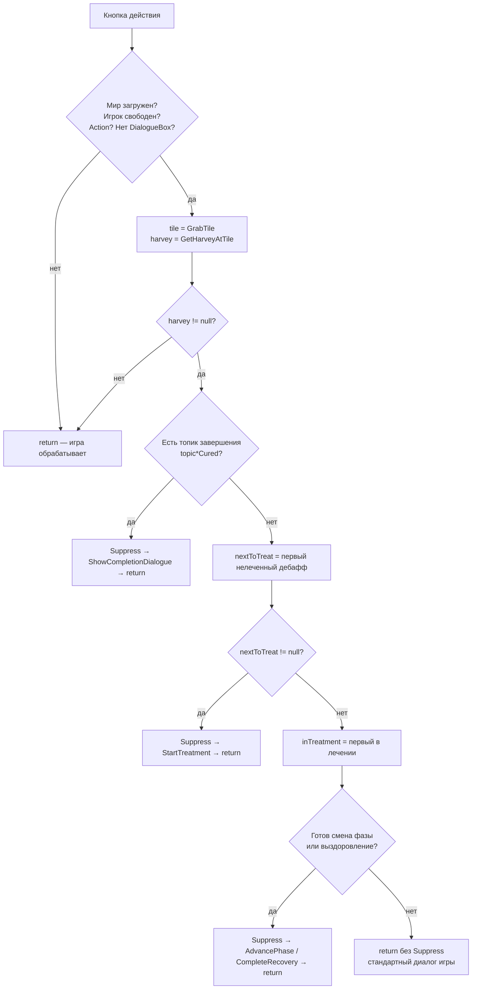

# Блок-схема: клик по Харви (InteractionHandler.OnButtonPressed)

## Диаграмма Mermaid (для GitHub / VS Code)



---

## Текстовая блок-схема

```
                    ┌─────────────────────────┐
                    │  Кнопка действия       │
                    │  (клик / Use Tool)     │
                    └───────────┬───────────┘
                                │
                                ▼
                    ┌─────────────────────────┐
                    │ Мир загружен?          │
                    │ Игрок свободен?        │
                    │ Кнопка = Action?        │
                    │ Нет открытого DialogueBox? │
                    │ currentLocation != null? │
                    └───────────┬───────────┘
                                │ нет → return (игра обработает сама)
                                │ да
                                ▼
                    ┌─────────────────────────┐
                    │ tile = GetCursorPosition().GrabTile
                    │ harvey = GetHarveyAtTile(loc, tile)
                    └───────────┬───────────┘
                                │ harvey == null → return (стандартный диалог игры)
                                │ harvey != null
                                ▼
                    ┌─────────────────────────┐
                    │ 1. Есть топик завершения?│
                    │    (topic*Cured и т.п.)  │
                    └───────────┬───────────┘
                                │ да → Suppress(e) → ShowCompletionDialogue → return
                                │ нет
                                ▼
                    ┌─────────────────────────┐
                    │ modDebuffs = все        │
                    │ ActiveDebuffs с "buff*" │
                    └───────────┬───────────┘
                                │
                                ▼
                    ┌─────────────────────────┐
                    │ nextToTreat = первый     │
                    │ нелеченный (TreatmentStarted=false,
                    │ HasBuff=true) по приоритету
                    └───────────┬───────────┘
                                │ nextToTreat != null
                                │ → Suppress(e)
                                │ → injuries.MainInjury = nextToTreat.BuffId
                                │ → StartTreatment(harvey, injuries, nextToTreat.BuffId)
                                │ → return
                                │
                                │ nextToTreat == null
                                ▼
                    ┌─────────────────────────┐
                    │ inTreatment = первый     │
                    │ дебафф в лечении         │
                    │ (TreatmentStarted=true)  │
                    └───────────┬───────────┘
                                │
                                ▼
                    ┌─────────────────────────┐
                    │ CheckAndHandlePhaseTransition?
                    │ (готов к смене фазы или  │
                    │  к полному выздоровлению)│
                    └───────────┬───────────┘
                                │ да → Suppress(e) → AdvanceToNextPhase или CompleteRecovery → return
                                │ нет
                                ▼
                    ┌─────────────────────────┐
                    │ Ничего не делаем         │
                    │ return без Suppress      │
                    │ → игра показывает        │
                    │   стандартный диалог     │
                    └─────────────────────────┘
```

---

## Подпроцессы

### CheckAndHandleCompletionTopic(harvey)
```
  Для каждого topicId из списка topic*Cured:
    если HasTopic(topicId) →
      Suppress(MouseLeft), Suppress(MouseRight)
      ShowCompletionDialogue(harvey, topicId)
      return true
  return false
```

### StartTreatment(harvey, injuries, mainInjuryId)
```
  Если уже открыт DialogueBox → return
  TreatWithReaction(harvey, injuries)     // эмоция + текст над головой
  Если mainInjuryId != null:
    при необходимости AddTopic(phaseTopicId, 7)
    ApplyTreatmentForInjury(mainInjuryId)
  Если есть Complications → TreatAllComplications
  combinedDialogue = BuildCombinedDialogue(injuries)
  DelayedAction(1000 мс):
    Speak(harvey, combinedDialogue)
    changeFriendship(10)
    ShowEmote(Heart)
```

### CheckAndHandlePhaseTransition(harvey, injuryId, debuffState)
```
  Если IsInjuryReadyForNextPhase(injuryId) →
    AdvanceToNextPhase(harvey, injuryId, debuffState)
    return true
  Если IsInjuryReadyForRecovery(injuryId) →
    CompleteRecovery(harvey, injuryId)
    return true
  return false
```

---

## Итог по результату клика

| Условие | Действие мода | Игра |
|--------|----------------|------|
| Не Харви на GrabTile | — | Стандартный диалог (если клик по другому NPC/объекту) |
| Харви + есть топик завершения (topic*Cured) | Suppress, диалог завершения | Клик подавлен |
| Харви + есть нелеченный дебафф (buff* + !TreatmentStarted + HasBuff) | Suppress, StartTreatment | Клик подавлен |
| Харви + все в лечении + готов переход фазы/выздоровление | Suppress, смена фазы или CompleteRecovery | Клик подавлен |
| Харви + нечего обрабатывать | Не Suppress | Стандартный диалог Харви |

---

## Соответствие мануалу SMAPI (Input API)

- **Подавление клика:** мануал: *«Suppress — подавить указанную кнопку; для кликов: `this.Helper.Input.Suppress(SButton.MouseLeft)`; подавление действует до отпускания кнопки, игра не обработает нажатие»*. В моде вызывается `_helper.Input.Suppress(e.Button)` — подавляется именно та кнопка, которая вызвала событие (Action = мышь или геймпад). **Корректно.**
- **Цель клика:** мануал: *«GrabTile — тайл, который игра считает под курсором для действий по клику»*. Мод берёт `GetCursorPosition().GrabTile` и проверяет Харви через `location.isCharacterAtTile(tile)`. **Корректно.**
- **Показ диалога:** мод кладёт реплику в `npc.CurrentDialogue.Push(dialogue)` и вызывает `Game1.drawDialogue(npc)` (DialogueManager.Speak). Так же показывают диалог ванильный код и другие моды. **Корректно.**
