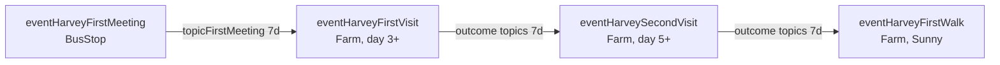

# 01 — Ранняя фермерская цепочка: topics и условия запуска

> Раздел аудита [Harvey Relationship Visits](README.md).  
> Уровень отношений: **знакомство / низкие hearts** (до dating).

Точечный аудит CP-событий на ферме и связанных conversation topics.

**Область:** `eventHarveyFirstVisit`, `eventHarveySecondVisit`, `eventHarveyFirstWalk`  
**Источники:** `eventsCare.json`, `events.json`, `dialoguesHarvey.json`, `content.json`

---

## 1. Карта цепочки



| Шаг | Event ID | Локация | Файл |
|---|---|---|---|
| 0 | `eventHarveyFirstMeeting` | BusStop | `eventsCare.json` |
| 1 | `eventHarveyFirstVisit` | Farm | `eventsCare.json` |
| 2 | `eventHarveySecondVisit` | Farm | `eventsCare.json` |
| 3 | `eventHarveyFirstWalk` | Farm (+ fork `acceptWalk` → Forest) | `events.json` |

---

## 2. Фактические topic IDs

### 2.1 `eventHarveyFirstVisit`

**Условия запуска (до правок — без изменений):**

```
Time 600 1200
PLAYER_HAS_CONVERSATION_TOPIC Current topicFirstMeeting
!PLAYER_HAS_SEEN_EVENT Current eventHarveyFirstVisit
DAYS_PLAYED 3
```

**Topics после выбора (`quickQuestion`, 7 дней):**

| Выбор | Topic ID |
|---|---|
| «Спасибо за заботу» | `topicHarveyFirstVisitAgree` |
| «Я справлюсь сама» | `topicHarveyFirstVisitNeutral` |
| «Мне нужно время привыкнуть» | `topicHarveyFirstVisitRefused` |

**Topic в конце события (2 дня):**

| Команда | Topic ID | Длительность |
|---|---|---|
| `action addConversationTopic topicHarveyFirstVisit 2/` | `topicHarveyFirstVisit` | 2 дня |

**Диалоги:** `dialoguesHarvey.json` — ключи `topicHarveyFirstVisitAgree`, `Neutral`, `Refused` (Harvey + spouse-варианты).

---

### 2.2 `eventHarveySecondVisit`

**Topics после выбора (`quickQuestion`, 7 дней):**

| Выбор | Topic ID |
|---|---|
| «Попробую чай» | `topicHarveySecondVisitAgree` |
| «Спасибо, но пока не хочу» | `topicHarveySecondVisitNeutral` |
| «Может быть позже» | `topicHarveySecondVisitRefused` |

**Topic в конце события (10 дней):**

| Команда | Topic ID | Длительность |
|---|---|---|
| `addConversationTopic topicHarveySecondVisit 10/` | `topicHarveySecondVisit` | 10 дней |

> **Замечание:** в конце события команда без префикса `action` (как и в `events.json` для FirstWalk). На условия следующего шага это не влияет после правки — gate завязан на outcome-topics.

**Диалоги:** `dialoguesHarvey.json` — ключи `topicHarveySecondVisitAgree`, `Neutral`, `Refused`.

---

### 2.3 `eventHarveyFirstWalk`

**Topics (справочно, вне scope правки условий):**

| Путь | Topic ID | Длительность |
|---|---|---|
| Отказ от прогулки | `topicHarveyDeclineFirstWalk` | 7 дней |
| Прогулка: позитивный выбор | `topicHarveyWalkGood` | 7 дней |
| Прогулка: нейтральный | `topicHarveyWalkNeutral` | 7 дней |
| Прогулка: негативный | `topicHarveyWalkBad` | 7 дней |
| Прогулка: общий (accept) | `topicHarveyAcceptFirstWalk` | 7 дней |

---

## 3. Найденная проблема

### 3.1 Несоответствие gate-topic и outcome-topics

| Следующее событие | Проверяло (было) | Реально блокирующие topics | Эффект |
|---|---|---|---|
| `eventHarveySecondVisit` | `!topicHarveyFirstVisit` (2 д) | `topicHarveyFirstVisitAgree/Neutral/Refused` (7 д) | Второй визит мог сработать на **3–5-й день** после первого, пока outcome-topic ещё активен |
| `eventHarveyFirstWalk` | `!topicHarveySecondVisit` (10 д) | `topicHarveySecondVisitAgree/Neutral/Refused` (7 д) | Gate ссылался на «обёрточный» topic, а не на outcome после выбора; логика цепочки не совпадала с диалогами по Agree/Neutral/Refused |

### 3.2 Одноразовость

| Event | `!PLAYER_HAS_SEEN_EVENT` до правки | После |
|---|---|---|
| `eventHarveyFirstVisit` | ✅ было | ✅ без изменений |
| `eventHarveySecondVisit` | ❌ не было | ✅ добавлено |
| `eventHarveyFirstWalk` | ❌ не было | ✅ добавлено |

---

## 4. Внесённые исправления

**Правило:** не менять тексты реплик и не переписывать структуру событий — только строки условий в ключах `Entries`.

### 4.1 `eventsCare.json` — `eventHarveySecondVisit`

**Было:**

```
eventHarveySecondVisit/Time 600 1200/GameStateQuery DAYS_PLAYED 5/GameStateQuery !PLAYER_HAS_CONVERSATION_TOPIC Current topicHarveyFirstVisit/GameStateQuery PLAYER_HAS_SEEN_EVENT Current eventHarveyFirstVisit
```

**Стало:**

```
eventHarveySecondVisit/Time 600 1200/GameStateQuery DAYS_PLAYED 7/GameStateQuery !PLAYER_HAS_CONVERSATION_TOPIC Current topicHarveyFirstVisitAgree/GameStateQuery !PLAYER_HAS_CONVERSATION_TOPIC Current topicHarveyFirstVisitNeutral/GameStateQuery !PLAYER_HAS_CONVERSATION_TOPIC Current topicHarveyFirstVisitRefused/GameStateQuery PLAYER_HAS_SEEN_EVENT Current eventHarveyFirstVisit/GameStateQuery !PLAYER_HAS_SEEN_EVENT Current eventHarveySecondVisit
```

**Смысл изменений:**

1. `DAYS_PLAYED 7` (было 5) — pacing второго визита.
2. Три проверки `!PLAYER_HAS_CONVERSATION_TOPIC` на outcome-topics первого визита — второй визит ждёт окончания **7-дневного** окна после выбора.
3. `!PLAYER_HAS_SEEN_EVENT Current eventHarveySecondVisit` — защита от повторного просмотра.

---

### 4.2 `events.json` — `eventHarveyFirstWalk`

**Было:**

```
eventHarveyFirstWalk/Time 600 1200/Weather Sunny/GameStateQuery !PLAYER_HAS_CONVERSATION_TOPIC Current topicHarveySecondVisit/GameStateQuery PLAYER_HAS_SEEN_EVENT Current eventHarveySecondVisit
```

**Стало:**

```
eventHarveyFirstWalk/Time 600 1200/Weather Sunny/GameStateQuery DAYS_PLAYED 11/GameStateQuery !PLAYER_HAS_CONVERSATION_TOPIC Current topicHarveySecondVisitAgree/GameStateQuery !PLAYER_HAS_CONVERSATION_TOPIC Current topicHarveySecondVisitNeutral/GameStateQuery !PLAYER_HAS_CONVERSATION_TOPIC Current topicHarveySecondVisitRefused/GameStateQuery PLAYER_HAS_SEEN_EVENT Current eventHarveySecondVisit/GameStateQuery !PLAYER_HAS_SEEN_EVENT Current eventHarveyFirstWalk
```

**Смысл изменений:**

1. `DAYS_PLAYED 11` — pacing прогулки после SecondVisit.
2. Три проверки на outcome-topics второго визита — прогулка не стартует, пока активен краткосрочный topic после выбора с чаем.
3. `!PLAYER_HAS_SEEN_EVENT Current eventHarveyFirstWalk` — защита от повторного просмотра.

---

## 5. Diff (кратко)

```diff
# eventsCare.json — ключ eventHarveySecondVisit
- GameStateQuery DAYS_PLAYED 5
+ GameStateQuery DAYS_PLAYED 7
- !PLAYER_HAS_CONVERSATION_TOPIC Current topicHarveyFirstVisit
+ !PLAYER_HAS_CONVERSATION_TOPIC Current topicHarveyFirstVisitAgree
+ !PLAYER_HAS_CONVERSATION_TOPIC Current topicHarveyFirstVisitNeutral
+ !PLAYER_HAS_CONVERSATION_TOPIC Current topicHarveyFirstVisitRefused
+ !PLAYER_HAS_SEEN_EVENT Current eventHarveySecondVisit

# events.json — ключ eventHarveyFirstWalk
+ GameStateQuery DAYS_PLAYED 11
- !PLAYER_HAS_CONVERSATION_TOPIC Current topicHarveySecondVisit
+ !PLAYER_HAS_CONVERSATION_TOPIC Current topicHarveySecondVisitAgree
+ !PLAYER_HAS_CONVERSATION_TOPIC Current topicHarveySecondVisitNeutral
+ !PLAYER_HAS_CONVERSATION_TOPIC Current topicHarveySecondVisitRefused
+ !PLAYER_HAS_SEEN_EVENT Current eventHarveyFirstWalk
```

---

## 6. Ожидаемое поведение после правки

| Правило | Статус |
|---|---|
| `eventHarveySecondVisit` не срабатывает, пока активен outcome-topic первого визита | ✅ |
| `eventHarveyFirstWalk` не срабатывает, пока активен outcome-topic второго визита | ✅ |
| Условия используют реальные topic IDs (Agree/Neutral/Refused), а не только обёрточные | ✅ |
| Повторный просмотр SecondVisit / FirstWalk блокируется через `eventsSeen` | ✅ |
| Тексты реплик не изменены | ✅ |

---

## 7. Открытые замечания (не исправлялись в этом шаге)

1. **`topicHarveyFirstVisit` (2 д) и `topicHarveySecondVisit` (10 д)** — по-прежнему добавляются в конце событий, но больше не участвуют в gate следующего шага. Могут использоваться для других реакций или как legacy-cooldown; при необходимости — отдельный аудит.
2. **Синтаксис `addConversationTopic` vs `action addConversationTopic`** — в конце SecondVisit и FirstWalk команда без `action`; в FirstVisit в конце — с `action`. Стоит унифицировать отдельным PR, если выяснится расхождение в runtime.
3. **`DAYS_PLAYED 7` для SecondVisit** — минимальный день не привязан к дню FirstVisit; outcome-topic (7 д) всё равно блокирует раньше, чем сработает только `DAYS_PLAYED`.
4. **Связь с `13-one-shot-audit.md`** — там `eventHarveySecondVisit` был в HIGH как «C# bridge topics или снять seen/topic gate»; данная правка закрывает CP-часть topic gate для ранней цепочки.

---

## 8. Чеклист для теста в игре

> Чеклист из [harvey-events-fix-report.md §8](../harvey-events-fix-report.md#8-чеклист-тестирования) — предпочтительный для прогона после правок 2026-05-23.

- [ ] Пройти `eventHarveyFirstMeeting` → дождаться `eventHarveyFirstVisit` (день 3+, topicFirstMeeting).
- [ ] Сделать любой выбор в FirstVisit → убедиться, что SecondVisit **не** стартует в течение 7 игровых дней (при `DAYS_PLAYED >= 7`).
- [ ] После снятия outcome-topic — SecondVisit срабатывает один раз.
- [ ] Аналогично: после SecondVisit FirstWalk ждёт 7 дней outcome-topic + Sunny + day 11 + time window.
- [ ] Повторный заход на ферму не перезапускает SecondVisit / FirstWalk.
