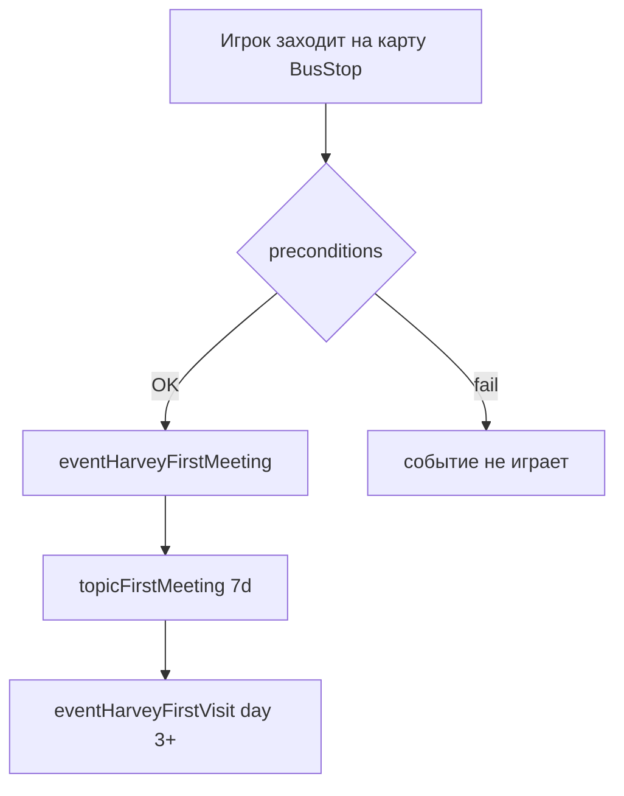

# 02 — Первая встреча: почему не срабатывает и как починить

> Раздел аудита [Harvey Relationship Visits](README.md).  
> Event: `eventHarveyFirstMeeting` → topic `topicFirstMeeting` → gate для `eventHarveyFirstVisit`.

---

## 1. Текущая схема



**Сейчас в CP** (`eventsCare.json`, дубль в `events.json`):

```
Target: Data/Events/BusStop
Key: eventHarveyFirstMeeting/Time 0600 2600
     /GameStateQuery !PLAYER_HAS_SEEN_EVENT Current eventHarveyFirstMeeting
     /GameStateQuery !PLAYER_HAS_CONVERSATION_TOPIC Current topicFirstMeeting
```

Скрипт в начале добавляет `topicFirstMeeting`, дальше — знакомство, еда, fork `declineFood` / `refuseCheckup`.

**Gate следующего шага** (`eventHarveyFirstVisit`):

```
PLAYER_HAS_CONVERSATION_TOPIC Current topicFirstMeeting
```

Без `topicFirstMeeting` вся ранняя фермерская цепочка **не стартует**.

---

## 2. Две разные причины «unmet»

### 2.1 Игрок «знакомится» с Харви до кат-сцены

Флаг `PLAYER_HAS_MET Harvey` становится `true`, как только игрок **один раз поговорит** с NPC (клиника, фестиваль, случайный диалог в Town).

После этого условие `!PLAYER_HAS_MET Harvey` **навсегда ложно** → `eventHarveyFirstMeeting` больше не может запуститься, даже если игрок каждый день ходит через BusStop.

Типичный сценарий: день 1–2, игрок заходит в клинику / в Town, кликает Харви → met=true → BusStop-сцена мёртва.

### 2.2 Игрок попадает в город, не загружая BusStop

Событие висит **только** на `Data/Events/BusStop`. Оно проверяется при **входе на карту BusStop**, не при «логическом» пути через долину.

Обход BusStop в ванилле и с модами:

| Маршрут | Загружает BusStop? |
|---|---|
| Ферма → юг → BusStop → Town | ✅ да |
| **Warp Totem: Town** | ❌ нет |
| **Minecart → Town** | ❌ нет |
| Телепорт / debug / некоторые моды на быстрый travel | ❌ нет |
| Multiplayer / кастомный spawn | ⚠️ может не быть |

Итог: игрок живёт в долине, Харви может быть ещё unmet, но **карта BusStop ни разу не загружалась** → событие не проверялось.

---

## 3. Рекомендуемый стек исправлений

Лучше делать **слоями**: каждый следующий слой — страховка, если предыдущий не сработал.

### Слой A — CP: правильный one-shot gate (обязательно)

**Заменить** `!PLAYER_HAS_MET Harvey` **на**:

```
GameStateQuery !PLAYER_HAS_SEEN_EVENT Current eventHarveyFirstMeeting
GameStateQuery !PLAYER_HAS_CONVERSATION_TOPIC Current topicFirstMeeting
```

| Было | Стало |
|---|---|
| Блокирует навсегда после первого диалога | Блокирует только после проигрыша кат-сцены |
| Нет защиты от повтора через met | `eventsSeen` — каноничный one-shot для story event |

`PLAYER_HAS_MET` убрать из preconditions первой встречи. Знакомство произойдёт **внутри** события (или сразу после — vanilla так и работает для event NPCs).

Опционально: `GameStateQuery DAYS_PLAYED 1` (или 2), чтобы не конкурировать с intro дня 1.

**Файлы:** `eventsCare.json` (канон), убрать/синхронизировать дубль в `events.json`.

---

### Слой B — CP: fallback-локация Town (рекомендуется)

Зарегистрировать **тот же** `eventHarveyFirstMeeting` (+ fork-ключи `declineFood`, `refuseCheckup`) на:

```
Target: Data/Events/Town
```

**Preconditions** — те же, что на BusStop после слоя A:

```
Time 0600 2600
!PLAYER_HAS_SEEN_EVENT Current eventHarveyFirstMeeting
!PLAYER_HAS_CONVERSATION_TOPIC Current topicFirstMeeting
```

**Скрипт:** тот же текст и forks, но **другие координаты** под карту Town (вход с юга / площадь / тропа к клинике). BusStop-координаты `(19,23)` на Town не подходят.

Практика:

1. В игре один раз пройти сцену на BusStop, записать рабочие тайлы.
2. Подобрать на Town пару тайлов с проходимостью + `faceDirection` для farmer/Harvey.
3. Держать **один** источник текста (или комментарий «sync with eventsCare BusStop»), чтобы forks не разъехались.

При первом заходе в Town (totem / вагонетка) событие отыграет там же, где игрок уже «живёт».

---

### Слой C — C# safety net (надёжно, по образцу mine rescue)

В `InjuryCare` уже есть `PassOutHandler.TriggerEventByName` — запуск CP-события из `Data/Events/{location}`.

**Триггер:** `PlayerEventHandler.OnWarped` (или `DayStarted` + флаг «ещё не пробовали»).

**Условия:**

```csharp
!Game1.player.eventsSeen.Contains("eventHarveyFirstMeeting")
&& !HasConversationTopic("topicFirstMeeting")
&& Game1.Date.TotalDays >= 1
&& (location is Town or BusStop or Hospital)
```

**Действие (вариант 1 — мягкий):**  
`TriggerEventByName("eventHarveyFirstMeeting", currentLocationName)` — только если событие зарегистрировано на **текущей** карте (после слоя B на Town это сработает).

**Действие (вариант 2 — жёсткий):**  
warp farmer → BusStop, затем `startEvent` — гарантированно, но заметный телепорт; хуже для immersion.

**Действие (вариант 3 — только спасение цепочки):**  
если `PLAYER_HAS_MET Harvey` && !seen && days >= 5 → `AddConversationTopic("topicFirstMeeting", 7)` + короткая реплика при клике. **Кат-сцена теряется** — только аварийный fallback.

Рекомендация: **вариант 1** после слоёв A+B; вариант 3 — последняя страховка для старых сейвов.

---

### Слой D — CP: ослабить gate `eventHarveyFirstVisit` (опционально)

Если meeting так и не отыграл, но игрок уже met + day ≥ 3:

Дублировать ключ `eventHarveyFirstVisit` с альтернативным precondition (в SDV OR в одном ключе нет — нужен **второй ключ** с тем же script):

```
eventHarveyFirstVisit/.../GameStateQuery PLAYER_HAS_SEEN_EVENT Current eventHarveyFirstMeeting/...
```

Текущий gate через `topicFirstMeeting` оставить как основной; seen-event gate — запасной после починки meeting.

Либо в начале script FirstVisit добавить `addConversationTopic topicFirstMeeting` если topic нет — **тяжелее**, трогает script.

---

## 4. Чего не делать

| Плохая идея | Почему |
|---|---|
| Только добавить topic в C# без события | Цепочка оживает, но пропадает вся первая сцена и тон знакомства |
| Оставить `!PLAYER_HAS_MET` + дублировать на Town | Клиника по-прежнему навсегда блокирует meeting |
| Один fallback только на Farm | Meeting по сюжету — «встреча в пути в город», Farm ломает нарратив (если только не отдельный альтернативный event ID) |
| Два разных event ID для BusStop и Town | `eventsSeen` и `eventSeen_*` диалоги в `dialoguesHarvey.json` завязаны на один ID |

---

## 5. План внедрения (минимальный diff)

### ✅ Слой A — сделано (2026-05-23)

**Файлы:** `eventsCare.json`, `events.json` (BusStop key `eventHarveyFirstMeeting`).

```diff
- eventHarveyFirstMeeting/Time 0600 2600/GameStateQuery !PLAYER_HAS_MET Current Harvey
+ eventHarveyFirstMeeting/Time 0600 2600/GameStateQuery !PLAYER_HAS_SEEN_EVENT Current eventHarveyFirstMeeting/GameStateQuery !PLAYER_HAS_CONVERSATION_TOPIC Current topicFirstMeeting
```

`eventsCare.json` загружается после `events.json` в `content.json` — канонический script остаётся в eventsCare; дубль в events.json синхронизирован по ключу.

### 🔲 Дальше

1. ~~**eventsCare.json** — BusStop key~~ ✅
2. **eventsCare.json** — новый блок `EditData` → `Data/Events/Town` с тем же event + forks, новые coords (отдельный PR / тест в игре).
3. **events.json** — удалить дублирующий `eventHarveyFirstMeeting` или синхронизировать с eventsCare (сейчас два источника правды).
4. **InjuryCare** (опционально) — `FirstMeetingBridge.TryTriggerOnWarp()` по слою C.
5. **01-early-farm-visit-chain.md** — обновить предусловие цепочки: meeting может прийти с Town, не только BusStop.

---

## 6. Чеклист теста

- [ ] Warp Totem → Town на день 2, **не** заходя на BusStop → meeting играет на Town.
- [ ] Зайти в клинику, поговорить с Харви, **потом** totem в Town → meeting **всё ещё** играет (слой A).
- [ ] После meeting → `topicFirstMeeting` → `eventHarveyFirstVisit` на day 3+.
- [ ] Повторный заход BusStop/Town → meeting **не** повторяется (`eventsSeen`).
- [ ] Fork declineFood / refuseCheckup → `topicAgreedCheckup` / checkup chain на BusStop (отдельная проверка локации checkup — см. events-inventory).

---

## 7. Связанные риски в текущем CP

- **Дубль** `eventHarveyFirstMeeting` в `events.json` и `eventsCare.json` — порядок загрузки CP решает, какой script победит; при правках легко сломать один из двух.
- **`eventHarveyCheckup`** зарегистрирован в `Data/Events/BusStop`, но координаты скрипта — клиника (`5 9`); при переносе meeting на Town checkup тоже стоит пересмотреть (Hospital vs BusStop).

---

**Статус:** слой A ✅ в CP (`eventsCare.json`, `events.json`); слои B–D **ещё не внедрены**.
