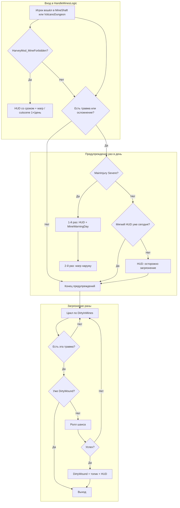

# Дебаффы ран: запрет Харви на поход в шахту и алгоритм

## Список дебаффов Severe (единый для обеих механик)

Во всех проверках шахты и госпитализации используется один и тот же набор **InjurySets.Severe** из `Core/Constants.cs`. При **хотя бы одном** из этих дебаффов у игрока:

- срабатывает **запрет на посещение шахты** (предупреждение → письмо → дебафф MineForbidden);
- при наличии топика **topicMineInjuryRescue** и включённом конфиге — **принудительная госпитализация**.

| № | ID дебаффа | Краткое описание |
|---|------------|-------------------|
| 1 | `buffBadlyHurt` | Сильная рана |
| 2 | `buffShrapnelWounds` | Осколочные ранения |
| 3 | `buffFracturedBone` | Перелом кости |
| 4 | `buffConcussion` | Сотрясение мозга |
| 5 | `buffSurgicalWound` | Послеоперационная рана |
| 6 | `buffInfectedWound` | Инфицированная рана |
| 7 | `buffBurnWounds` | Ожоговые раны |

**Всего: 7 дебаффов.** Другие травмы (например `buffSprainedAnkle`, `buffDeepCuts`) в этот список не входят — при них только мягкое предупреждение в шахте, без письма и без дебаффа MineForbidden.

---

## Запрет на посещение шахты

### Условия

Проверяются **только дебаффы** из **Severe** (список выше). Топики не используются.

| Что происходит | Условие в коде |
|----------------|----------------|
| Строгое предупреждение в шахте | **HandleMinesLogic()** при **MainInjury ∈ Severe** (`IsMainInjurySerious()`): первый вход за день → HUD error + **MineWarningDay** = today + **LastMineSevereWarningDay** = today; повторный вход в тот же день → warp наружу (без **MineForbidden** до следующего утра). |
| Письмо и дебафф на следующий день | **DayEnding**: **MineWarningDay == сегодня** и **SendLetters** → `mailHarveyMineForbidden` на завтра. **DayStarted**: **MineWarningDay == вчера** → **HarveyMod_MineForbidden** + **MineForbiddenAppliedDay** + HUD со сроком. |
| Мягкое предупреждение (buffDeepCuts и др.) | Не Severe: HUD 1×/день (`_lastMineSoftHudDay`), **без** MineWarningDay / письма / запрета; **DirtyWound** — отдельно по экспозиции в шахте. |
| CP `eventHarveyMineInterception` | Только при активном **HarveyMod_MineForbidden** (локация `Mine`, не buffDeepCuts). |

Подробнее — в разделах «Дебафф HarveyMod_MineForbidden» и «Как проверить ограничения на вход в шахту».

---

## Принудительная госпитализация

### Условия

Нужны **одновременно** три вещи:

| № | Условие | Где в коде |
|---|---------|------------|
| 1 | Топик **topicMineInjuryRescue** | `Helpers.GameUtils.HasConversationTopic("topicMineInjuryRescue")` |
| 2 | Хотя бы один дебафф из **Severe** (те же 7, что в таблице выше) | `_buffManager.HasAnyBuff(InjurySets.Severe.ToArray())` |
| 3 | В конфиге **ForceHospitalization == true** | `_config.ForceHospitalization` |

Топик **topicMineInjuryRescue** выдаётся после обморока в шахте с критическим здоровьем (0–10) при отношениях с Харви. Без этого топика принудительная госпитализация по сценарию шахты **не запускается**, даже если у игрока есть любой дебафф из Severe.

**Список дебаффов, при которых возможна принудительная госпитализация** (при наличии топика и конфига) — тот же, что и для запрета шахты: **buffBadlyHurt**, **buffShrapnelWounds**, **buffFracturedBone**, **buffConcussion**, **buffSurgicalWound**, **buffInfectedWound**, **buffBurnWounds**.

Точки входа: **HandleHospitalLogic** (вход в госпиталь) и **CheckHarveyProximity** (игрок рядом с Харви). Подробнее — в разделе «Принудительная госпитализация» ниже.

---

## Строгое предупреждение в шахте (при Severe)

> «Харви: У тебя серьёзные раны — ты не должна идти в шахту! Возможны осложнения.»

Далее: в state записывается **MineWarningDay**; на следующий день приходит письмо **mailHarveyMineForbidden** и накладывается дебафф **HarveyMod_MineForbidden** (см. раздел «Дебафф HarveyMod_MineForbidden»).

---

## Другие травмы (без запрета шахты)

При **любой другой** активной травме или осложнении (не из Severe) при первом за день входе в шахту показывается только **мягкое напоминание**:

> «Харви: Будь осторожна в шахте — твои раны могут загрязниться.»

Вход в шахту при этом не блокируется; возможна проверка на загрязнение раны (см. блок-схему).

---

## Дебафф «Харви запретил шахту» (HarveyMod_MineForbidden)

Дебафф **не** накладывается сразу при входе в шахту. Логика такая:

1. **День 1:** Игрок заходит в шахту/вулкан с **серьёзной травмой** (Severe) → показывается строгое предупреждение HUD, в state записывается **MineWarningDay** = текущий день.
2. **Конец дня 1:** В `DayEnding` при `SendLetters == true` планируется письмо на завтра: **mailHarveyMineForbidden**.
3. **День 2 (утро):** В `DayStarted` проверяется: если **MineWarningDay == вчера** → накладывается дебафф **HarveyMod_MineForbidden**, в state записывается **MineForbiddenAppliedDay** = сегодня. Письмо приходит в почту.
4. Дебафф входит в **снапшот баффов** (`SavedActiveBuffs`) и **восстанавливается** каждое утро вместе с остальными баффами мода.
5. **Снятие:** Через **MineForbiddenDurationDays** игровых дней (по умолчанию 2) в `DayStarted` вызывается **ExpireMineForbiddenIfDue()** — дебафф снимается, **MineForbiddenAppliedDay** обнуляется.

| Поле | Значение |
|------|----------|
| **ID** | `HarveyMod_MineForbidden` (константа `InjuryBuffs.MineForbidden`) |
| **Название** | Харви запретил шахту |
| **Описание** | Харви запретил посещение шахты и вулкана на время из-за твоих ран. Запрет снимется через несколько дней. |
| **Эффекты** | Speed -1, Luck -1 |
| **Длительность** | 2 игровых дня (настраивается в конфиге **MineForbiddenDurationDays**) |
| **Письмо** | **mailHarveyMineForbidden** (добавляется в `DayEnding`, приходит на следующий день после предупреждения) |

---

## Как проверить ограничения на вход в шахту

1. **Получить серьёзную травму**  
   Через консоль SMAPI: `injury_debuff_add buffBadlyHurt` (или другой Severe: `buffConcussion`, `buffFracturedBone` и т.д.).

2. **Зайти в шахту или вулкан**  
   Перейдите в **MineShaft** или **VolcanoDungeon**.

3. **В тот же день (первый раз за день)**  
   - HUD: *«Харви: У тебя серьёзные раны — ты не должна идти в шахту! Возможны осложнения.»*  
   - Дебафф **пока не накладывается** — в state записывается день предупреждения.

4. **Следующий день (утро)**  
   - В почте приходит письмо от Харви **mailHarveyMineForbidden** (запрет шахты).  
   - В панели баффов появляется дебафф **«Харви запретил шахту»**.  
   - В логе: `[Шахта] Наложен дебафф «Харви запретил шахту» на 2 дн.`

5. **Снятие дебаффа**  
   Через **2 игровых дня** (по умолчанию, настраивается **MineForbiddenDurationDays**) в начале дня дебафф снимается автоматически. Дебафф сохраняется в state и восстанавливается после загрузки/нового дня, пока не истечёт срок.

6. **Мягкое предупреждение (без Severe)**  
   При любой другой травме при первом за день входе в шахту показывается только: *«Харви: Будь осторожна в шахте — твои раны могут загрязниться.»* — без письма и без дебаффа MineForbidden.

---

## Блок-схема алгоритма (вход в шахту/вулкан)

Вызов: **PlayerEventHandler.OnWarped** → при переходе в `MineShaft` или `VolcanoDungeon` вызывается **HandleMinesLogic()**.



---

## Текстовая блок-схема (упрощённо)

```
[ Игрок вошёл в шахту/вулкан ]
            │
            ▼
┌─────────────────────────────────────────┐
│ ПРЕДУПРЕЖДЕНИЕ (раз в день)             │
├─────────────────────────────────────────┤
│ Есть любая травма/осложнение?           │
│   Нет → пропуск                          │
│   Да → Уже предупреждали сегодня?       │
│          Да → пропуск                    │
│          Нет → Запомнить день            │
│                 Есть Severe?             │
│                   Да → «Не должна идти   │
│                         в шахту!» +      │
│                         MineWarningDay   │
│                         = сегодня        │
│                   Нет → «Будь осторожна,│
│                         раны могут       │
│                         загрязниться»    │
└─────────────────────────────────────────┘
            │
            ▼
┌─────────────────────────────────────────┐
│ ЗАГРЯЗНЕНИЕ РАНЫ                        │
├─────────────────────────────────────────┤
│ Для каждой травмы из DirtyInMines:       │
│   (buffDeepCuts, buffBurnWounds,        │
│    buffShrapnelWounds)                   │
│   Есть эта травма и нет DirtyWound?     │
│     Да → ролл по шансу → при успехе:     │
│            DirtyWound + топик + HUD     │
└─────────────────────────────────────────┘
```

---

## Топик topicMineInjuryRescue (спасение из шахты)

Топик помечает ситуацию: «игрок потерял сознание в шахте с критическим здоровьем, Харви в отношениях». По нему потом может запуститься принудительная госпитализация.

### Когда топик выдаётся

**Файл:** `EventHandlers/PassOutHandler.cs` → метод **OnPlayerWarped** (вызывается при любом телепорте игрока, в т.ч. после пробуждения после обморока).

Топик **добавляется** в триггере «обморок с критическим здоровьем (0–10) + отношения с Харви»: Харви всегда приходит на помощь в такой ситуации. При обмороке в шахте дополнительно выдаётся топик для сценария спасения и принудительной госпитализации.

| Условие | Описание |
|--------|----------|
| Игрок в отношениях с Харви | Встреча или брак (проверка `DialogueManager.IsDatingOrMarriedToHarvey()`: Dating или Married) |
| Был обморок | `State.WasPassedOut == true` (выставляется в **TrackPassOut** в конце дня) |
| Здоровье при обмороке 0–10 | `LastPassedOutHealth` от 0 до 10 |
| Обморок был в шахте (для топика) | `LastPassedOutLocation` содержит подстроку `"Mine"` (например `Mine`, `UndergroundMine`; «Вулкан» не подходит) — топик `topicMineInjuryRescue` добавляется только при выполнении этого условия |

**Что делает код при выполнении условий:**

1. Вызывается `InjuryManager.ApplyBadlyHurtSafe()` — при первом за сессию срабатывании накладывается **buffBadlyHurt** и состояние травмы; повторно триггер не срабатывает (защита внутри `ApplyInjurySafe`).
2. Если обморок был в шахте (`LastPassedOutLocation` содержит `"Mine"`) → **добавляется топик** `topicMineInjuryRescue` на **2 дня** — так срабатывает сценарий «Харви пришёл на помощь», принудительная госпитализация при визите в больницу или при приближении к Харви.
3. Иначе показывается HUD: «Ты чувствуешь себя очень плохо после потери сознания...». В логе при обмороке в шахте: `"Добавлен топик: ранен в шахте + потеря сознания"`.

**Откуда берутся WasPassedOut и LastPassedOut\***  
В конце дня вызывается **TrackPassOut()**: при обмороке от истощения (stamina ≤ -15), от урона (health ≤ 0) или от времени (time ≥ 2600) в state пишутся `WasPassedOut`, `LastPassedOutHealth`, `LastPassedOutLocation`. При первом же варпе на следующий день (или при пробуждении) срабатывает **OnPlayerWarped** и при выполнении условий выше выдаётся топик.

### Где топик используется

Топик **topicMineInjuryRescue** нужен **только для принудительной госпитализации**. Запрет на посещение шахты (предупреждение, письмо, дебафф **HarveyMod_MineForbidden**) от топиков не зависит — проверяются только дебаффы **Severe** при входе в шахту/вулкан.

| Место | Файл / метод | Условие | Действие |
|-------|---------------|---------|----------|
| Вход в госпиталь | `PlayerEventHandler.HandleHospitalLogic` | Варп в локацию госпиталя + **ForceHospitalization** + топик **topicMineInjuryRescue** + хотя бы один дебафф из **Severe** (см. список в начале документа) | Запуск принудительной госпитализации (`mine_rescue`), топик **удаляется** |
| Близость Харви | `PlayerEventHandler.CheckHarveyProximity` | Игрок в пределах **ProximityTiles** от Харви, те же условия | То же: принудительная госпитализация, топик удаляется |

После обморока в шахте с критическим здоровьем при пробуждении у игрока накладывается **buffBadlyHurt** (входит в Severe) и добавляется топик **topicMineInjuryRescue** — при входе в госпиталь или при приближении к Харви сработает принудительная госпитализация (если включён **ForceHospitalization**).

### Как проверить в игре

1. **Подготовка**
   - Убедиться, что персонаж в отношениях с Харви (встреча или брак).
   - В конфиге мода включить **ForceHospitalization** (принудительная госпитализация).
   - Сохраниться перед тестом.

2. **Получить топик (обморок в шахте с критическим здоровьем)**
   - Зайти в шахту, в названии локации которой есть `"Mine"` (обычная шахта или подземелье; вулкан `VolcanoDungeon` в коде не считается «шахтой» для этого топика).
   - Довести здоровье до **0–10** (монстры/ловушки) или до обморока от истощения при малом здоровье, и **потерять сознание** в этой локации.
   - Дождаться конца дня (сохранение) — в state запишутся обморок и локация.
   - На следующий день при **пробуждении** (телепорт домой/в клинику) сработает **OnPlayerWarped** → при выполнении условий наложится **buffBadlyHurt** и добавится **topicMineInjuryRescue** на 2 дня.

3. **Проверить по логу SMAPI**
   - После пробуждения в логе должно быть:  
     `"Триггер: Критическое состояние после обморока"` и  
     `"Добавлен топик: ранен в шахте + потеря сознание"`.

4. **Проверить принудительную госпитализацию**
   - С топиком и баффом **buffBadlyHurt** (или другой Severe):
     - **Вариант А:** зайти в госпиталь (варп в локацию госпиталя) — должна запуститься принудительная госпитализация с объяснением «mine_rescue», после чего топик удалится.
     - **Вариант Б:** подойти близко к Харви (в городе/в клинике) — при срабатывании проверки близости тоже должна запуститься госпитализация и топик удалится.

5. **Проверить по дебаг-HUD (F10)**  
   В блоке «Активные топики» до срабатывания госпитализации должен быть топик `topicMineInjuryRescue` (с указанием дней). После принудительной госпитализации его в списке быть не должно.

**Если топик не появляется:** проверьте, что обморок был в локации с `"Mine"` в имени, здоровье при обмороке было 0–10, персонаж в отношениях с Харви (встреча или брак) и что в логе есть сообщение «Добавлен топик: ранен в шахте + потеря сознания».

---

## Принудительная госпитализация

Механика удерживает игрока в больнице на заданное время после тяжёлых травм (в т.ч. после спасения из шахты). Управляется **HospitalizationManager**; включение — опция конфига **ForceHospitalization** (по умолчанию `true`).

### Когда запускается

Принудительная госпитализация по сценарию шахты стартует в двух точках (в обоих случаях нужны **одновременно**: топик **topicMineInjuryRescue**, хотя бы один дебафф из **Severe**, конфиг **ForceHospitalization**):

| Точка входа | Условия | Файл / метод |
|-------------|---------|--------------|
| **Вход в госпиталь** | `topicMineInjuryRescue` + любой дебафф из **Severe** + **ForceHospitalization** | `PlayerEventHandler.HandleHospitalLogic` (при варпе в локацию госпиталя из `OnWarped` → `HandleLocationLogic`) |
| **Близость к Харви** | То же; плюс игрок в пределах **ProximityTiles** от Харви | `PlayerEventHandler.CheckHarveyProximity` (раз в ~1 сек при `UpdateTicked`) |

**Топик, при котором возможна принудительная госпитализация:** только **`topicMineInjuryRescue`**. Список дебаффов Severe (те же 7, что для запрета шахты) — см. раздел «Список дебаффов Severe» в начале документа.

В сценарии «спасение из шахты» после пробуждения у игрока уже есть **buffBadlyHurt** (из Severe) и топик — достаточно зайти в госпиталь или подойти к Харви, чтобы сработала госпитализация.

### Что происходит при старте

1. **HospitalizationManager.StartForcedHospitalizationWithExplanation(injuryId, harvey, reason)** (причина `"mine_rescue"` или `"general"`):
   - Включается режим госпитализации: `_hospitalHoldActive = true`, запоминаются травма и время поступления (`_admissionTime`).
   - Игрок телепортируется к больничной кровати: **WarpToHospitalBed()** — варп в локацию из конфига (**HospitalLocationName**, по умолчанию `"Hospital"`) на тайлы **HospitalBedX**, **HospitalBedY** (по умолчанию 20, 5).
   - Показывается диалог-объяснение: для `mine_rescue` — текст про раны после инцидента в шахте и минимум N часов под наблюдением; для `general` — общее «состояние критическое, в палату».
   - Проигрывается звук `debuffHit`.

2. Для сценария шахты после этого топик **topicMineInjuryRescue** удаляется.

### Удержание в больнице и выход

- **Блокировка варпа:** при любой попытке **выйти из локации госпиталя** вызывается **HandleWarpAttempt** (из **PlayerEventHandler.OnWarped**). Блокируется только переход **из клиники наружу**; варпы из других локаций (например из шахты) не трогаются.
- **Срок выписки:** в конфиге задаётся **MinHospitalStayMinutes** (игровые минуты; по умолчанию **120** = 2 игровых часа). **CanDischarge()** возвращает `true`, когда с момента `_admissionTime` прошло не меньше этого времени.
- **Если срок ещё не прошёл:** варп из госпиталя отменяется, игрока возвращают к кровати (**WarpToHospitalBed**), показывается реплика Харви («Назад в палату» и т.п.) или HUD «Ты слишком тяжело ранена».
- **Если срок прошёл:** при попытке выйти вызывается **Discharge()** — флаг госпитализации сбрасывается, показывается реакция Харви на выписку, варп разрешается (игрок выходит из госпиталя).

### Конфиг (ModConfig)

| Параметр | По умолчанию | Описание |
|----------|--------------|----------|
| **ForceHospitalization** | `true` | Включать ли принудительную госпитализацию при тяжёлых травмах и сценарии шахты. |
| **MinHospitalStayMinutes** | `120` | Минимальное время (игровые минуты) в больнице до разрешения выхода. |
| **HospitalLocationName** | `"Hospital"` | Имя локации госпиталя для телепорта и проверки «в клинике». |
| **HospitalBedX** / **HospitalBedY** | `20`, `5` | Координаты кровати в локации госпиталя. |
| **ProximityTiles** | `3` | Радиус в тайлах для срабатывания «Харви рядом» (в т.ч. для старта госпитализации по близости). |

### Краткая схема

```
[ Условия: ForceHospitalization + topicMineInjuryRescue + травма из Severe ]
    │
    ├─ Игрок зашёл в госпиталь (HandleHospitalLogic) ──► StartForcedHospitalizationWithExplanation("mine_rescue")
    │
    └─ Игрок рядом с Харви (CheckHarveyProximity) ─────► то же
                │
                ▼
    WarpToHospitalBed + диалог объяснения, топик topicMineInjuryRescue удалён
                │
                ▼
    [ Игрок пытается выйти из госпиталя (OnWarped → HandleWarpAttempt) ]
                │
                ├─ Прошло < MinHospitalStayMinutes ──► варп отменён, возврат к кровати, реплика «Назад в палату»
                │
                └─ Прошло ≥ MinHospitalStayMinutes ──► Discharge(), разрешён выход, реакция Харви на выписку
```

---

## Связь с другими системами

- **Список дебаффов Severe (7 шт.):** один и тот же для запрета шахты и для принудительной госпитализации — см. таблицу в начале документа (`Core/Constants.cs` → **InjurySets.Severe**).
- **Запрет шахты:** при входе в MineShaft/VolcanoDungeon проверяются только дебаффы **Severe**; топики не используются. Далее: MineWarningDay → письмо и дебафф **HarveyMod_MineForbidden** на следующий день. См. разделы «Запрет на посещение шахты» и «Дебафф HarveyMod_MineForbidden».
- **Принудительная госпитализация:** топик **topicMineInjuryRescue** + хотя бы один дебафф из **Severe** + **ForceHospitalization**; после срабатывания топик удаляется. См. раздел «Принудительная госпитализация».
- **DirtyInMines** (риск загрязнения в шахте): `buffDeepCuts`, `buffBurnWounds`, `buffShrapnelWounds` — при нахождении в шахте/вулкане по ним проверяется шанс появления осложнения «Загрязнённая рана».
