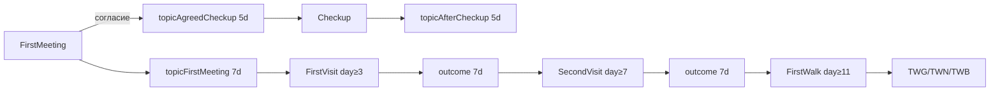

## Приложение A: жизненный цикл топиков

<a id="приложение-a-жизненный-цикл-топиков"></a>

Пока топик активен на фермере:

1. Харви отвечает **специальной репликой** (`dialoguesHarvey*.json`, ключ = ID топика).
2. CP-события могут требовать `PLAYER_HAS_CONVERSATION_TOPIC`.
3. Топик **снимается** (`removeConversationTopic`) или **истекает** по TTL (дней).

### Ранняя цепочка (схема)



| Топик | Дней | Создаёт | Gate / снимает | Реплика Harvey (суть) | Эффект в событии |
|---|---:|---|---|---|---|
| `topicFirstMeeting` | 7 | FirstMeeting | → FirstVisit | «Как дела на ферме?» | friendship +20 |
| `topicAgreedCheckup` | 5 | FirstMeeting | → Checkup; remove в Checkup | «Зайди в клинику» | — |
| `topicAfterCheckup` | 5 | Checkup | TTL | «Принимай витамины» | — |
| `topicHarveyFirstVisitAgree/Neutral/Refused` | 7 | FirstVisit QQ | gate SecondVisit | Agree: «шляпа, не переутомляйся» | friendship +10…+25 |
| `topicHarveySecondVisitAgree/Neutral/Refused` | 7 | SecondVisit QQ | gate FirstWalk | Agree: «под моей защитой» | +10…+20 |
| `topicHarveyWalkGood/Neutral/Bad` | 7 | FirstWalk forest QQ | TTL | Good: «вижу тебя лучше» | +100 / 0 / −20 |

### Story E1→E8 (cooldown)

| Топик | Дней | После | Блокирует |
|---|---:|---|---|
| `HarveyMod_CD_Global` | 2–4 | E1,E3,E5–E8 | следующие Story |
| `HarveyMod_CD_E1`…`E8` | 2–7 | соответствующее E | следующий шаг |
| `topicHarveyPierBreath` | 7 | E4 | повтор E4 |

Линейность: `seen E(n−1)` + hearts + `!seen self` + `!CD_Global`. **Баг:** `HarveyMod_CD_E2` в gate E3, но не создаётся.

### Клиника + C# bridge

| Топик | Дней | Источник | Потребитель |
|---|---:|---|---|
| `topicHarveyNeedsFirstTreatment` | 7 | **C#** при treatable-травме | `HarveyMod_FirstTreatment` |
| `topicFirstTreatmentComplete` | 7 | FirstTreatment | gate повтора |
| `topicNightCrisisComplete` | 5 | NightCrisis_* | gate повтора |
| `topicBirthdayHospitalComplete` | 14 | Birthday_* | gate повтора |
| `topicHarveyMandatoryCheckup` | 1 | after22 event | MorningCheckup |
| `topicPassedOutInTown` | 2 | **C#** PassOutHandler | after22 event |
| `topicDiagnosisComplete` | — | **⚠️ orphan** | TreatmentPlanMeeting |
| `topicRescueOperation` | — | **⚠️ orphan** | RescueOperation |

### Шахта

| Топик | Дней | Источник | Назначение |
|---|---:|---|---|
| `topicMineRescuePending` | 1 | **C#** перед cutscene | блокирует mine interception |
| `topicMineInjuryRescue` | 2 | CP rescue / C# fallback | диалог «Отдыхай»; снимает C# при госпитализации |
| `HarveyMineIntercept` | 3 | MineInterception | TTL |

### InjuryCare (паттерн)

```
C# травма → topicInjury + buff → диалог Harvey
→ клик → TreatmentManager → phase topics → topicInjuryCured
→ клик → эпилог + buffHarveyCare
```

Примеры injury-topics: `topicHurt`, `topicBadlyHurt`, `topicDeepCuts`, `topicFracturedBone` — реплики в `dialoguesHarveyInjury.json`. Осложнения: `topicHarvey_WetBandage`, `_DirtyWound`, `_Neglect` (4–7 д).

### Storm comfort

Consumer: `buffStressThunder` + Storm → cutscene → **remove** `topicStressThunder` + `buffStressImmunity` + friendship. Producer stress-topics **отключён** (`triggersStress.json` не в content.json).

### Orphan-topics (недостижимы без ручной установки)

`topicDiagnosisComplete`, `topicRescueOperation`, stress-topics, `HarveyMod_CD_E2`.

*Подробные цепочки: `14-scenario-chains.md`, правки: `harvey-events-fix-report.md`.*
